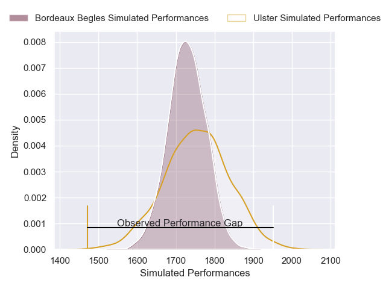
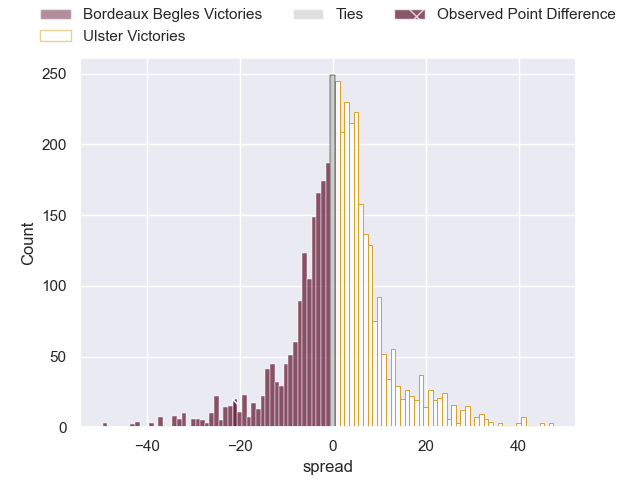
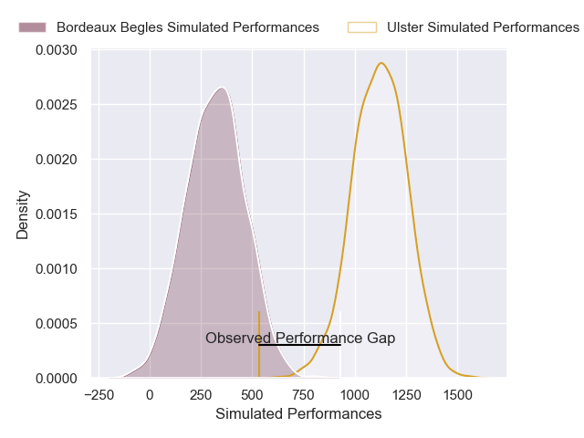
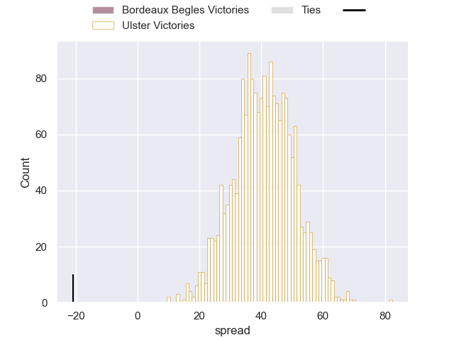
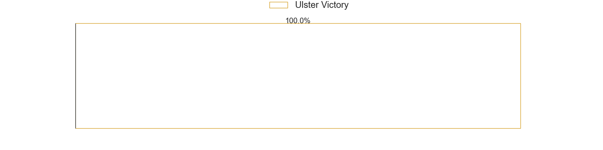

---  
layout: page  
title: Bordeaux Begles at Ulster; 40-19  
date: 2024-12-14 18:00:00 -0500  
categories: "European Rugby Champions Cup 2024" match review  
---
# Bordeaux Begles at Ulster; 40-19

# Club Level Predictions

The first set of predictions treats a club as the smallest object, as the club develops its members, organizes a gameplan, and deploys its players as needed for each match. This club model has a prediction of 0.535, which translates to predicting Ulster to win by 1.2.

Our Over/Under is 47.5 - and combined with the spread above, we have a predicted scoreline of 23 to 24

Each club has a rating and a rating deviation (similar to a Glicko rating), and expected performances can be generated. This allows for simulated matches and spreads like the ones below.
## Projected Performances - Club Model

## Projected Spreads - Club Model

## Projected Results - Club Model

# Player Level Predictions

Treating teams instead as an entity made up of the currently active players, I have ratings for each player in an altogether different system. These can be combined to form team ratings once teamsheets are announced, weighting starters a bit higher than the reserves. After the match is played, players can be weighted by their minutes on the field, allowing for an accurate measure of the team's composition. With these compiled team ratings, we can make predictions, measure inaccuracy, and update the individual player ratings.
## Prediction without Player Minutes: Ulster by 21.9

Ulster by 12.1 on a neutral pitch

## Projected Performances - Player Model

## Projected Spreads - Player Model

## Projected Results - Player Model

|   Away Minutes | Away Player               |   Away Percentile |   Number |   Home Percentile | Home Player        |   Home Minutes |
|---------------:|:--------------------------|------------------:|---------:|------------------:|:-------------------|---------------:|
|             63 | Jefferson Poirot          |             80.28 |        1 |             72.43 | Eric O'Sullivan    |              0 |
|             34 | Romain Latterrade         |             29.26 |        2 |             92.18 | Rob Herring        |             28 |
|             68 | Romain Latterrade         |             29.26 |        2 |             92.18 | Rob Herring        |             28 |
|             34 | Carlu Sadie               |             76.33 |        3 |             17.83 | Tom O'Toole        |             56 |
|             65 | Guido Petti               |             95.65 |        4 |             58.44 | Iain Henderson     |             81 |
|             63 | Jonny Gray                |             96.54 |        5 |             22.74 | Kieran Treadwell   |             81 |
|             63 | Marko Gazzotti            |             80.21 |        6 |             60.07 | Cormac Izuchukwu   |             25 |
|             63 | Lachlan Swinton           |             13.71 |        7 |             80.03 | Nick Timoney       |             18 |
|              7 | Tevita Tatafu             |             70.57 |        8 |             63.81 | David McCann       |             81 |
|             38 | Maxime Lucu               |             98.85 |        9 |             28.52 | Nathan Doak        |             25 |
|             81 | Joey Carbery              |             85.45 |       10 |             40    | Aidan Morgan       |             25 |
|             56 | Arthur Retiere            |             97.62 |       11 |             39.35 | Zac Ward           |             18 |
|              9 | Yoram Moefana             |             88.61 |       12 |             85.74 | Stuart McCloskey   |             11 |
|             18 | Nicolas Depoortere        |             80.1  |       13 |             99.43 | Jude Postlethwaite |             11 |
|             18 | Nicolas Depoortere        |             80.1  |       13 |             99.43 | Jude Postlethwaite |             47 |
|             18 | Nicolas Depoortere        |             80.1  |       13 |             99.43 | Jude Postlethwaite |             81 |
|             18 | Nicolas Depoortere        |             80.1  |       13 |             99.43 | Jude Postlethwaite |             34 |
|             63 | Damian Penaud             |             96.9  |       14 |             29.01 | Werner Kok         |             53 |
|             81 | Louis Bielle-Biarrey      |             78.84 |       15 |              9.18 | Mike Lowry         |             65 |
|             81 | Maxime Lamothe            |             32.08 |       16 |             44.91 | John Andrew        |             81 |
|             65 | Ugo Boniface              |             80.93 |       17 |             35.83 | Andrew Warwick     |             81 |
|             63 | Ben Tameifuna             |             87.37 |       18 |             61.28 | Scott Wilson       |             63 |
|             65 | Adam Coleman              |             97.96 |       19 |             78.33 | Harry Sheridan     |             81 |
|             63 | Alexandre Ricard          |             76.82 |       20 |             91    | Marcus Rea         |             47 |
|             81 | Bastien Vergnes Taillefer |             76.86 |       21 |            nan    | Dave Shanahan      |             47 |
|             81 | Ben Tapuai                |             45.26 |       22 |            nan    | James Humphreys    |             72 |
|             71 | Mateo Garcia              |             47.57 |       23 |            nan    | Rory Telfer        |             47 |

