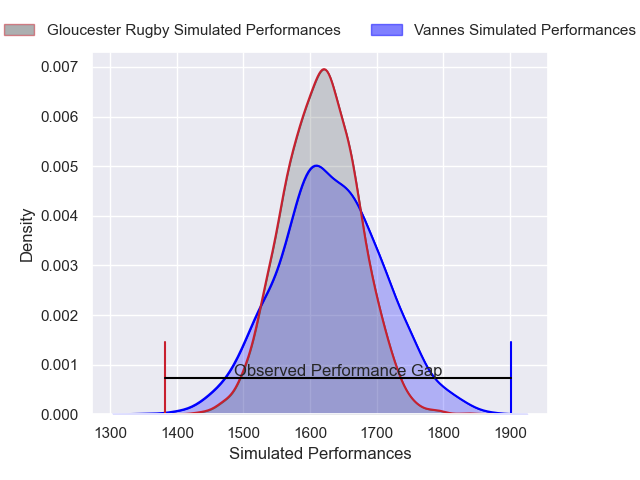
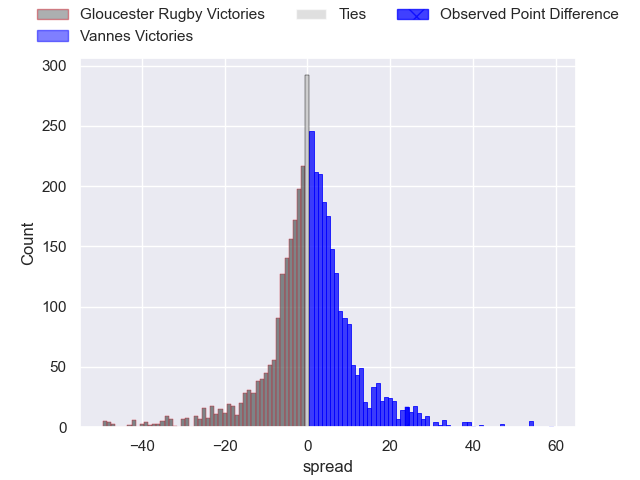
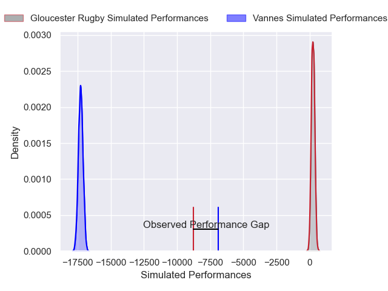
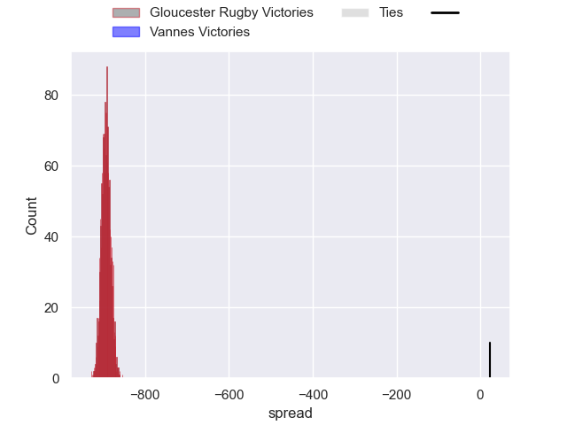

---  
layout: page  
title: Gloucester Rugby at Vannes; 19-43  
date: 2024-12-14 18:00:00 -0500  
categories: "European Rugby Challenge Cup 2024" match review  
---
# Gloucester Rugby at Vannes; 19-43

# Club Level Predictions

The first set of predictions treats a club as the smallest object, as the club develops its members, organizes a gameplan, and deploys its players as needed for each match. This club model has a prediction of 0.518, which translates to predicting Vannes to win by 0.6.

Our Over/Under is 49.5 - and combined with the spread above, we have a predicted scoreline of 24 to 25

Each club has a rating and a rating deviation (similar to a Glicko rating), and expected performances can be generated. This allows for simulated matches and spreads like the ones below.
## Projected Performances - Club Model

## Projected Spreads - Club Model

## Projected Results - Club Model

# Player Level Predictions

Treating teams instead as an entity made up of the currently active players, I have ratings for each player in an altogether different system. These can be combined to form team ratings once teamsheets are announced, weighting starters a bit higher than the reserves. After the match is played, players can be weighted by their minutes on the field, allowing for an accurate measure of the team's composition. With these compiled team ratings, we can make predictions, measure inaccuracy, and update the individual player ratings.
## Prediction without Player Minutes: Gloucester Rugby by 18.9

Gloucester Rugby by 24.4 on a neutral pitch

## Projected Performances - Player Model

## Projected Spreads - Player Model

## Projected Results - Player Model

|   Away Minutes | Away Player       |   Away Percentile |   Number |   Home Percentile | Home Player         |   Home Minutes |
|---------------:|:------------------|------------------:|---------:|------------------:|:--------------------|---------------:|
|             70 | Mayco Vivas       |             11.79 |        1 |             90.55 | Mako Vunipola       |             81 |
|             81 | Morgan Nelson     |             13.77 |        2 |             83.72 | Theo Beziat         |             81 |
|             80 | Kirill Gotovtsev  |             64.55 |        3 |             47.43 | Simon Bourgeois     |              6 |
|             52 | Freddie Clarke    |             36.52 |        4 |             83.76 | Anton Bresler       |             27 |
|             27 | Cameron Jordan    |             83.23 |        5 |             88.76 | Timothe Mezou       |             81 |
|             22 | Cameron Jordan    |             83.23 |        5 |             88.76 | Timothe Mezou       |             81 |
|             41 | Danny Eite        |             28.61 |        6 |             40.97 | Karl Chateau        |             41 |
|             48 | Harry Taylor      |             19.36 |        7 |             98.96 | Francisco Gorrissen |             68 |
|             62 | Albert Tuisue     |             83.12 |        8 |             54.18 | Sione Kalamafoni    |             52 |
|             33 | Charlie Chapman   |             61.9  |        9 |             97.11 | Michael Ruru        |             83 |
|             33 | George Barton     |             63.89 |       10 |             93.1  | Maxime Lafage       |              1 |
|             83 | Jack Reeves       |             12.02 |       11 |             85.78 | Romaric Camou       |             81 |
|             33 | William Butler    |             73.36 |       12 |             63.47 | Tani Vili           |             33 |
|             83 | Chris Harris      |             27.52 |       13 |             88.25 | Robin Taccola       |             33 |
|             19 | Jake Morris       |             15.63 |       14 |             66.14 | Enzo Benmegal       |             33 |
|             83 | Ioan Jones        |             79.66 |       15 |             52.54 | Paul Surano         |             17 |
|             81 | Gareth Blackmore  |            nan    |       16 |             52.27 | Cyril Blanchard     |             50 |
|             50 | Archie McArthur   |            nan    |       17 |            nan    | Charlesty Berguet   |             33 |
|             52 | Alfie Petch       |            nan    |       18 |              7.17 | Santiago Medrano    |             33 |
|             52 | Alfie Petch       |            nan    |       18 |              7.17 | Santiago Medrano    |             21 |
|             52 | Alfie Petch       |            nan    |       18 |              7.17 | Santiago Medrano    |             75 |
|             52 | Alfie Petch       |            nan    |       18 |              7.17 | Santiago Medrano    |             63 |
|             52 | Alfie Petch       |            nan    |       18 |              7.17 | Santiago Medrano    |             81 |
|             52 | Alfie Petch       |            nan    |       18 |              7.17 | Santiago Medrano    |             58 |
|             52 | Alfie Petch       |            nan    |       18 |              7.17 | Santiago Medrano    |             25 |
|             52 | Alfie Petch       |            nan    |       18 |              7.17 | Santiago Medrano    |             13 |
|             37 | Deian Gwynne      |            nan    |       19 |             77.7  | Eric Marks          |             27 |
|             37 | Deian Gwynne      |            nan    |       19 |             77.7  | Eric Marks          |             67 |
|             47 | Caio James        |            nan    |       20 |             80.77 | Fabrice Metz        |             83 |
|             48 | Caolan Englefield |             78.62 |       21 |             16.25 | Simon Augry         |             83 |
|             19 | Rory Taylor       |            nan    |       22 |             11.41 | Jules Le Bail       |             83 |
|             83 | Jack Cotgreave    |            nan    |       23 |             58.21 | Inaki Ayarza        |             83 |

