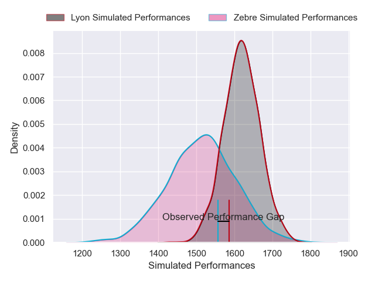
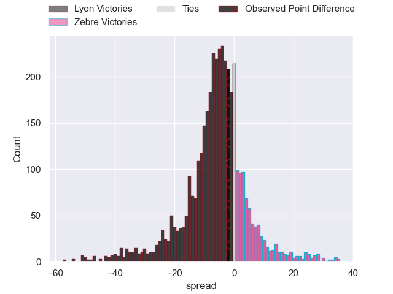
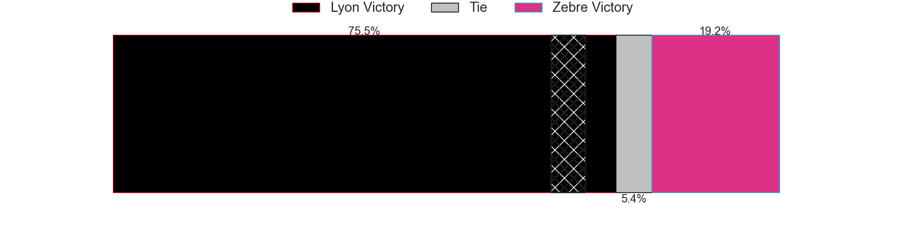
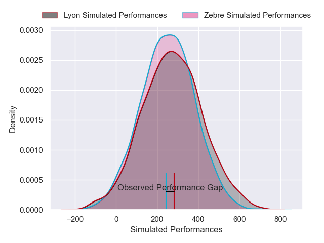
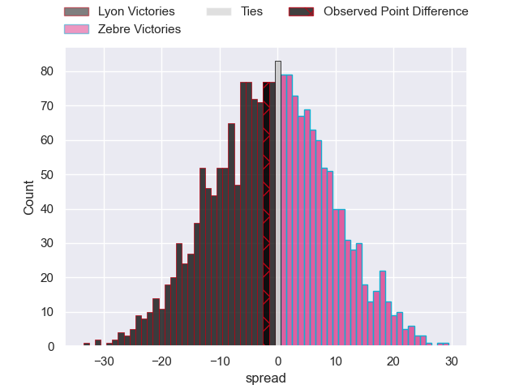

---  
layout: page  
title: Lyon at Zebre; 21-19  
date: 2024-12-14 18:00:00 -0500  
categories: "European Rugby Challenge Cup 2024" match review  
---
# Lyon at Zebre; 21-19

# Club Level Predictions

The first set of predictions treats a club as the smallest object, as the club develops its members, organizes a gameplan, and deploys its players as needed for each match. This club model has a prediction of 0.357, which translates to predicting Lyon to win by 5.2.

Our Over/Under is 49.5 - and combined with the spread above, we have a predicted scoreline of 27 to 22

Each club has a rating and a rating deviation (similar to a Glicko rating), and expected performances can be generated. This allows for simulated matches and spreads like the ones below.
## Projected Performances - Club Model

## Projected Spreads - Club Model

## Projected Results - Club Model

# Player Level Predictions

Treating teams instead as an entity made up of the currently active players, I have ratings for each player in an altogether different system. These can be combined to form team ratings once teamsheets are announced, weighting starters a bit higher than the reserves. After the match is played, players can be weighted by their minutes on the field, allowing for an accurate measure of the team's composition. With these compiled team ratings, we can make predictions, measure inaccuracy, and update the individual player ratings.
## Prediction without Player Minutes: Zebre by 4.5

Lyon by 1.8 on a neutral pitch

## Projected Performances - Player Model

## Projected Spreads - Player Model

## Projected Results - Player Model

|   Away Minutes | Away Player          |   Away Percentile |   Number |   Home Percentile | Home Player            |   Home Minutes |
|---------------:|:---------------------|------------------:|---------:|------------------:|:-----------------------|---------------:|
|             52 | Jerome Rey           |             16.62 |        1 |             59.35 | Danilo Fischetti       |             16 |
|             30 | Sam Matavesi         |             84.42 |        2 |             59.81 | Tommaso Di Bartolomeo  |             56 |
|             27 | Jermaine Ainsley     |             21.9  |        3 |             18.29 | Matteo Nocera          |             28 |
|             16 | Theo William         |              7.11 |        4 |              8.48 | Leonard Krumov         |             80 |
|             53 | Tomas Lavanini       |             92.98 |        5 |             45.31 | Andrea Zambonin        |             80 |
|             20 | Steeve Blanc-Mappaz  |             22.15 |        6 |             55.96 | Giacomo Milano         |             67 |
|             59 | Liam Allen           |             74.7  |        7 |             26.66 | Bautista Stavile       |             80 |
|             32 | Maxime Gouzou        |             11.69 |        8 |             12.69 | Giovanni Licata        |             80 |
|             80 | Esteban Gonzalez     |             47.84 |        9 |             77.57 | Gonzalo Garcia         |             80 |
|             80 | Esteban Gonzalez     |             47.84 |        9 |             77.57 | Gonzalo Garcia         |             15 |
|             80 | Martin Meliande      |              4.49 |       10 |             93.88 | Geronimo Prisciantelli |             61 |
|             74 | Vincent Rattez       |             85.68 |       11 |             24.05 | Simone Gesi            |             25 |
|             80 | Semi Radradra        |             98.63 |       12 |             21    | Fetuli Paea            |             57 |
|             80 | Alfred Parisien      |             70.36 |       13 |             92.35 | Luca Morisi            |             13 |
|             69 | Ethan Dumortier      |             31.52 |       14 |             18.6  | Jacopo Trulla          |             12 |
|             69 | Alexandre Tchaptchet |             39.56 |       15 |              8.69 | Alessandro Fusco       |             23 |
|             80 | Hamza Kaabeche       |             17.96 |       16 |             78.64 | Luca Rizzoli           |             65 |
|             80 | Yanis Charcosset     |             28.35 |       17 |             28.66 | Giampietro Ribaldi     |             80 |
|             72 | Irakli Aptsiauri     |             66.22 |       18 |             18.62 | Muhamed Hasa           |             27 |
|             80 | Killian Geraci       |             24.79 |       19 |             12.52 | Iacopo Bianchi         |             74 |
|             80 | Beka Saghinadze      |             90.2  |       20 |             68.48 | Rusiate Nasove         |             80 |
|             80 | Charlie Cassang      |             82.56 |       21 |             23.09 | Thomas Dominguez       |             67 |
|             80 | Monty Ioane          |             93    |       22 |             13.88 | Giacomo Da Re          |             64 |
|             80 | Xavier Mignot        |             64.05 |       23 |             58.98 | Scott Gregory          |             80 |

