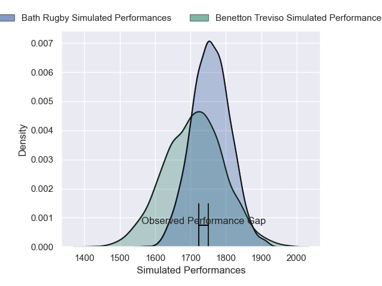
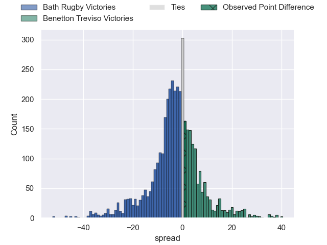
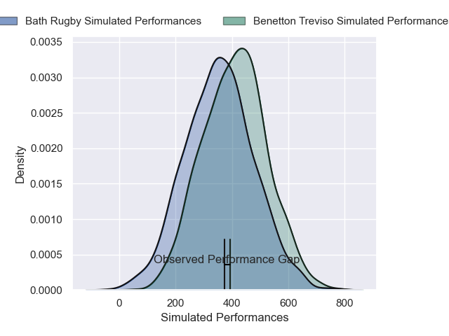
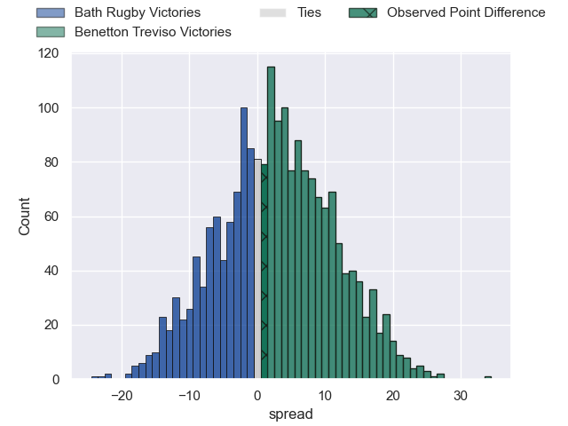
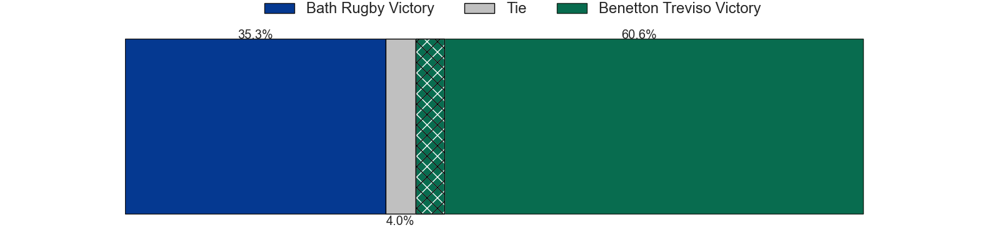

---  
layout: page  
title: Bath Rugby at Benetton Treviso; 21-22  
date: 2024-12-15 18:00:00 -0500  
categories: "European Rugby Champions Cup 2024" match review  
---
# Bath Rugby at Benetton Treviso; 21-22

# Club Level Predictions

The first set of predictions treats a club as the smallest object, as the club develops its members, organizes a gameplan, and deploys its players as needed for each match. This club model has a prediction of 0.434, which translates to predicting Bath Rugby to win by 2.4.

Our Over/Under is 60.5 - and combined with the spread above, we have a predicted scoreline of 31 to 29

Each club has a rating and a rating deviation (similar to a Glicko rating), and expected performances can be generated. This allows for simulated matches and spreads like the ones below.
## Projected Performances - Club Model

## Projected Spreads - Club Model

## Projected Results - Club Model

# Player Level Predictions

Treating teams instead as an entity made up of the currently active players, I have ratings for each player in an altogether different system. These can be combined to form team ratings once teamsheets are announced, weighting starters a bit higher than the reserves. After the match is played, players can be weighted by their minutes on the field, allowing for an accurate measure of the team's composition. With these compiled team ratings, we can make predictions, measure inaccuracy, and update the individual player ratings.
## Prediction without Player Minutes: Benetton Treviso by 4.5

Bath Rugby by 3.3 on a neutral pitch

## Projected Performances - Player Model

## Projected Spreads - Player Model

## Projected Results - Player Model

|   Away Minutes | Away Player         |   Away Percentile |   Number |   Home Percentile | Home Player         |   Home Minutes |
|---------------:|:--------------------|------------------:|---------:|------------------:|:--------------------|---------------:|
|             42 | Francois van Wyk    |             75.7  |        1 |             32.44 | Mirco Spagnolo      |             35 |
|             64 | Niall Annett        |             57.32 |        2 |              1.09 | Siua Maile          |             20 |
|             83 | Billy Sela          |             75.23 |        3 |             86.25 | Simone Ferrari      |             83 |
|             47 | Ewan Richards       |             72.84 |        4 |             65.18 | Niccolo Cannone     |             59 |
|             56 | Ross Molony         |             87.42 |        5 |             94.44 | Federico Ruzza      |             13 |
|             41 | Josh Bayliss        |             21.12 |        6 |             78.53 | Sebastian Negri     |             81 |
|             70 | Ethan Staddon       |             53.49 |        7 |             47.79 | Manuel Zuliani      |             83 |
|             27 | Miles Reid          |             83.64 |        8 |             66.28 | Toa Halafihi        |             58 |
|             25 | Miles Reid          |             83.64 |        8 |             66.28 | Toa Halafihi        |             58 |
|             26 | Louis Schreuder     |             68.27 |        9 |             16.28 | Andy Uren           |             35 |
|             83 | Orlando Bailey      |             91.63 |       10 |             87.14 | Tomas Albornoz      |             35 |
|             83 | Ruaridh McConnochie |             52.22 |       11 |             57.12 | Onisi Ratave        |             11 |
|             77 | Cameron Redpath     |              8.15 |       12 |             74.58 | Malakai Fekitoa     |             14 |
|             31 | Max Ojomoh          |             93.33 |       13 |             88.81 | Tommaso Menoncello  |             81 |
|             46 | Regan Grace         |             64.75 |       14 |             43.42 | Louis Lynagh        |             81 |
|              3 | Tom de Glanville    |             18.48 |       15 |             87.25 | Rhyno Smith         |             46 |
|             30 | Kepu Tuipulotu      |            nan    |       16 |             57.94 | Bautista Bernasconi |             67 |
|              6 | Arthur Cordwell     |            nan    |       17 |             89.52 | Thomas Gallo        |             63 |
|             81 | Thomas du Toit      |             80.44 |       18 |             80.91 | Tiziano Pasquali    |             52 |
|             70 | Quinn Roux          |             94.99 |       19 |             21.7  | Riccardo Favretto   |             81 |
|             60 | Ted Hill            |             92.08 |       20 |             50.17 | Alessandro Izekor   |             55 |
|             67 | Tom Carr-Smith      |            nan    |       21 |             39.37 | Alessandro Garbisi  |             61 |
|             20 | Louie Hennessey     |             32.68 |       22 |             66.33 | Jacob Umaga         |             81 |
|             81 | Jaco Coetzee        |             53.42 |       23 |             94.11 | Juan Ignacio Brex   |             46 |

