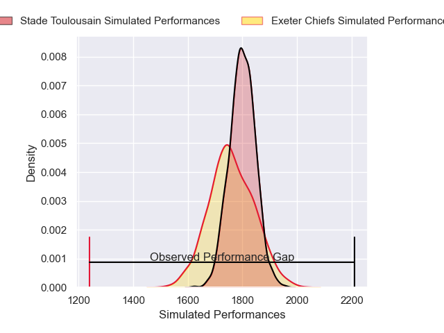
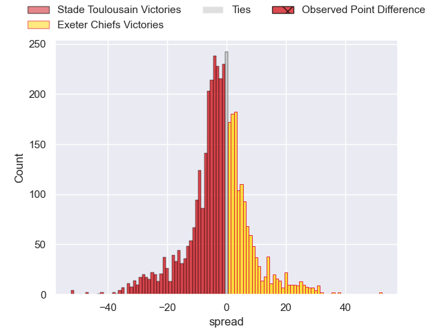
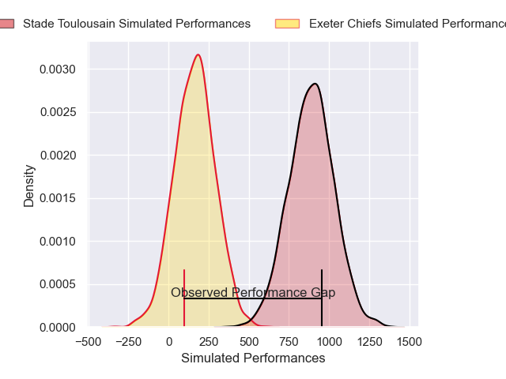
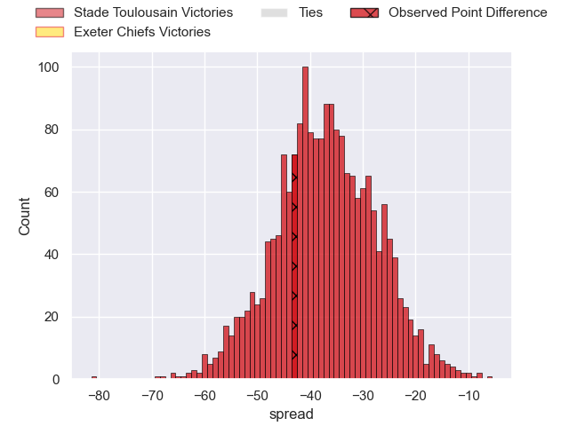
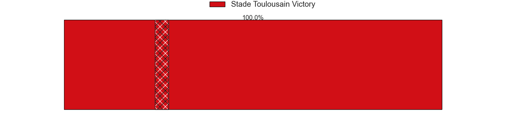

---  
layout: page  
title: Stade Toulousain at Exeter Chiefs; 64-21  
date: 2024-12-15 18:00:00 -0500  
categories: "European Rugby Champions Cup 2024" match review  
---
# Stade Toulousain at Exeter Chiefs; 64-21

# Club Level Predictions

The first set of predictions treats a club as the smallest object, as the club develops its members, organizes a gameplan, and deploys its players as needed for each match. This club model has a prediction of 0.445, which translates to predicting Stade Toulousain to win by 1.9.

Our Over/Under is 57.5 - and combined with the spread above, we have a predicted scoreline of 30 to 28

Each club has a rating and a rating deviation (similar to a Glicko rating), and expected performances can be generated. This allows for simulated matches and spreads like the ones below.
## Projected Performances - Club Model

## Projected Spreads - Club Model

## Projected Results - Club Model

# Player Level Predictions

Treating teams instead as an entity made up of the currently active players, I have ratings for each player in an altogether different system. These can be combined to form team ratings once teamsheets are announced, weighting starters a bit higher than the reserves. After the match is played, players can be weighted by their minutes on the field, allowing for an accurate measure of the team's composition. With these compiled team ratings, we can make predictions, measure inaccuracy, and update the individual player ratings.
## Prediction without Player Minutes: Stade Toulousain by 24.4

Stade Toulousain by 32.4 on a neutral pitch

## Projected Performances - Player Model

## Projected Spreads - Player Model

## Projected Results - Player Model

|   Away Minutes | Away Player            |   Away Percentile |   Number |   Home Percentile | Home Player          |   Home Minutes |
|---------------:|:-----------------------|------------------:|---------:|------------------:|:---------------------|---------------:|
|             80 | Rodrigue Neti          |             76.77 |        1 |             71.43 | Will Goodrick-Clarke |             81 |
|             71 | Julien Marchand        |             96.57 |        2 |             86.45 | Dan Frost            |             81 |
|             23 | Dorian Aldegheri       |             90.05 |        3 |             35.58 | Ehren Painter        |             81 |
|             81 | Thibaud Flament        |             93.62 |        4 |             61.71 | Rusiate Tuima        |             81 |
|             80 | Emmanuel Meafou        |             86.24 |        5 |              6.11 | Richard Capstick     |             29 |
|             73 | Francois Cros          |             95.57 |        6 |             12.18 | Ethan Roots          |             81 |
|             73 | Francois Cros          |             95.57 |        6 |             12.18 | Ethan Roots          |             64 |
|             73 | Francois Cros          |             95.57 |        6 |             12.18 | Ethan Roots          |             27 |
|             54 | Jack Willis            |             97.53 |        7 |             90.12 | Jacques Vermeulen    |             81 |
|             68 | Alexandre Roumat       |             90.82 |        8 |             40.73 | Ross Vintcent        |             29 |
|             45 | Antoine Dupont         |             99.67 |        9 |             93.52 | Stu Townsend         |             41 |
|             80 | Romain Ntamack         |             95.1  |       10 |             96.33 | Henry Slade          |             34 |
|             80 | Matthis Lebel          |             96.96 |       11 |             52.76 | Tom Wyatt            |              8 |
|             25 | Santiago Chocobares    |             64.08 |       12 |             86.75 | Tamati Tua           |             10 |
|             52 | Pierre-Louis Barassi   |             95.39 |       13 |             39.45 | Ben Hammersley       |             81 |
|             81 | Juan Cruz Mallia       |             98.52 |       14 |             24.75 | Immanuel Feyi-Waboso |             38 |
|             81 | Juan Cruz Mallia       |             98.52 |       14 |             24.75 | Immanuel Feyi-Waboso |             19 |
|             80 | Thomas Ramos           |             96.49 |       15 |              1.48 | Josh Hodge           |             81 |
|             64 | Guillaume Cramont      |             86.92 |       16 |             90.5  | Jack Yeandle         |             17 |
|             81 | David Ainu'u           |             86.72 |       17 |            nan    | Kwenzo Blose         |             52 |
|             81 | Joel Merkler           |             84.65 |       18 |            nan    | Jimmy Roots          |             17 |
|             54 | Joshua Brennan         |             88.88 |       19 |             91.16 | Dafydd Jenkins       |             27 |
|             81 | Theo Ntamack           |             59.6  |       20 |             81.8  | Greg Fisilau         |             63 |
|             18 | Mathis Castro-Ferreira |            nan    |       21 |            nan    | Will Becconsall      |             47 |
|             40 | Paul Graou             |             44.68 |       22 |             26.73 | Will Haydon-Wood     |             25 |
|             81 | Blair Kinghorn         |             99.26 |       23 |             41.02 | Zack Wimbush         |             36 |

