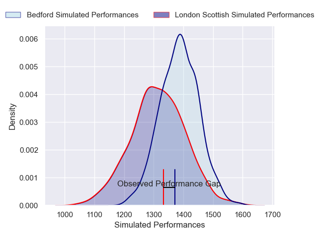
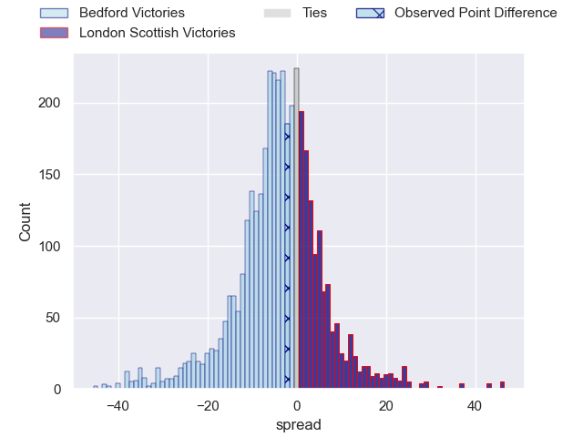
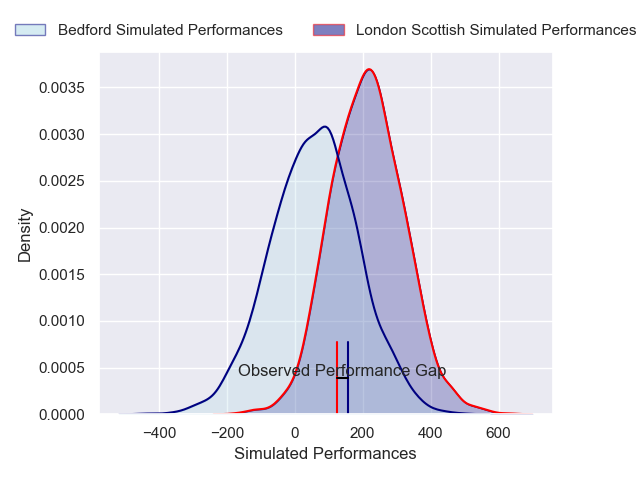
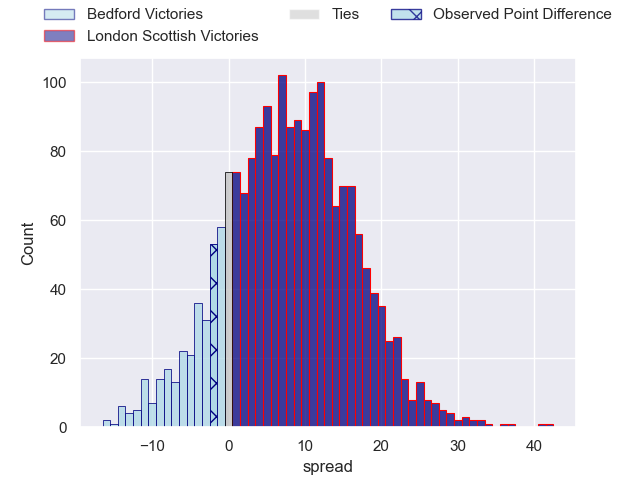

---  
layout: page  
title: Bedford at London Scottish; 22-20  
date: 2024-12-15 18:00:00 -0500  
categories: "RFU Championship 2024" match review  
---
# Bedford at London Scottish; 22-20

# Club Level Predictions

The first set of predictions treats a club as the smallest object, as the club develops its members, organizes a gameplan, and deploys its players as needed for each match. This club model has a prediction of 0.401, which translates to predicting Bedford to win by 3.6.

Our Over/Under is 60.5 - and combined with the spread above, we have a predicted scoreline of 32 to 29

Each club has a rating and a rating deviation (similar to a Glicko rating), and expected performances can be generated. This allows for simulated matches and spreads like the ones below.
## Projected Performances - Club Model

## Projected Spreads - Club Model

## Projected Results - Club Model

# Player Level Predictions

Treating teams instead as an entity made up of the currently active players, I have ratings for each player in an altogether different system. These can be combined to form team ratings once teamsheets are announced, weighting starters a bit higher than the reserves. After the match is played, players can be weighted by their minutes on the field, allowing for an accurate measure of the team's composition. With these compiled team ratings, we can make predictions, measure inaccuracy, and update the individual player ratings.
## Prediction without Player Minutes: London Scottish by 5.9

London Scottish by 1.4 on a neutral pitch

## Projected Performances - Player Model

## Projected Spreads - Player Model

## Projected Results - Player Model

|   Away Minutes | Away Player             |   Away Percentile |   Number |   Home Percentile | Home Player          |   Home Minutes |
|---------------:|:------------------------|------------------:|---------:|------------------:|:---------------------|---------------:|
|             80 | Jamie Jack              |             46.87 |        1 |             34.42 | Tom Osborne          |             21 |
|             80 | Johnny Stewart          |             56.81 |        2 |             46.95 | Austin Wallis        |             15 |
|             23 | Oisin Heffernan         |             83.83 |        3 |             17.89 | Ashley Challenger    |             15 |
|             80 | George Smith            |             34.01 |        4 |             26.29 | Matt Wilkinson       |             59 |
|             80 | Rory Ward               |             70.78 |        5 |             43.43 | Jake Spurway         |             22 |
|             80 | Luke Frost              |             12    |        6 |             18.77 | Will Trenholm        |             56 |
|             65 | Joe Howard              |             17.74 |        7 |             29.48 | Bailey Ransom        |             67 |
|             32 | Freddie Tuilagi         |             11.86 |        8 |             27.48 | Zach Carr            |             28 |
|             21 | James Lennon            |             20    |        9 |             14.59 | Jonny Law            |             17 |
|             10 | William Maisey          |             88.69 |       10 |             30.71 | Alexander Lloyd-Seed |             10 |
|             80 | Alfie Garside           |             78.06 |       11 |             65.74 | Roma Zheng           |             32 |
|             23 | Michael Le Bourgeois    |             76.84 |       12 |             63.16 | Ben Waghorn          |             48 |
|             13 | Lucas Titherington      |             66.51 |       13 |             90.24 | Sean Kerr            |             80 |
|             34 | Matt Worley             |             84.9  |       14 |             83.94 | Will Brown           |             80 |
|             58 | Ewan Baker              |             38.95 |       15 |             45.88 | Cameron Anderson     |             80 |
|             51 | George Makepeace-Cubitt |             75.35 |       16 |             37.7  | Lewis Gjaltema       |             70 |
|             80 | Alex Woolford           |             77.89 |       17 |             57.31 | Hayden Hyde          |             52 |
|             49 | Joey Conway             |             61.98 |       18 |             26.46 | Tom Wilstead         |             80 |
|             39 | Jonny Weimann           |            nan    |       19 |             24.87 | Alex Wardell         |             80 |
|             31 | Cameron King            |              8.71 |       20 |            nan    | Archie Stanley       |             70 |
|             80 | Josh Matavesi           |             12.82 |       21 |             14.14 | Ioan Rhys Davies     |             10 |
|             80 | Tommy Herman            |             53.68 |       22 |            nan    | nan                  |            nan |
|             63 | Beltus Nonleh           |             57.32 |       23 |            nan    | nan                  |            nan |

