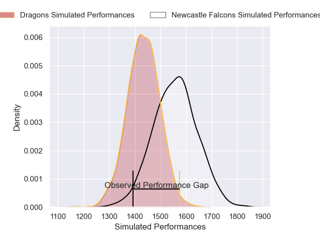
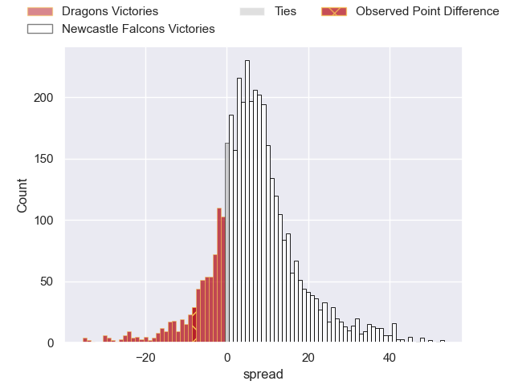
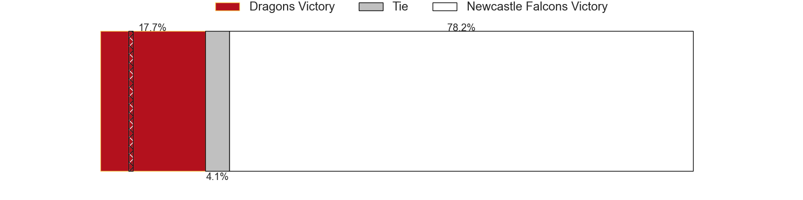
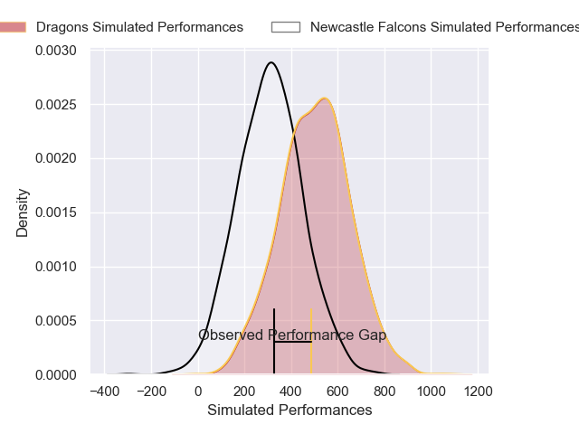
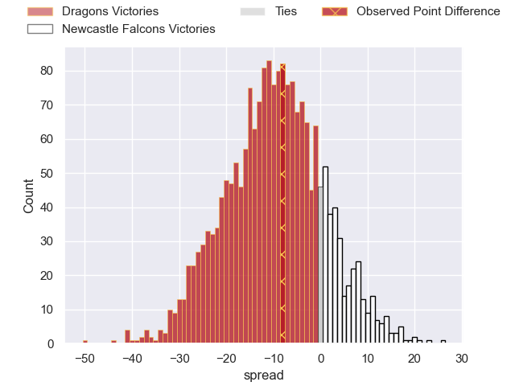

---  
layout: page  
title: Dragons at Newcastle Falcons; 22-14  
date: 2024-12-15 18:00:00 -0500  
categories: "European Rugby Challenge Cup 2024" match review  
---
# Dragons at Newcastle Falcons; 22-14

# Club Level Predictions

The first set of predictions treats a club as the smallest object, as the club develops its members, organizes a gameplan, and deploys its players as needed for each match. This club model has a prediction of 0.668, which translates to predicting Newcastle Falcons to win by 6.2.

Our Over/Under is 48.5 - and combined with the spread above, we have a predicted scoreline of 21 to 27

Each club has a rating and a rating deviation (similar to a Glicko rating), and expected performances can be generated. This allows for simulated matches and spreads like the ones below.
## Projected Performances - Club Model

## Projected Spreads - Club Model

## Projected Results - Club Model

# Player Level Predictions

Treating teams instead as an entity made up of the currently active players, I have ratings for each player in an altogether different system. These can be combined to form team ratings once teamsheets are announced, weighting starters a bit higher than the reserves. After the match is played, players can be weighted by their minutes on the field, allowing for an accurate measure of the team's composition. With these compiled team ratings, we can make predictions, measure inaccuracy, and update the individual player ratings.
## Prediction without Player Minutes: Newcastle Falcons by 10.6

Dragons by 3.2 on a neutral pitch

## Projected Performances - Player Model

## Projected Spreads - Player Model

## Projected Results - Player Model

|   Away Minutes | Away Player      |   Away Percentile |   Number |   Home Percentile | Home Player         |   Home Minutes |
|---------------:|:-----------------|------------------:|---------:|------------------:|:--------------------|---------------:|
|             20 | Rodrigo Martinez |             68.89 |        1 |             63.75 | Murray McCallum     |             81 |
|             33 | Brodie Coghlan   |             59.03 |        2 |             54.67 | Ollie Fletcher      |             15 |
|             41 | Chris Coleman    |             30.84 |        3 |             30.71 | Callum Hancock      |             81 |
|             32 | Steven Cummins   |             13.22 |        4 |              2.46 | Sebastian de Chaves |             56 |
|             48 | George Nott      |              6.93 |        5 |             17.87 | Kiran McDonald      |             81 |
|             71 | Ryan Woodman     |             67.04 |        6 |             56.13 | Freddie Lockwood    |             81 |
|             40 | Dan Lydiate      |             37.14 |        7 |             96    | Tom Gordon          |             20 |
|             40 | Aaron Wainwright |             24.04 |        8 |             17.28 | Callum Chick        |             81 |
|             40 | Aaron Wainwright |             24.04 |        8 |             17.28 | Callum Chick        |             15 |
|             40 | Aaron Wainwright |             24.04 |        8 |             17.28 | Callum Chick        |              0 |
|             40 | Aaron Wainwright |             24.04 |        8 |             17.28 | Callum Chick        |             51 |
|             81 | Che Hope         |             46.51 |        9 |              0.66 | Sam Stuart          |             30 |
|             15 | Angus O'Brien    |             18.98 |       10 |             73.06 | Kieran Wilkinson    |             25 |
|             81 | Oli Andrew       |             46.93 |       11 |             42.18 | Ben Stevenson       |             61 |
|             81 | Aneurin Owen     |             72.03 |       12 |             57.61 | Connor Doherty      |             61 |
|             66 | Joe Westwood     |             63.98 |       13 |             57.41 | Alex Hearle         |             61 |
|             66 | Ewan Rosser      |             26.61 |       14 |             24.51 | Adam Radwan         |             81 |
|             78 | Huw Anderson     |             42.14 |       15 |             82.62 | Ben Redshaw         |             59 |
|             81 | Oli Burrows      |            nan    |       16 |             69.94 | Bryan Byrne         |             66 |
|             49 | Josh Reynolds    |             39.12 |       17 |            nan    | Mike Rewcastle      |             78 |
|             81 | Paula Latu       |            nan    |       18 |            nan    | Connor Hancock      |             30 |
|             22 | Nick Thomas      |            nan    |       19 |            nan    | Finn Baker          |             20 |
|             41 | Evan Minto       |            nan    |       20 |            nan    | Ollie Leatherbarrow |             81 |
|             81 | Rhodri Williams  |             84.88 |       21 |             44.19 | Hugh O'Sullivan     |             51 |
|             66 | Cai Evans        |             11.46 |       22 |              1.63 | Brett Connon        |             61 |
|              8 | Harry Wilson     |             98.92 |       23 |             75.72 | Oliver Spencer      |             81 |
|             54 | Harry Wilson     |             98.92 |       23 |             75.72 | Oliver Spencer      |             81 |
|             81 | Harry Wilson     |             98.92 |       23 |             75.72 | Oliver Spencer      |             81 |

