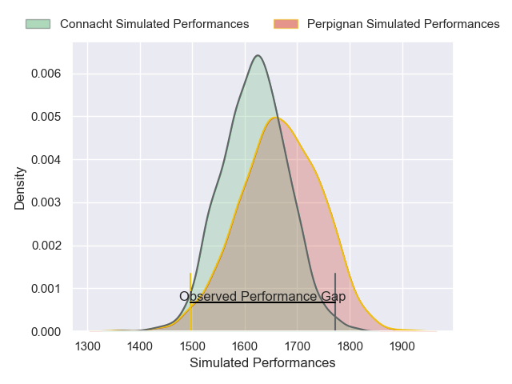
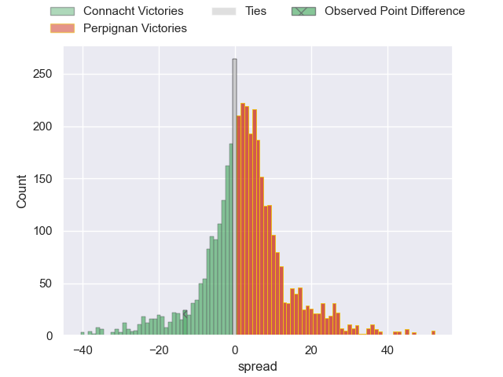
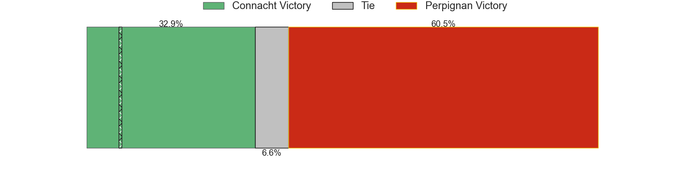
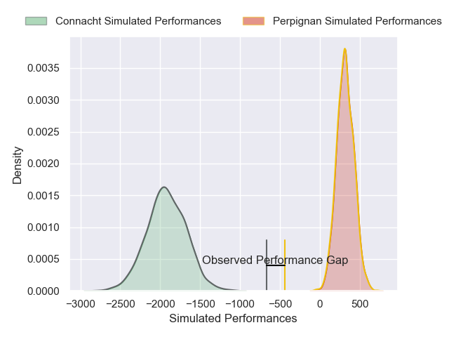
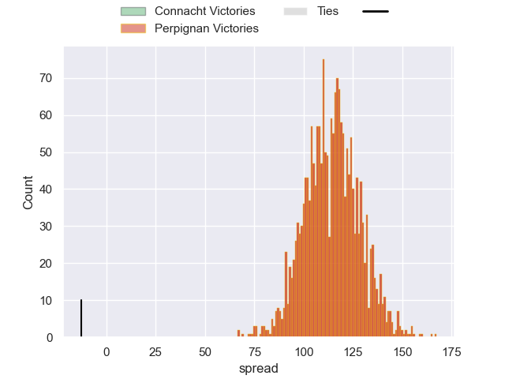

---  
layout: page  
title: Connacht at Perpignan; 31-18  
date: 2024-12-15 18:00:00 -0500  
categories: "European Rugby Challenge Cup 2024" match review  
---
# Connacht at Perpignan; 31-18

# Club Level Predictions

The first set of predictions treats a club as the smallest object, as the club develops its members, organizes a gameplan, and deploys its players as needed for each match. This club model has a prediction of 0.565, which translates to predicting Perpignan to win by 2.3.

Our Over/Under is 42.5 - and combined with the spread above, we have a predicted scoreline of 20 to 23

Each club has a rating and a rating deviation (similar to a Glicko rating), and expected performances can be generated. This allows for simulated matches and spreads like the ones below.
## Projected Performances - Club Model

## Projected Spreads - Club Model

## Projected Results - Club Model

# Player Level Predictions

Treating teams instead as an entity made up of the currently active players, I have ratings for each player in an altogether different system. These can be combined to form team ratings once teamsheets are announced, weighting starters a bit higher than the reserves. After the match is played, players can be weighted by their minutes on the field, allowing for an accurate measure of the team's composition. With these compiled team ratings, we can make predictions, measure inaccuracy, and update the individual player ratings.
## Prediction without Player Minutes: Perpignan by 32.6

Perpignan by 17.7 on a neutral pitch

## Projected Performances - Player Model

## Projected Spreads - Player Model

## Projected Results - Player Model

|   Away Minutes | Away Player           |   Away Percentile |   Number |   Home Percentile | Home Player              |   Home Minutes |
|---------------:|:----------------------|------------------:|---------:|------------------:|:-------------------------|---------------:|
|             81 | Denis Buckley         |             77.69 |        1 |             68.48 | Lorencio Boyer Gallardo  |             12 |
|             47 | Eoin de Buitlear      |             71.67 |        2 |             56.96 | Seilala Lam              |             12 |
|             67 | Sam Illo              |             71.66 |        3 |             41.79 | Nemo Roelofse            |             81 |
|             31 | Darragh Murray        |             41.65 |        4 |             36.94 | Alessandro Ortombina     |             47 |
|              4 | Joe Joyce             |             43.52 |        5 |             26.73 | Adrien Warion            |              9 |
|             50 | Cian Prendergast      |             26.05 |        6 |             27.08 | Noe Della Schiava        |             34 |
|             81 | Shamus Hurley-Langton |             77.98 |        7 |             58.53 | Max Hicks                |             52 |
|             18 | Sean O'Brien          |            100    |        8 |             28.98 | Andro Dvali              |             25 |
|             81 | Sean O'Brien          |            100    |        8 |             28.98 | Andro Dvali              |             25 |
|             26 | Sean O'Brien          |            100    |        8 |             28.98 | Andro Dvali              |             25 |
|             24 | Sean O'Brien          |            100    |        8 |             28.98 | Andro Dvali              |             25 |
|             14 | Sean O'Brien          |            100    |        8 |             28.98 | Andro Dvali              |             25 |
|             19 | Sean O'Brien          |            100    |        8 |             28.98 | Andro Dvali              |             25 |
|             52 | Sean O'Brien          |            100    |        8 |             28.98 | Andro Dvali              |             25 |
|             72 | Sean O'Brien          |            100    |        8 |             28.98 | Andro Dvali              |             25 |
|              4 | Sean O'Brien          |            100    |        8 |             28.98 | Andro Dvali              |             25 |
|              3 | Sean O'Brien          |            100    |        8 |             28.98 | Andro Dvali              |             25 |
|             59 | Sean O'Brien          |            100    |        8 |             28.98 | Andro Dvali              |             25 |
|             81 | Matthew Devine        |             80.98 |        9 |             19.18 | James Hall               |             81 |
|             81 | Jack Carty            |             96.36 |       10 |              6.67 | Antoine Aucagne          |             24 |
|             45 | Andrew Smith          |             17.57 |       11 |             17.25 | Maxim Granell            |             61 |
|              4 | Cathal Forde          |              2.87 |       12 |             32.06 | Apisai Naqalevu          |              4 |
|             81 | Byron Ralston         |             17.42 |       13 |              6.41 | Eneriko Buliruarua       |             45 |
|             81 | Chay Mullins          |             78.38 |       14 |             26.15 | Jefferson Joseph         |             81 |
|             81 | Santiago Cordero      |             95.69 |       15 |              2.43 | Ali Crossdale            |             81 |
|              4 | Adam McBurney         |             46.64 |       16 |              5.01 | Victor Montgaillard      |             81 |
|             81 | Jordan Duggan         |             38.9  |       17 |            nan    | Joan Barcenilla D'Onghia |             62 |
|              4 | Jack Aungier          |             29.16 |       18 |             23.55 | Kieran Brookes           |             55 |
|              4 | Oisin Dowling         |             66.87 |       19 |             54.71 | Bastien Chinarro         |             57 |
|              4 | Paul Boyle            |             13.36 |       20 |             77.63 | So'otala Fa'aso'o        |             36 |
|              4 | Ben Murphy            |             47.54 |       21 |             24.1  | Gela Aprasidze           |             63 |
|              4 | David Hawkshaw        |             41.24 |       22 |             68.69 | Tommaso Allan            |             78 |
|              4 | Conor Oliver          |             86.55 |       23 |              5.84 | Alivereti Duguivalu      |             19 |

