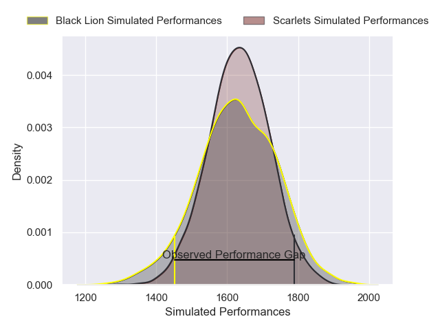
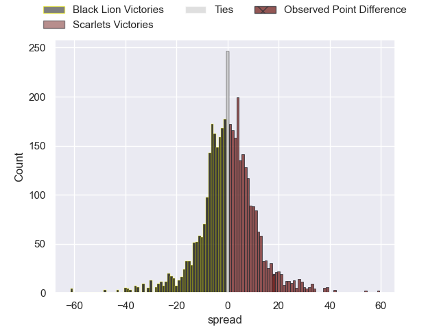
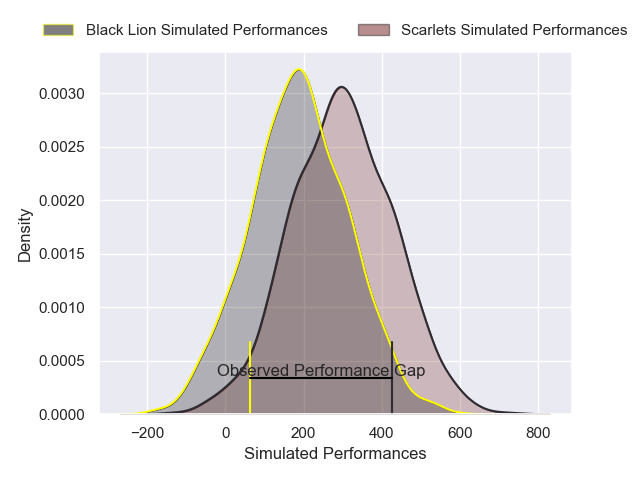
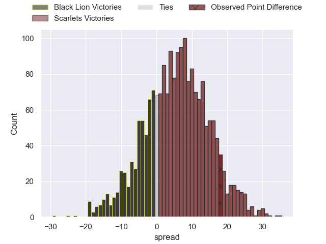
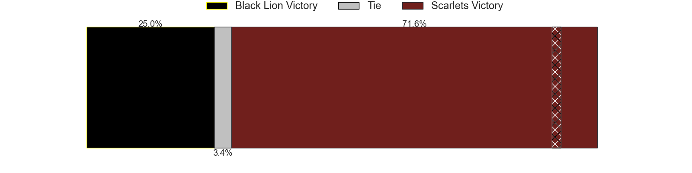

---  
layout: page  
title: Black Lion at Scarlets; 18-36  
date: 2024-12-15 18:00:00 -0500  
categories: "European Rugby Challenge Cup 2024" match review  
---
# Black Lion at Scarlets; 18-36

# Club Level Predictions

The first set of predictions treats a club as the smallest object, as the club develops its members, organizes a gameplan, and deploys its players as needed for each match. This club model has a prediction of 0.505, which translates to predicting Scarlets to win by 0.2.

Our Over/Under is 55.5 - and combined with the spread above, we have a predicted scoreline of 28 to 28

Each club has a rating and a rating deviation (similar to a Glicko rating), and expected performances can be generated. This allows for simulated matches and spreads like the ones below.
## Projected Performances - Club Model

## Projected Spreads - Club Model

## Projected Results - Club Model

# Player Level Predictions

Treating teams instead as an entity made up of the currently active players, I have ratings for each player in an altogether different system. These can be combined to form team ratings once teamsheets are announced, weighting starters a bit higher than the reserves. After the match is played, players can be weighted by their minutes on the field, allowing for an accurate measure of the team's composition. With these compiled team ratings, we can make predictions, measure inaccuracy, and update the individual player ratings.
## Prediction without Player Minutes: Scarlets by 8.8

Black Lion by 0.4 on a neutral pitch

## Projected Performances - Player Model

## Projected Spreads - Player Model

## Projected Results - Player Model

|   Away Minutes | Away Player             |   Away Percentile |   Number |   Home Percentile | Home Player          |   Home Minutes |
|---------------:|:------------------------|------------------:|---------:|------------------:|:---------------------|---------------:|
|             80 | Vasil Kakovin           |             28.64 |        1 |             87.52 | Kemsley Mathias      |             70 |
|             10 | Irakli Kvatadze         |             32.55 |        2 |             93.77 | Marnus van der Merwe |             29 |
|             80 | Giorgi Chkhartishvili   |             27.97 |        3 |             71.83 | Henry Thomas         |             51 |
|             28 | Lado Chachanidze        |             32.27 |        4 |             91.8  | Max Douglas          |             45 |
|             64 | Mikheil Babunashvili    |             86.33 |        5 |             89.97 | Sam Lousi            |             44 |
|             35 | Sandro Mamamtavrishvili |             81.6  |        6 |             88.67 | Taine Plumtree       |             44 |
|             73 | Giorgi Tsutskiridze     |             79.05 |        7 |             80.32 | Josh MacLeod         |             70 |
|             80 | Luka Ivanishvili        |             60.27 |        8 |             88.81 | Vaea Fifita          |              9 |
|             16 | Tengiz Peranidze        |             38.87 |        9 |             42.86 | Gareth Davies        |             55 |
|             12 | Luka Matkava            |             89.8  |       10 |             45.1  | Sam Costelow         |             80 |
|              7 | Amiran Shvangiradze     |             46.15 |       11 |             34.79 | Ellis Mee            |             80 |
|             12 | Tornike Kakhoidze       |             44.26 |       12 |             92.05 | Johnny Williams      |             68 |
|             80 | Demur Tapladze          |             74.88 |       13 |             41.71 | Joe Roberts          |             80 |
|             35 | Aka Tabutsadze          |             84.75 |       14 |             67.47 | Tom Rogers           |             80 |
|             55 | Luka Tsirekidze         |             22.55 |       15 |             18.67 | Ioan Nicholas        |             80 |
|             36 | Dato Abdushelishvili    |             52.2  |       16 |            nan    | Archer Holz          |             57 |
|             73 | Bachuki Tchumbadze      |            nan    |       17 |             85.31 | Alec Hepburn         |             42 |
|             61 | Tengiz Zamtaradze       |             15.26 |       18 |              8.1  | Shaun Evans          |             80 |
|             52 | Giorgi Sinauridze       |            nan    |       19 |             60.05 | Jarrod Taylor        |             10 |
|             80 | Davit Khuroshvili       |            nan    |       20 |              4.01 | Jac Price            |             65 |
|              8 | Sandro Todua            |             90.27 |       21 |             18.44 | Archie Hughes        |             80 |
|             80 | Demuri Epremidze        |             33    |       22 |             30.81 | Eddie James          |             10 |
|             72 | Ioane Metreveli         |             33.27 |       23 |             10    | Ioan Lloyd           |             80 |

