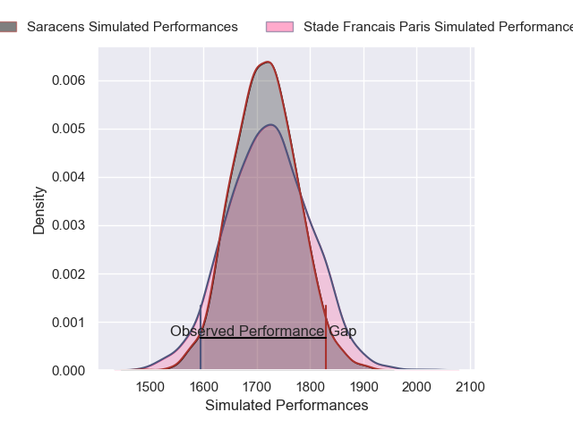
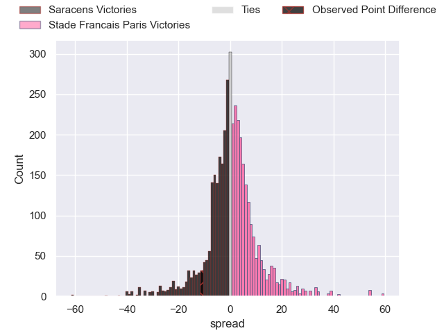
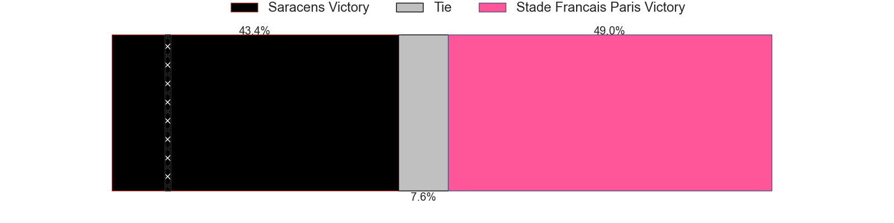
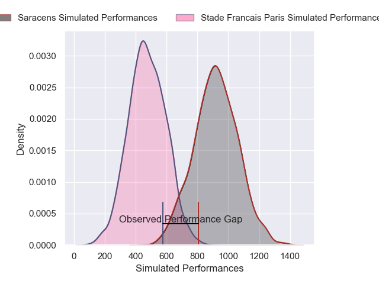
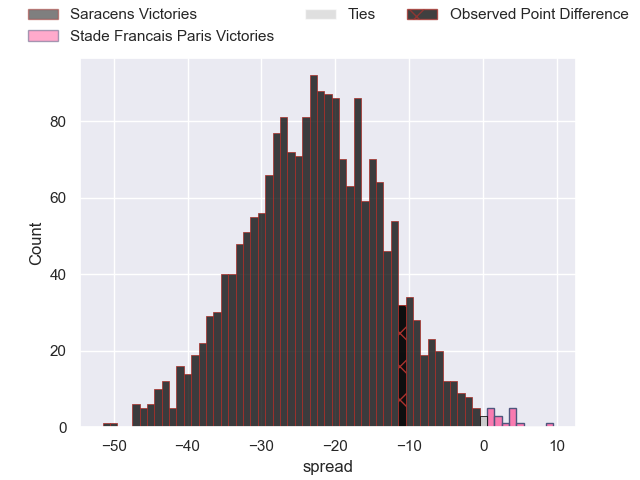
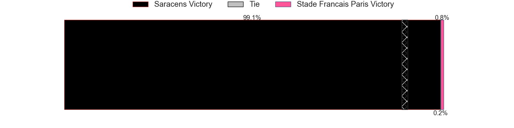

---  
layout: page  
title: Saracens at Stade Francais Paris; 28-17  
date: 2024-12-15 18:00:00 -0500  
categories: "European Rugby Champions Cup 2024" match review  
---
# Saracens at Stade Francais Paris; 28-17

# Club Level Predictions

The first set of predictions treats a club as the smallest object, as the club develops its members, organizes a gameplan, and deploys its players as needed for each match. This club model has a prediction of 0.507, which translates to predicting Stade Francais Paris to win by 0.2.

Our Over/Under is 28.5 - and combined with the spread above, we have a predicted scoreline of 14 to 14

Each club has a rating and a rating deviation (similar to a Glicko rating), and expected performances can be generated. This allows for simulated matches and spreads like the ones below.
## Projected Performances - Club Model

## Projected Spreads - Club Model

## Projected Results - Club Model

# Player Level Predictions

Treating teams instead as an entity made up of the currently active players, I have ratings for each player in an altogether different system. These can be combined to form team ratings once teamsheets are announced, weighting starters a bit higher than the reserves. After the match is played, players can be weighted by their minutes on the field, allowing for an accurate measure of the team's composition. With these compiled team ratings, we can make predictions, measure inaccuracy, and update the individual player ratings.
## Prediction without Player Minutes: Saracens by 2.7

Saracens by 18.1 on a neutral pitch

## Projected Performances - Player Model

## Projected Spreads - Player Model

## Projected Results - Player Model

|   Away Minutes | Away Player          |   Away Percentile |   Number |   Home Percentile | Home Player              |   Home Minutes |
|---------------:|:---------------------|------------------:|---------:|------------------:|:-------------------------|---------------:|
|             17 | Rhys Carre           |             43.18 |        1 |             64.43 | Clement Castets          |             83 |
|             19 | Jamie George         |             97.18 |        2 |             96.09 | Giacomo Nicotera         |             70 |
|             81 | Marco Riccioni       |             74.76 |        3 |             69.56 | Paul Alo-Emile           |             35 |
|              6 | Maro Itoje           |             98.95 |        4 |              8.17 | Paul Gabrillagues        |             13 |
|             44 | Nick Isiekwe         |             95.61 |        5 |             16.24 | Tanginoa Halaifonua      |             81 |
|             62 | Theo McFarland       |             33.88 |        6 |             87.64 | Sekou Macalou            |             81 |
|             57 | Ben Earl             |             99.22 |        7 |             54.62 | Ryan Chapuis             |             81 |
|             64 | Tom Willis           |             42.44 |        8 |             19.13 | Juan Martin Scelzo       |             64 |
|             11 | Ivan van Zyl         |             88.1  |        9 |             96.95 | Brad Weber               |              0 |
|              0 | Fergus Burke         |             66.13 |       10 |             77.28 | Zack Henry               |             51 |
|             16 | Rotimi Segun         |             73.29 |       11 |             51.69 | Charles Laloi            |             83 |
|             33 | Nick Tompkins        |             99.71 |       12 |             74.93 | Jeremy Ward              |             60 |
|             81 | Lucio Cinti          |             73.46 |       13 |             64.25 | Joe Marchant             |             83 |
|             67 | Liam Williams        |             97.41 |       14 |             78    | Peniasi Dakuwaqa         |             74 |
|             21 | Elliot Daly          |             92.66 |       15 |             73.82 | Leo Barre                |             74 |
|             83 | Theo Dan             |             77.46 |       16 |             17.68 | Lucas Peyresblanques     |             48 |
|             83 | Phil Brantingham     |             15.35 |       17 |             41.53 | Moses Alo-Emile          |             54 |
|             83 | Alec Clarey          |             75.14 |       18 |             33.35 | Hugo Ndiaye              |             70 |
|             81 | Harry Wilson         |             97.55 |       19 |             60.93 | Setareki Turagacoke      |             64 |
|             69 | Harry Wilson         |             97.55 |       19 |             60.93 | Setareki Turagacoke      |             64 |
|             21 | Harry Wilson         |             97.55 |       19 |             60.93 | Setareki Turagacoke      |             64 |
|             19 | Harry Wilson         |             97.55 |       19 |             60.93 | Setareki Turagacoke      |             64 |
|             81 | Juan Martin Gonzalez |             95.51 |       20 |             17.89 | Andy Timo                |              4 |
|             81 | Gareth Simpson       |             28.14 |       21 |             54.82 | Yoan Tanga               |             17 |
|              4 | Tiff Eden            |             11.97 |       22 |             19.8  | Samuel Ezeala            |              4 |
|              4 | Olly Hartley         |             36.34 |       23 |             21.3  | Louis Foursans-Bourdette |             55 |

