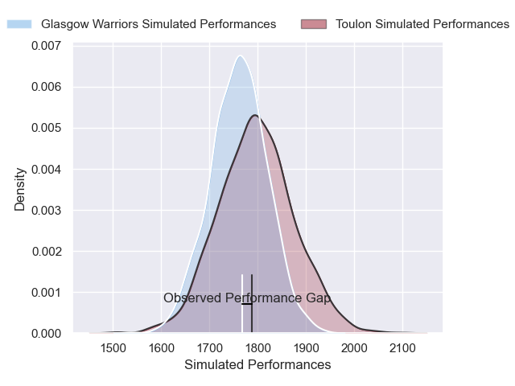
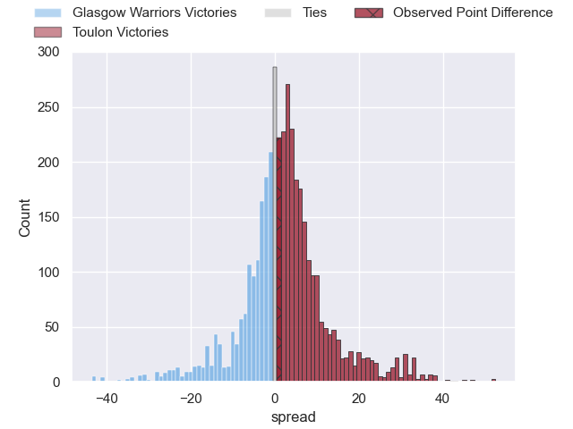
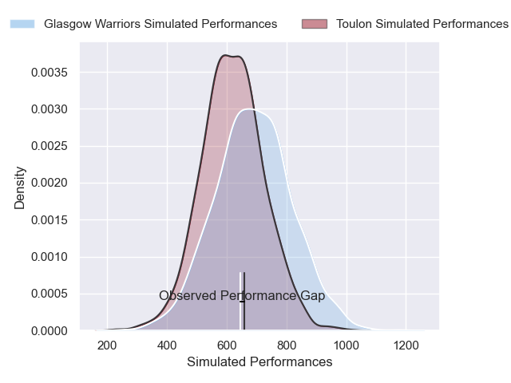
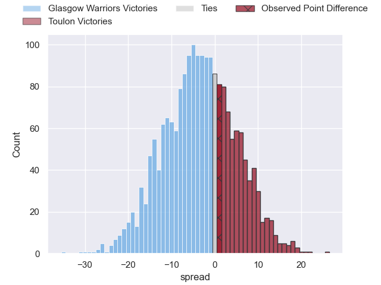

---  
layout: page  
title: Glasgow Warriors at Toulon; 29-30  
date: 2024-12-15 18:00:00 -0500  
categories: "European Rugby Champions Cup 2024" match review  
---
# Glasgow Warriors at Toulon; 29-30

# Club Level Predictions

The first set of predictions treats a club as the smallest object, as the club develops its members, organizes a gameplan, and deploys its players as needed for each match. This club model has a prediction of 0.549, which translates to predicting Toulon to win by 1.7.

Our Over/Under is 64.5 - and combined with the spread above, we have a predicted scoreline of 31 to 33

Each club has a rating and a rating deviation (similar to a Glicko rating), and expected performances can be generated. This allows for simulated matches and spreads like the ones below.
## Projected Performances - Club Model

## Projected Spreads - Club Model

## Projected Results - Club Model

# Player Level Predictions

Treating teams instead as an entity made up of the currently active players, I have ratings for each player in an altogether different system. These can be combined to form team ratings once teamsheets are announced, weighting starters a bit higher than the reserves. After the match is played, players can be weighted by their minutes on the field, allowing for an accurate measure of the team's composition. With these compiled team ratings, we can make predictions, measure inaccuracy, and update the individual player ratings.
## Prediction without Player Minutes: Toulon by 11.1

Glasgow Warriors by 0.6 on a neutral pitch

## Projected Performances - Player Model

## Projected Spreads - Player Model

## Projected Results - Player Model

|   Away Minutes | Away Player        |   Away Percentile |   Number |   Home Percentile | Home Player            |   Home Minutes |
|---------------:|:-------------------|------------------:|---------:|------------------:|:-----------------------|---------------:|
|             35 | Jamie Bhatti       |             91.79 |        1 |             90.65 | Dany Priso             |             66 |
|              6 | Gregor Hiddleston  |             79.13 |        2 |             90.65 | Teddy Baubigny         |             66 |
|             35 | Sam Talakai        |             58.54 |        3 |             91.39 | Kyle Sinckler          |             66 |
|             80 | Olujare Oguntibeju |             34.73 |        4 |             86.87 | David Ribbans          |             66 |
|             25 | Alex Samuel        |             75.93 |        5 |             82.32 | Brian Alainu'uese      |             66 |
|             80 | Henco Venter       |             97.61 |        6 |             74.02 | Lewis Ludlam           |             66 |
|             19 | Rory Darge         |             93.44 |        7 |             98.13 | Charles Ollivon        |             35 |
|             13 | Jack Mann          |             41.57 |        8 |             85.31 | Facundo Isa            |             80 |
|              6 | Ben Afshar         |             31.23 |        9 |             99.34 | Baptiste Serin         |             80 |
|             67 | Duncan Weir        |             86.94 |       10 |             79.18 | Paolo Garbisi          |             55 |
|             74 | Kyle Rowe          |             87.63 |       11 |             84.2  | Gabin Villiere         |             15 |
|             66 | Stafford McDowall  |             93.23 |       12 |             17.96 | Jérémy Sinzelle        |             25 |
|             66 | Sione Tuipulotu    |             87.93 |       13 |             90.19 | Leicester Fainga'anuku |             25 |
|             80 | Jamie Dobie        |             90.89 |       14 |             94.01 | Jiuta Wainiqolo        |             25 |
|             80 | Josh McKay         |             79.11 |       15 |             58.23 | Marius Domon           |              6 |
|             65 | Rory Sutherland    |             73.83 |       16 |             22.5  | Daniel Brennan         |             30 |
|             30 | Johnny Matthews    |             75.86 |       17 |             77.9  | Beka Gigashvili        |             30 |
|             80 | Zander Fagerson    |             92.99 |       18 |             74.92 | Gianmarco Lucchesi     |             30 |
|             80 | Scott Cummings     |             99.45 |       19 |             68.82 | Matthias Halagahu      |             80 |
|             74 | Angus Fraser       |             41.43 |       20 |             84.08 | Enzo Herve             |             55 |
|             80 | Matt Fagerson      |             96.93 |       21 |             70.1  | Jules Danglot          |             30 |
|             80 | George Horne       |            100    |       22 |             79.13 | Selevasio Tolofua      |             30 |
|             55 | Tom Jordan         |             72.45 |       23 |             82.8  | Seta Tuicuvu           |             55 |

