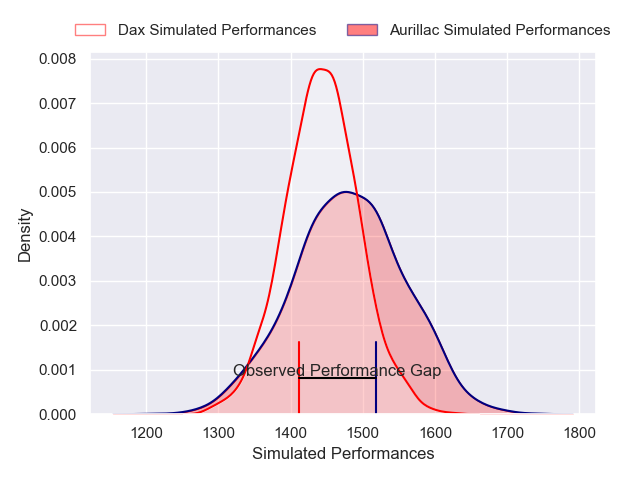
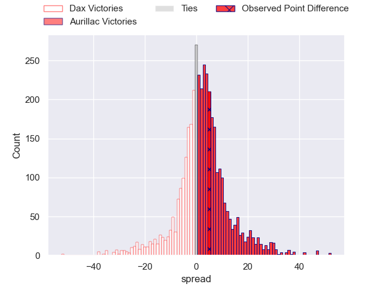
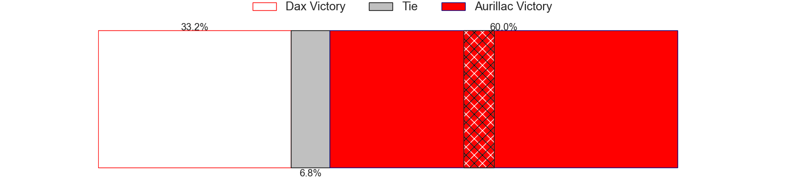
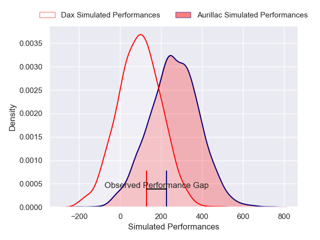
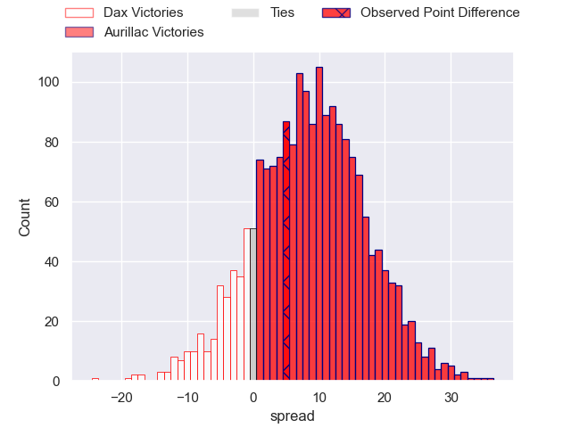
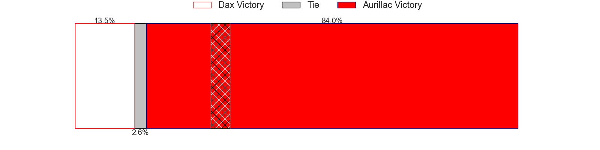

---  
layout: page  
title: Dax at Aurillac; 22-27  
date: 2024-12-20 18:00:00 -0500  
categories: "Pro D2 2024" match review  
---
# Dax at Aurillac; 22-27

# Club Level Predictions

The first set of predictions treats a club as the smallest object, as the club develops its members, organizes a gameplan, and deploys its players as needed for each match. This club model has a prediction of 0.556, which translates to predicting Aurillac to win by 2.0.

Our Over/Under is 36.5 - and combined with the spread above, we have a predicted scoreline of 17 to 19

Each club has a rating and a rating deviation (similar to a Glicko rating), and expected performances can be generated. This allows for simulated matches and spreads like the ones below.
## Projected Performances - Club Model

## Projected Spreads - Club Model

## Projected Results - Club Model

# Player Level Predictions

Treating teams instead as an entity made up of the currently active players, I have ratings for each player in an altogether different system. These can be combined to form team ratings once teamsheets are announced, weighting starters a bit higher than the reserves. After the match is played, players can be weighted by their minutes on the field, allowing for an accurate measure of the team's composition. With these compiled team ratings, we can make predictions, measure inaccuracy, and update the individual player ratings.
## Prediction without Player Minutes: Aurillac by 8.4

Dax by 4.6 on a neutral pitch

## Projected Performances - Player Model

## Projected Spreads - Player Model

## Projected Results - Player Model

|   Away Minutes | Away Player           |   Away Percentile |   Number |   Home Percentile | Home Player             |   Home Minutes |
|---------------:|:----------------------|------------------:|---------:|------------------:|:------------------------|---------------:|
|             80 | Dino Casadei          |             55.99 |        1 |             48.15 | Irakli Mtchedlidze      |             47 |
|             57 | Louis Barrere         |              8.39 |        2 |              9.01 | Luka Nioradze           |             57 |
|             46 | Diogo Hasse Ferreira  |              6.52 |        3 |              7.96 | Giorgi Kartvelishvili   |             24 |
|             21 | Étienne Loiret        |             52.47 |        4 |             19.17 | Louis Bruinsma          |             80 |
|             25 | Jean-Baptiste Singer  |              5.03 |        5 |              5.55 | Abongile Nonkontwana    |             80 |
|             25 | Jean-Baptiste Barrère |             14.03 |        6 |             74.57 | Eoghan Masterson        |             80 |
|             52 | Paul Arnaud Ausset    |             50.77 |        7 |             61.05 | Lucas Oudard            |             33 |
|             40 | Genesis Mamea Lemalu  |             62.03 |        8 |             12.32 | Didier Tison            |             80 |
|             28 | Paul Ravier           |             78.26 |        9 |              8.86 | David Delarue           |             80 |
|             28 | Romuald Séguy         |             48.89 |       10 |              0.2  | Ugo Seunes              |             46 |
|             22 | Diego Miranda         |             55.11 |       11 |             15.55 | AJ Coertzen             |             27 |
|             80 | Jale Vatubua          |              1.27 |       12 |             10.73 | Elijah Niko             |             53 |
|             22 | Benjamin Puntous      |             26.05 |       13 |             56.88 | Hugo Bastard            |             57 |
|             22 | Maxime Oltmann        |             14.33 |       14 |             52.44 | Karl Martin             |             80 |
|             23 | Théo Duprat           |             40.74 |       15 |             18.89 | Dachi Papunashvili      |             80 |
|             33 | Louis Mary            |             45.33 |       16 |             26.24 | Ronan Loughnane         |             58 |
|             80 | Kito Falatea          |             51.4  |       17 |             38.94 | Mehdi Slamani           |             28 |
|             60 | David Lolohea         |             41.63 |       18 |             34.55 | Tedo Abzhandadze        |             16 |
|             20 | Arnaud Aletti         |             81.97 |       19 |             81.18 | Heath Backhouse         |             52 |
|             80 | Brice Ferrer          |             40.5  |       20 |             45.7  | Mael Perrin             |             40 |
|             37 | Sylvère Reteau        |             76.81 |       21 |             52.54 | Gymael Jean-Jacques     |             80 |
|             80 | Hugo Fourquet         |             85.17 |       22 |             30.28 | Dominic Robertson-McCoy |             80 |
|             80 | Viliame Tutuvili      |             41.54 |       23 |            nan    | Boris Hadinegoro        |             16 |

