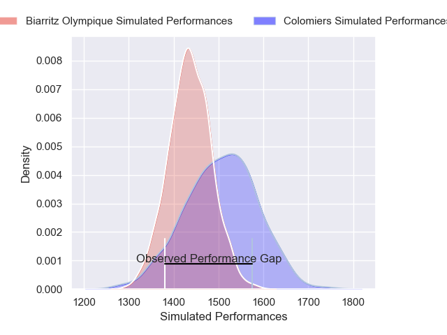
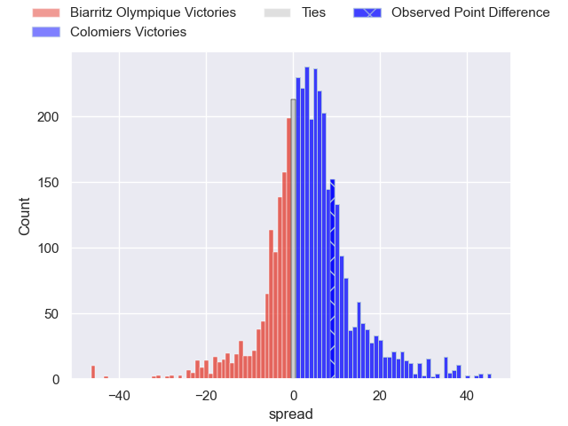
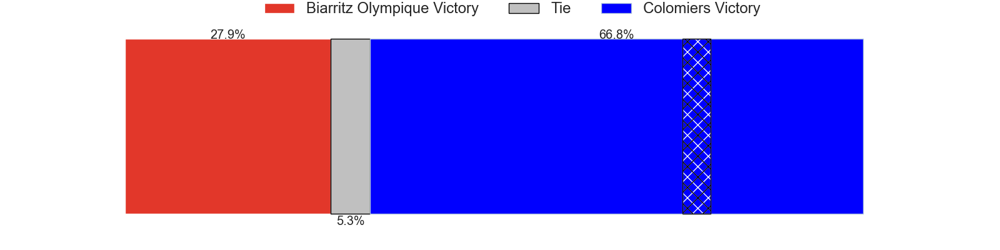
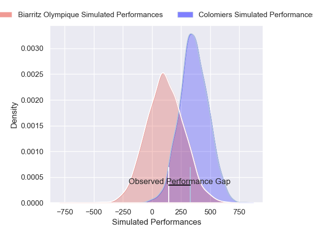
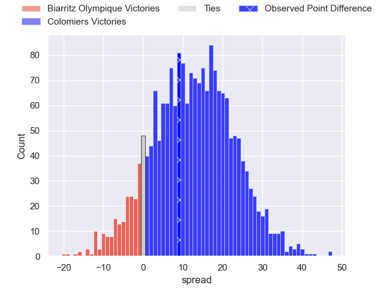
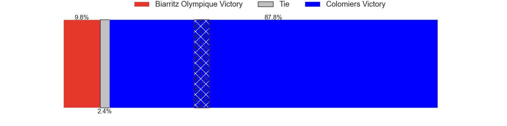

---  
layout: page  
title: Biarritz Olympique at Colomiers; 20-29  
date: 2024-12-20 18:00:00 -0500  
categories: "Pro D2 2024" match review  
---
# Biarritz Olympique at Colomiers; 20-29

# Club Level Predictions

The first set of predictions treats a club as the smallest object, as the club develops its members, organizes a gameplan, and deploys its players as needed for each match. This club model has a prediction of 0.601, which translates to predicting Colomiers to win by 3.6.

Our Over/Under is 41.5 - and combined with the spread above, we have a predicted scoreline of 19 to 22

Each club has a rating and a rating deviation (similar to a Glicko rating), and expected performances can be generated. This allows for simulated matches and spreads like the ones below.
## Projected Performances - Club Model

## Projected Spreads - Club Model

## Projected Results - Club Model

# Player Level Predictions

Treating teams instead as an entity made up of the currently active players, I have ratings for each player in an altogether different system. These can be combined to form team ratings once teamsheets are announced, weighting starters a bit higher than the reserves. After the match is played, players can be weighted by their minutes on the field, allowing for an accurate measure of the team's composition. With these compiled team ratings, we can make predictions, measure inaccuracy, and update the individual player ratings.
## Prediction without Player Minutes: Colomiers by 14.0

Colomiers by 1.4 on a neutral pitch

## Projected Performances - Player Model

## Projected Spreads - Player Model

## Projected Results - Player Model

|   Away Minutes | Away Player        |   Away Percentile |   Number |   Home Percentile | Home Player               |   Home Minutes |
|---------------:|:-------------------|------------------:|---------:|------------------:|:--------------------------|---------------:|
|             80 | Killian Taofifenua |             31.35 |        1 |             68.59 | Guillaume Tartas          |             50 |
|             80 | Luteru Tolai       |             69.25 |        2 |             21.58 | Thomas Larrieu            |             80 |
|             80 | Zakaria El Fakir   |             14.11 |        3 |             62.19 | Michael Simutoga          |             80 |
|             80 | Charlie Matthews   |             16.83 |        4 |             19.25 | Jean Thomas               |             20 |
|             50 | Piula Faasalele    |             76.84 |        5 |             25.67 | Maxime Granouillet        |             80 |
|             50 | Aitor Hourcade     |             13.61 |        6 |             27.13 | Anthony Coletta           |             30 |
|             80 | Cornell du Preez   |             86.99 |        7 |             70.32 | Aldric Lescure            |             33 |
|             80 | Masivesi Dakuwaqa  |             51.86 |        8 |             11.6  | Caleb Timu                |             64 |
|             80 | Pierre Pages       |             14.49 |        9 |             44.61 | Mathis Galthié            |             80 |
|             20 | Edgar Retiere      |             62.83 |       10 |             13.74 | Joaquin de la Vega Mendia |             16 |
|             80 | Mathieu Acebes     |             94.89 |       11 |             15.02 | Martin Alonso Munoz       |             80 |
|             60 | Francois Vergnaud  |              5.95 |       12 |             61.66 | Ray Nu'u                  |             80 |
|             80 | Ilian Perraux      |             59.9  |       13 |             88.88 | Rodrigo Marta             |             50 |
|             80 | Zach Kibirige      |             14.48 |       14 |             77.67 | Vincent Pinto             |             72 |
|             80 | Kylian Jaminet     |             86.67 |       15 |             26.67 | Ugo Pacome                |             50 |
|             80 | Alexandre Plantier |             30.78 |       16 |             33.42 | Elias El Ansari           |             47 |
|             80 | Solomone Tukuafu   |             63.76 |       17 |             43.94 | Pablo Dimcheff            |             80 |
|             47 | Yohan Beheregaray  |             54.35 |       18 |             21.44 | Marco Fepulea'i           |             30 |
|             66 | Thomas Hebert      |             31.04 |       19 |             21.34 | Anzelo Tuitavuki          |             80 |
|             80 | Imanol Biscay      |             49.76 |       20 |             18.91 | Jeremy Bechu              |             60 |
|             60 | Steeve Barry       |              9.91 |       21 |             14.26 | Max Auriac                |             30 |
|             33 | Thomas Dolhagaray  |             46.46 |       22 |            nan    | Louis Descoux             |             80 |
|             80 | Levi Douglas       |             32.09 |       23 |            nan    | Arthur Diaz               |             30 |

