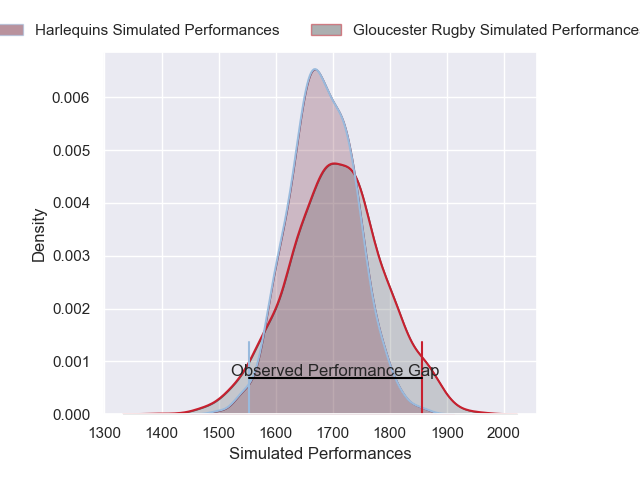
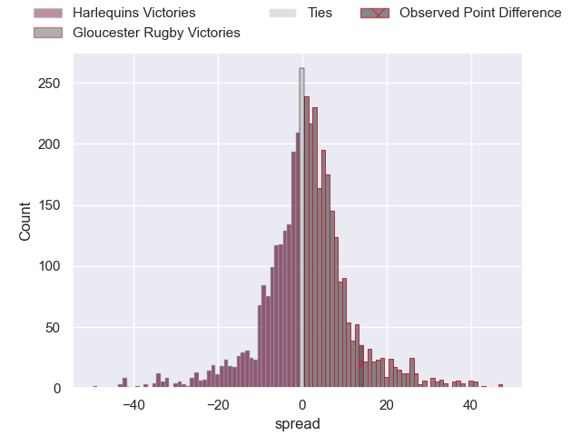
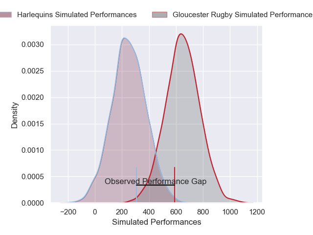
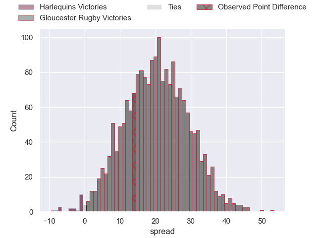
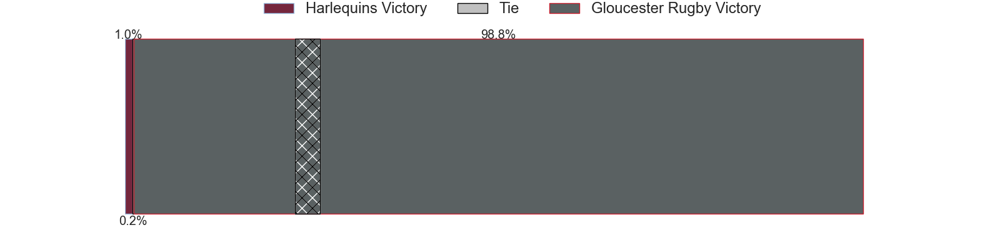

---  
layout: page  
title: Harlequins at Gloucester Rugby; 0-14  
date: 2024-12-20 18:00:00 -0500  
categories: "Gallagher Premiership 2024" match review  
---
# Harlequins at Gloucester Rugby; 0-14

# Club Level Predictions

The first set of predictions treats a club as the smallest object, as the club develops its members, organizes a gameplan, and deploys its players as needed for each match. This club model has a prediction of 0.533, which translates to predicting Gloucester Rugby to win by 1.2.

Our Over/Under is 61.5 - and combined with the spread above, we have a predicted scoreline of 30 to 31

Each club has a rating and a rating deviation (similar to a Glicko rating), and expected performances can be generated. This allows for simulated matches and spreads like the ones below.
## Projected Performances - Club Model

## Projected Spreads - Club Model

## Projected Results - Club Model

# Player Level Predictions

Treating teams instead as an entity made up of the currently active players, I have ratings for each player in an altogether different system. These can be combined to form team ratings once teamsheets are announced, weighting starters a bit higher than the reserves. After the match is played, players can be weighted by their minutes on the field, allowing for an accurate measure of the team's composition. With these compiled team ratings, we can make predictions, measure inaccuracy, and update the individual player ratings.
## Prediction without Player Minutes: Gloucester Rugby by 25.8

Gloucester Rugby by 10.0 on a neutral pitch

## Projected Performances - Player Model

## Projected Spreads - Player Model

## Projected Results - Player Model

|   Away Minutes | Away Player               |   Away Percentile |   Number |   Home Percentile | Home Player       |   Home Minutes |
|---------------:|:--------------------------|------------------:|---------:|------------------:|:------------------|---------------:|
|             22 | Fin Baxter                |             10.22 |        1 |             17.37 | Ciaran Knight     |             13 |
|             60 | Jack Walker               |             11.8  |        2 |             65.99 | Seb Blake         |             46 |
|             69 | Simon Kerrod              |             37.18 |        3 |             33.04 | Afolabi Fasogbon  |             55 |
|             22 | Dino Lamb                 |             45.62 |        4 |             36.86 | Freddie Thomas    |             63 |
|             82 | George Hammond            |             30.62 |        5 |             88.03 | Matias Alemanno   |             63 |
|             20 | Chandler Cunningham-South |             64.71 |        6 |             25    | Jack Clement      |             60 |
|             56 | Will Evans                |             51.19 |        7 |             22.87 | Lewis Ludlow      |             80 |
|             28 | Alex Dombrandt            |             62.46 |        8 |             68.48 | Ruan Ackermann    |             60 |
|             13 | Will Porter               |              9.98 |        9 |             83.74 | Tomos Williams    |             35 |
|             13 | Marcus Smith              |             77.98 |       10 |             75.35 | Gareth Anscombe   |             15 |
|             13 | Cadan Murley              |             34.6  |       11 |             85.44 | Josh Hathaway     |             17 |
|             47 | Lennox Anyanwu            |             84.2  |       12 |             48.59 | Seb Atkinson      |             63 |
|             22 | Oscar Beard               |             11.51 |       13 |             76.68 | Max Llewellyn     |             20 |
|             82 | Rodrigo Isgro             |             88.19 |       14 |             93.98 | Christian Wade    |             80 |
|             82 | Tyrone Green              |             53.7  |       15 |             77.41 | Santiago Carreras |             80 |
|             82 | Sam Riley                 |             75    |       16 |             90.84 | Jack Singleton    |             60 |
|             69 | Wyn Jones                 |             75.61 |       17 |             10.03 | Mayco Vivas       |             82 |
|             82 | Dillon Lewis              |             73.23 |       18 |             56.49 | Kirill Gotovtsev  |             82 |
|             82 | Irne Herbst               |             34.78 |       19 |             82.22 | Cameron Jordan    |              1 |
|             82 | Irne Herbst               |             34.78 |       19 |             82.22 | Cameron Jordan    |             82 |
|             82 | James Chisholm            |             93.2  |       20 |             76.93 | Albert Tuisue     |             18 |
|             81 | Danny Care                |             98.07 |       21 |             75.2  | Caolan Englefield |             59 |
|             82 | Jarrod Evans              |             64.04 |       22 |             33.27 | Chris Harris      |             82 |
|              0 | Nick David                |             79.5  |       23 |             56.97 | George Barton     |             82 |

