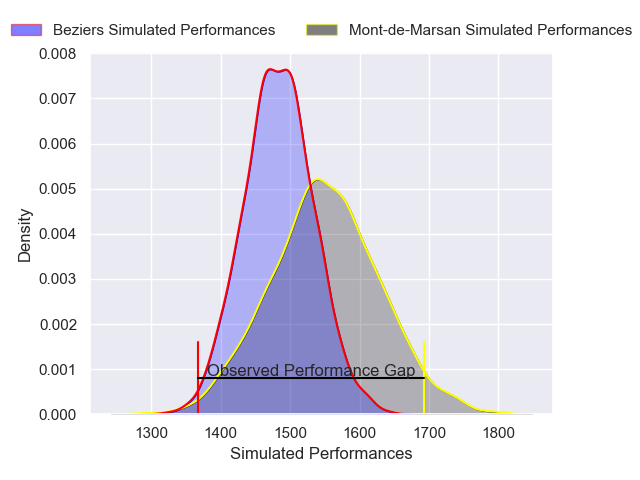
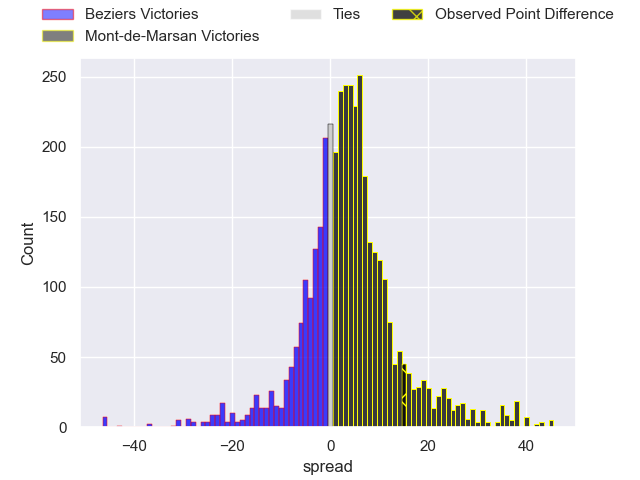
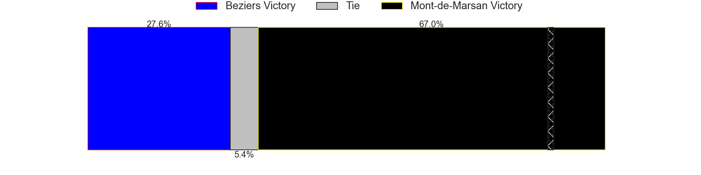
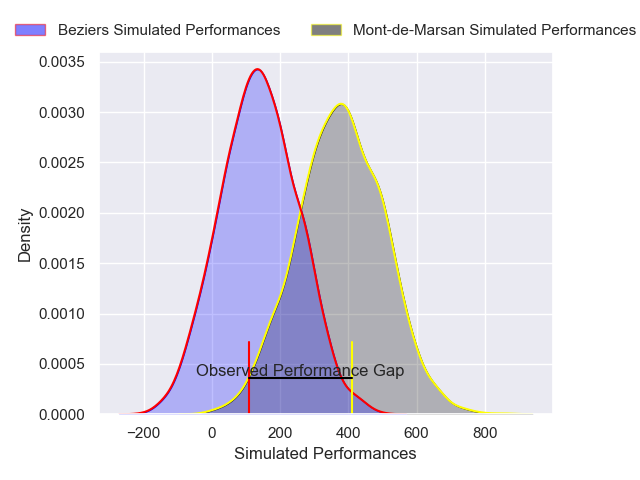
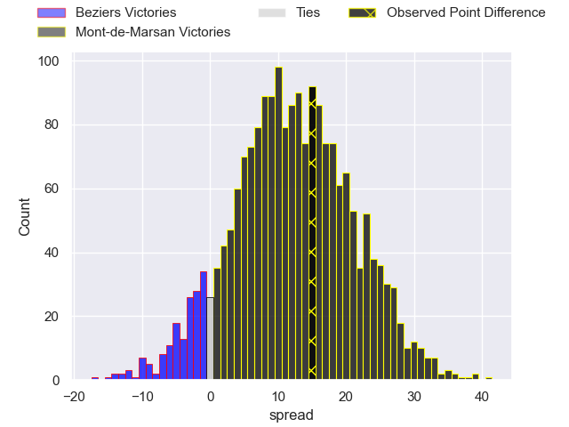
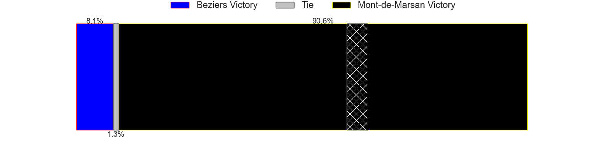

---  
layout: page  
title: Beziers at Mont-de-Marsan; 32-47  
date: 2024-12-20 18:00:00 -0500  
categories: "Pro D2 2024" match review  
---
# Beziers at Mont-de-Marsan; 32-47

# Club Level Predictions

The first set of predictions treats a club as the smallest object, as the club develops its members, organizes a gameplan, and deploys its players as needed for each match. This club model has a prediction of 0.596, which translates to predicting Mont-de-Marsan to win by 3.4.

Our Over/Under is 37.5 - and combined with the spread above, we have a predicted scoreline of 17 to 20

Each club has a rating and a rating deviation (similar to a Glicko rating), and expected performances can be generated. This allows for simulated matches and spreads like the ones below.
## Projected Performances - Club Model

## Projected Spreads - Club Model

## Projected Results - Club Model

# Player Level Predictions

Treating teams instead as an entity made up of the currently active players, I have ratings for each player in an altogether different system. These can be combined to form team ratings once teamsheets are announced, weighting starters a bit higher than the reserves. After the match is played, players can be weighted by their minutes on the field, allowing for an accurate measure of the team's composition. With these compiled team ratings, we can make predictions, measure inaccuracy, and update the individual player ratings.
## Prediction without Player Minutes: Mont-de-Marsan by 12.7

Beziers by 0.4 on a neutral pitch

## Projected Performances - Player Model

## Projected Spreads - Player Model

## Projected Results - Player Model

|   Away Minutes | Away Player            |   Away Percentile |   Number |   Home Percentile | Home Player           |   Home Minutes |
|---------------:|:-----------------------|------------------:|---------:|------------------:|:----------------------|---------------:|
|             39 | Marco Trauth           |             66.46 |        1 |             56.43 | Luka Goginava         |             55 |
|             34 | Jose Luis Gonzalez     |             84.16 |        2 |             44.88 | Samuel Lagrange       |             80 |
|             37 | Yannick Arroyo         |             62.32 |        3 |              6.27 | Anthony Alves         |             80 |
|             26 | Gillian Benoy          |             23.59 |        4 |             73.29 | Jules Dussutour       |             55 |
|             24 | Cam Dodson             |             59.58 |        5 |             76.32 | Romain Durand         |             80 |
|             16 | William van Bost       |             29.68 |        6 |             95.15 | Ioane Iashagashvili   |             25 |
|             16 | Clement Ancely         |             78.06 |        7 |             80.78 | Raphaël Robic         |             59 |
|             80 | Otonuku Jr Pauta       |             51.58 |        8 |             15.9  | Mike Faleafa          |             25 |
|             80 | Samuel Marques         |             76.17 |        9 |             58.94 | Nicolas Darquier      |             80 |
|             50 | Charly Malie           |             26.46 |       10 |             76.57 | Willie du Plessis     |             55 |
|             46 | Paul Reau              |             73.7  |       11 |             90.09 | Pierre Sayerse        |             80 |
|             33 | Taleta Tupuola         |             29.17 |       12 |             71.02 | Nacani Wakaya         |             64 |
|             80 | Paul Recor             |             58.44 |       13 |             20.49 | Gatien Masse          |             58 |
|             61 | Pierre Courtaud        |             27.36 |       14 |             34.38 | Semi Lagivala         |             80 |
|             29 | Gabin Lorre            |             78.89 |       15 |             47.41 | Alexandre de Nardi    |             41 |
|             29 | Damien Añon            |             72.14 |       16 |             26.87 | Waël Ponpon           |             80 |
|             52 | Baptiste Abescat-Leroy |             56.59 |       17 |             11.45 | Myles Edwards         |             49 |
|             80 | Romain Uruty           |            nan    |       18 |             28.15 | Aurélien Laforgue     |             55 |
|             54 | Christian Judge        |             45.02 |       19 |              7.14 | Luka Begic            |             48 |
|             50 | Taylor Gontineac       |             82.54 |       20 |             53.86 | Gheorghe Gajion       |             39 |
|             37 | Sias Koen              |             67.69 |       21 |             42.63 | Thomas Bultel         |             51 |
|             43 | Yahnis El Maslouhi     |             65.33 |       22 |             31.4  | Baptiste Canut        |             80 |
|             80 | Yanis Boulassel        |             23.91 |       23 |             27.96 | Yoann Laousse Azpiazu |             80 |

