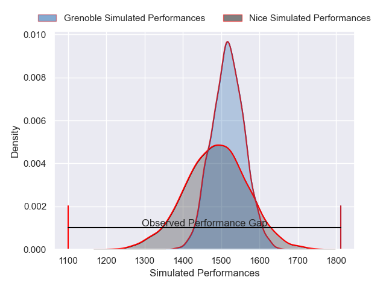
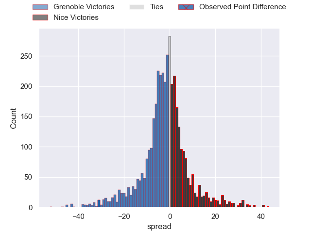
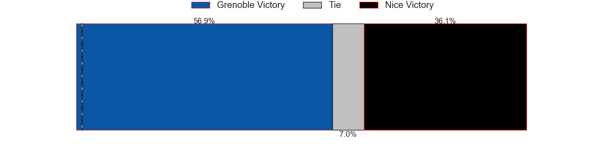
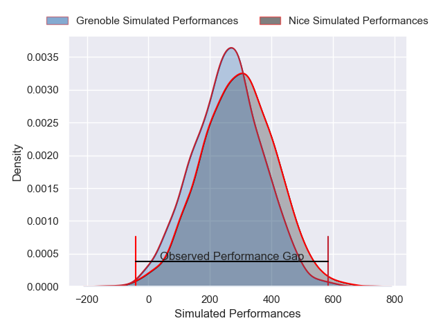
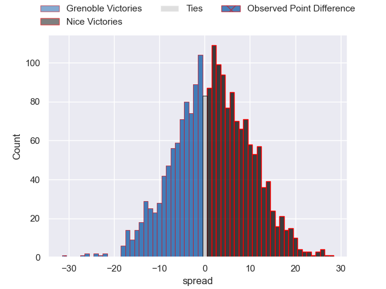

---  
layout: page  
title: Grenoble at Nice; 49-18  
date: 2024-12-20 18:00:00 -0500  
categories: "Pro D2 2024" match review  
---
# Grenoble at Nice; 49-18

# Club Level Predictions

The first set of predictions treats a club as the smallest object, as the club develops its members, organizes a gameplan, and deploys its players as needed for each match. This club model has a prediction of 0.453, which translates to predicting Grenoble to win by 1.6.

Our Over/Under is 51.5 - and combined with the spread above, we have a predicted scoreline of 27 to 25

Each club has a rating and a rating deviation (similar to a Glicko rating), and expected performances can be generated. This allows for simulated matches and spreads like the ones below.
## Projected Performances - Club Model

## Projected Spreads - Club Model

## Projected Results - Club Model

# Player Level Predictions

Treating teams instead as an entity made up of the currently active players, I have ratings for each player in an altogether different system. These can be combined to form team ratings once teamsheets are announced, weighting starters a bit higher than the reserves. After the match is played, players can be weighted by their minutes on the field, allowing for an accurate measure of the team's composition. With these compiled team ratings, we can make predictions, measure inaccuracy, and update the individual player ratings.
## Prediction without Player Minutes: Grenoble by 3.5

Grenoble by 6.9 on a neutral pitch

## Projected Performances - Player Model

## Projected Spreads - Player Model

## Projected Results - Player Model

|   Away Minutes | Away Player        |   Away Percentile |   Number |   Home Percentile | Home Player              |   Home Minutes |
|---------------:|:-------------------|------------------:|---------:|------------------:|:-------------------------|---------------:|
|             43 | Zack Gauthier      |             70.03 |        1 |              6.58 | Facundo Gigena           |             40 |
|             34 | Lilian Rossi       |             62.73 |        2 |             18.17 | Pierre Strippoli         |             80 |
|             40 | Giorgi Pertaia     |             81.13 |        3 |              7.15 | Luvuyo Pupuma            |             20 |
|             24 | Pierce Phillips    |             71.9  |        4 |              3.38 | Thibault Rey             |             14 |
|             24 | Giorgi Javakhia    |             89.51 |        5 |             16.74 | Clément Chartier         |             60 |
|             80 | Thomas Ployet      |             76.62 |        6 |             94.81 | Louis Suaud              |             80 |
|             80 | Victor Guillaumond |             80.87 |        7 |             39.54 | Joris Sylvestre Simon    |             66 |
|             62 | Hanru Sirgel       |             73.07 |        8 |             17.05 | Ramiha Tarrel Tia Smiler |             60 |
|             80 | Eric Escande       |             85.19 |        9 |              5.31 | Jules Gimbert            |             80 |
|             23 | Marc Palmier       |             17.17 |       10 |             68.48 | Tanguy Ménoret           |             24 |
|             22 | Wilfried Hulleu    |             83.46 |       11 |             83.69 | Andrzej Charlat          |             56 |
|             19 | Romain Fusier      |             46.83 |       12 |             12.39 | Luca Cutayar             |             30 |
|             17 | Julien Heriteau    |             68.78 |       13 |             66.83 | Nathan Courtade          |             80 |
|             61 | Geoffrey Cros      |             84.38 |       14 |             64.79 | Simon Delas              |             80 |
|             80 | Julien Farnoux     |             97.22 |       15 |             48.33 | Paul Auradou             |             25 |
|             28 | Bastien Soury      |             57.3  |       16 |             92.68 | David Odiete             |             80 |
|             19 | Barnabe Couilloud  |             16.75 |       17 |             87.89 | Sione Anga'aelangi       |             65 |
|             80 | Cody Thomas        |             48.9  |       18 |             87.16 | Martin Freytes           |             80 |
|             32 | Eli Eglaine        |             25.2  |       19 |             15.17 | Tom Ross                 |             56 |
|             80 | Max Clement        |             72.53 |       20 |             29.63 | Matéo Jeune Joly         |             67 |
|             17 | Kaminieli Rasaku   |             75.38 |       21 |            nan    | Hugo Sarrasin            |             21 |
|             80 | Cameron Holt       |            nan    |       22 |             53.54 | Julien Beaufils          |             64 |
|             56 | Camille Baz Marcos |            nan    |       23 |              8.93 | Bastien Berenguel        |             28 |

