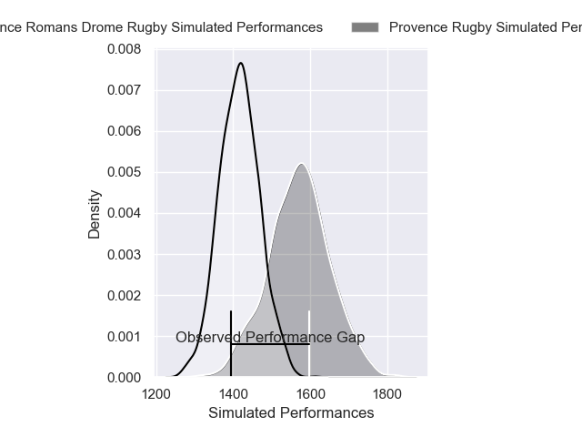
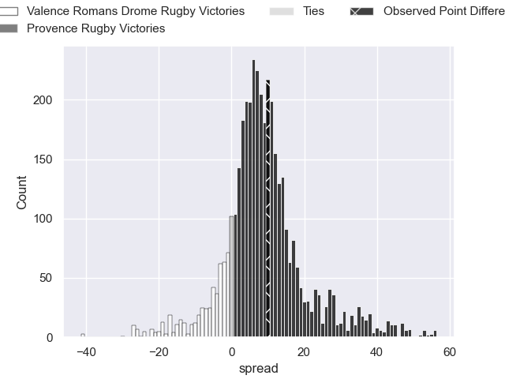
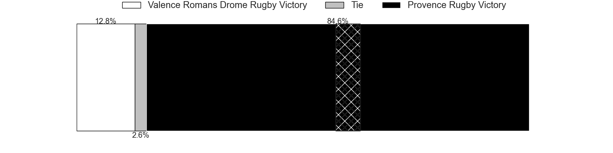
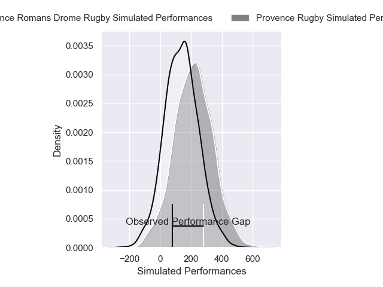
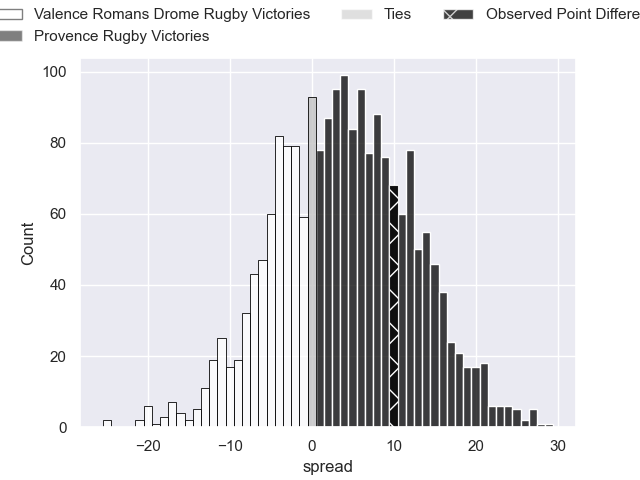
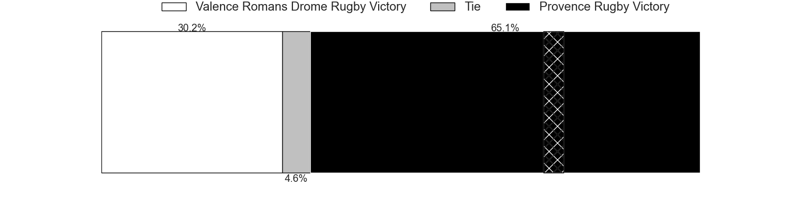

---  
layout: page  
title: Valence Romans Drome Rugby at Provence Rugby; 24-34  
date: 2024-12-20 18:00:00 -0500  
categories: "Pro D2 2024" match review  
---
# Valence Romans Drome Rugby at Provence Rugby; 24-34

# Club Level Predictions

The first set of predictions treats a club as the smallest object, as the club develops its members, organizes a gameplan, and deploys its players as needed for each match. This club model has a prediction of 0.713, which translates to predicting Provence Rugby to win by 8.0.

Our Over/Under is 56.5 - and combined with the spread above, we have a predicted scoreline of 24 to 32

Each club has a rating and a rating deviation (similar to a Glicko rating), and expected performances can be generated. This allows for simulated matches and spreads like the ones below.
## Projected Performances - Club Model

## Projected Spreads - Club Model

## Projected Results - Club Model

# Player Level Predictions

Treating teams instead as an entity made up of the currently active players, I have ratings for each player in an altogether different system. These can be combined to form team ratings once teamsheets are announced, weighting starters a bit higher than the reserves. After the match is played, players can be weighted by their minutes on the field, allowing for an accurate measure of the team's composition. With these compiled team ratings, we can make predictions, measure inaccuracy, and update the individual player ratings.
## Prediction without Player Minutes: Provence Rugby by 7.1

Valence Romans Drome Rugby by 2.8 on a neutral pitch

## Projected Performances - Player Model

## Projected Spreads - Player Model

## Projected Results - Player Model

|   Away Minutes | Away Player          |   Away Percentile |   Number |   Home Percentile | Home Player              |   Home Minutes |
|---------------:|:---------------------|------------------:|---------:|------------------:|:-------------------------|---------------:|
|             30 | Anthony Aléo         |             55.86 |        1 |             70.78 | Thomas Vernet            |             39 |
|             23 | Dorian Marco Pena    |             61.8  |        2 |             52.8  | Joseph Laget             |             23 |
|             20 | Vincent Vial         |             44.58 |        3 |             73.54 | Paul Mallez              |             80 |
|              8 | Ryan McCauley        |             68.43 |        4 |             86.21 | Jérôme Dufour            |             47 |
|             80 | Yassine Maamry       |             54.47 |        5 |             77.8  | Josh Tyrell              |             33 |
|             14 | Adrien Roux          |             66.67 |        6 |             76.53 | Teimana Harrison         |             43 |
|             14 | Ilia Spanderashvili  |             13.95 |        7 |              8.67 | Andres Zafra Tarazona    |             58 |
|             30 | Mathieu Vachon       |              2.87 |        8 |             41.55 | Malohi Suta              |             58 |
|             30 | Tim Menzel           |             88.57 |        9 |             23.03 | Arthur Coville           |             32 |
|             48 | Lucas Meret          |             24.65 |       10 |             81.01 | Jules Soulan             |             32 |
|             23 | Mosese Mawalu        |             86.28 |       11 |             76.83 | Léo Drouet               |             32 |
|             46 | Louis Marrou         |             82.93 |       12 |             86.44 | Kaveinga Finau           |             27 |
|             80 | Mathieu Guillomot    |              8.39 |       13 |             62.73 | Mathias Colombet         |             80 |
|             27 | Adam Vargas          |             93.67 |       14 |             23.63 | Adrien Lapegue-Lafaye    |             53 |
|             27 | Joris De Moura       |             86.3  |       15 |             82.78 | Thomas Salles            |             53 |
|             43 | Gareth Milasinovich  |             48.59 |       16 |             65.06 | Thomas Sauveterre        |             20 |
|             80 | Andrea Pontanier     |             64.08 |       17 |             75.6  | Bilel Taieb              |             80 |
|             57 | Cyril Deligny        |              2.02 |       18 |              9.89 | Tornike Jalagonia        |             53 |
|             80 | Anatole Pauvert      |             83.51 |       19 |             88.78 | Jimmy Gopperth           |              1 |
|             48 | Mattéo Rodor         |              8.53 |       20 |             88.72 | Nadir Bouhedjeur         |             41 |
|             80 | Florian Goumat       |             69.47 |       21 |             77.93 | Hayden Thompson-Stringer |             50 |
|             80 | Florian Goumat       |             69.47 |       21 |             77.93 | Hayden Thompson-Stringer |             66 |
|             80 | Florian Goumat       |             69.47 |       21 |             77.93 | Hayden Thompson-Stringer |             80 |
|             53 | Sven Bernat Girlando |             61.89 |       22 |             30.27 | Kevin Viallard           |             60 |
|             80 | Thembelani Bholi     |             69.73 |       23 |             33.92 | Enrique Pieretto         |             80 |

