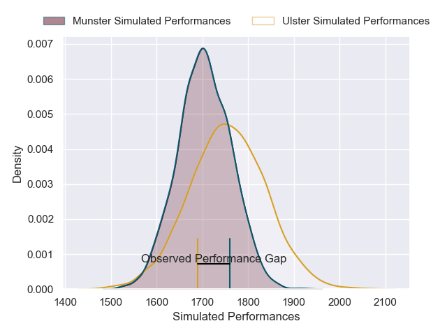
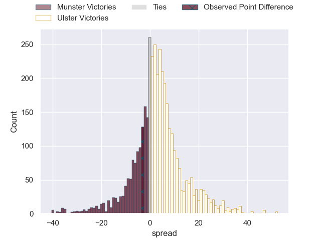
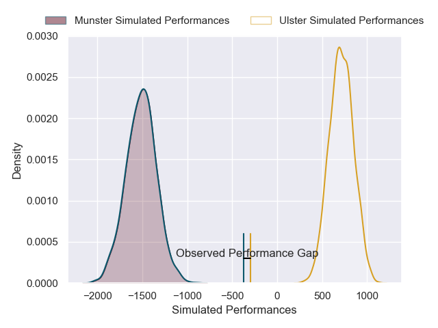
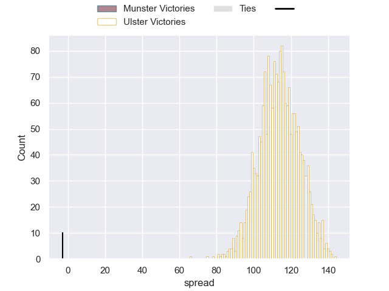

---  
layout: page  
title: Munster at Ulster; 22-19  
date: 2024-12-20 18:00:00 -0500  
categories: "United Rugby Championship 2024" match review  
---
# Munster at Ulster; 22-19

# Club Level Predictions

The first set of predictions treats a club as the smallest object, as the club develops its members, organizes a gameplan, and deploys its players as needed for each match. This club model has a prediction of 0.57, which translates to predicting Ulster to win by 2.5.

Our Over/Under is 36.5 - and combined with the spread above, we have a predicted scoreline of 17 to 20

Each club has a rating and a rating deviation (similar to a Glicko rating), and expected performances can be generated. This allows for simulated matches and spreads like the ones below.
## Projected Performances - Club Model

## Projected Spreads - Club Model

## Projected Results - Club Model

# Player Level Predictions

Treating teams instead as an entity made up of the currently active players, I have ratings for each player in an altogether different system. These can be combined to form team ratings once teamsheets are announced, weighting starters a bit higher than the reserves. After the match is played, players can be weighted by their minutes on the field, allowing for an accurate measure of the team's composition. With these compiled team ratings, we can make predictions, measure inaccuracy, and update the individual player ratings.
## Prediction without Player Minutes: Ulster by 59.4

Ulster by 49.7 on a neutral pitch

## Projected Performances - Player Model

## Projected Spreads - Player Model

## Projected Results - Player Model

|   Away Minutes | Away Player      |   Away Percentile |   Number |   Home Percentile | Home Player        |   Home Minutes |
|---------------:|:-----------------|------------------:|---------:|------------------:|:-------------------|---------------:|
|             61 | John Ryan        |              2.82 |        1 |             10.28 | Andrew Warwick     |             62 |
|             46 | John Ryan        |              2.82 |        1 |             10.28 | Andrew Warwick     |             62 |
|             80 | John Ryan        |              2.82 |        1 |             10.28 | Andrew Warwick     |             62 |
|             80 | Niall Scannell   |             52.64 |        2 |             88.2  | Rob Herring        |             26 |
|             80 | Stephen Archer   |             83.57 |        3 |              5.02 | Tom O'Toole        |             61 |
|             80 | Thomas Ahern     |             11.36 |        4 |             55.25 | Alan O'Connor      |              0 |
|             34 | Fineen Wycherley |             50.3  |        5 |             19.86 | Kieran Treadwell   |             28 |
|             80 | Jack O'Donoghue  |             77.04 |        6 |              7.65 | James McNabney     |             54 |
|             80 | John Hodnett     |             22.11 |        7 |             85.03 | Marcus Rea         |             26 |
|             80 | Gavin Coombes    |             57.16 |        8 |             51.43 | David McCann       |             80 |
|             25 | Paddy Patterson  |             65.86 |        9 |             91.63 | John Cooney        |             75 |
|              0 | Jack Crowley     |              1.62 |       10 |             28.28 | Aidan Morgan       |             71 |
|             45 | Shane Daly       |             81.1  |       11 |             22.94 | Zac Ward           |             82 |
|             18 | Shane Daly       |             81.1  |       11 |             22.94 | Zac Ward           |             82 |
|             17 | Shane Daly       |             81.1  |       11 |             22.94 | Zac Ward           |             82 |
|             24 | Shane Daly       |             81.1  |       11 |             22.94 | Zac Ward           |             82 |
|             67 | Alex Nankivell   |             91.02 |       12 |             68.68 | Stuart McCloskey   |             82 |
|             80 | Tom Farrell      |             28.78 |       13 |              0.88 | Jude Postlethwaite |             63 |
|             80 | Tom Farrell      |             28.78 |       13 |              0.88 | Jude Postlethwaite |             80 |
|             80 | Tom Farrell      |             28.78 |       13 |              0.88 | Jude Postlethwaite |             39 |
|             11 | Calvin Nash      |             87.2  |       14 |             25.3  | Werner Kok         |              7 |
|             80 | Mike Haley       |             24.07 |       15 |              6.67 | Mike Lowry         |             13 |
|             80 | Eoghan Clarke    |            nan    |       16 |             45.19 | John Andrew        |             80 |
|             80 | Dave Kilcoyne    |            nan    |       17 |             61.5  | Eric O'Sullivan    |             80 |
|             55 | Oli Jager        |             73.73 |       18 |             24.01 | Scott Wilson       |              9 |
|             24 | Evan O'Connell   |             77.97 |       19 |             54.03 | Harry Sheridan     |             19 |
|             62 | Alex Kendellen   |             90.65 |       20 |             71.09 | Matty Rea          |             54 |
|             80 | Ethan Coughlan   |             50.08 |       21 |            nan    | Dave Shanahan      |             80 |
|             56 | Rory Scannell    |             90.15 |       22 |            nan    | Jack Murphy        |             61 |
|             82 | Brian Gleeson    |             20.34 |       23 |            nan    | Rory Telfer        |             82 |

