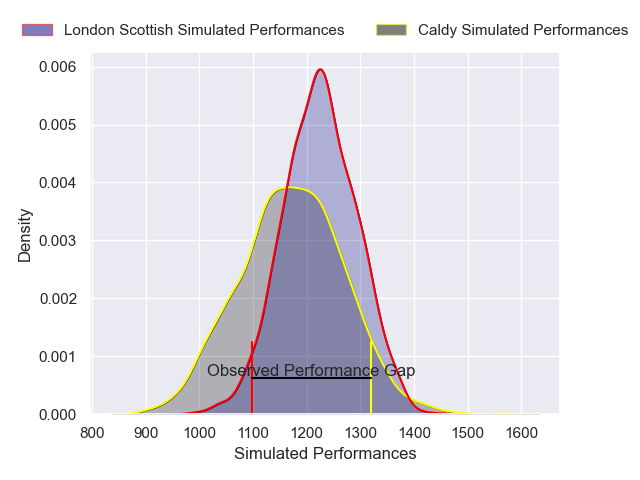
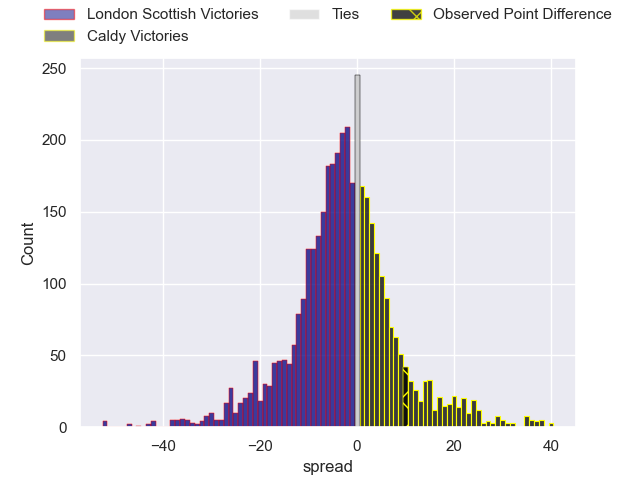
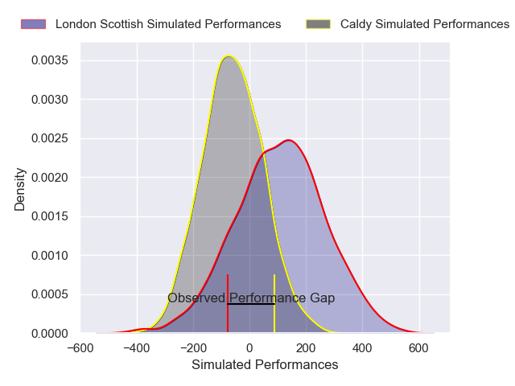
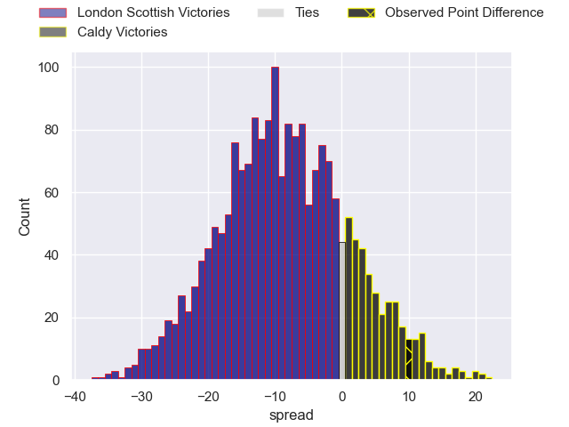

---  
layout: page  
title: London Scottish at Caldy; 10-20  
date: 2024-12-21 18:00:00 -0500  
categories: "RFU Championship 2024" match review  
---
# London Scottish at Caldy; 10-20

# Club Level Predictions

The first set of predictions treats a club as the smallest object, as the club develops its members, organizes a gameplan, and deploys its players as needed for each match. This club model has a prediction of 0.429, which translates to predicting London Scottish to win by 2.6.

Our Over/Under is 54.5 - and combined with the spread above, we have a predicted scoreline of 29 to 26

Each club has a rating and a rating deviation (similar to a Glicko rating), and expected performances can be generated. This allows for simulated matches and spreads like the ones below.
## Projected Performances - Club Model

## Projected Spreads - Club Model

## Projected Results - Club Model

# Player Level Predictions

Treating teams instead as an entity made up of the currently active players, I have ratings for each player in an altogether different system. These can be combined to form team ratings once teamsheets are announced, weighting starters a bit higher than the reserves. After the match is played, players can be weighted by their minutes on the field, allowing for an accurate measure of the team's composition. With these compiled team ratings, we can make predictions, measure inaccuracy, and update the individual player ratings.
## Prediction without Player Minutes: London Scottish by 11.4

London Scottish by 14.1 on a neutral pitch

## Projected Performances - Player Model

## Projected Spreads - Player Model

## Projected Results - Player Model

|   Away Minutes | Away Player          |   Away Percentile |   Number |   Home Percentile | Home Player          |   Home Minutes |
|---------------:|:---------------------|------------------:|---------:|------------------:|:---------------------|---------------:|
|             61 | Archie Stanley       |             50.91 |        1 |             13.23 | Joe Sproston         |             80 |
|             80 | Austin Wallis        |             19.1  |        2 |              2.8  | Oliver Hearn         |             47 |
|             80 | William Hobson       |             64.83 |        3 |              6.14 | Nathan Rushton       |             80 |
|             80 | Matt Wilkinson       |             16.57 |        4 |             86.9  | Tom Burrow           |             80 |
|             68 | Jake Spurway         |             26.54 |        5 |             20.9  | Thomas Sanders       |             52 |
|             79 | Will Trenholm        |             12.41 |        6 |              7.57 | Callum Ridgway       |             28 |
|             80 | Bailey Ransom        |             22.45 |        7 |             58.84 | Tristan Woodman      |             10 |
|             80 | Zach Carr            |             16.19 |        8 |              6.45 | Josiah Dickinson     |             52 |
|             60 | Jonny Law            |              7.73 |        9 |             16.26 | Ollie Wynn           |             73 |
|             52 | Tom Wilstead         |             12.32 |       10 |              2.83 | Lewis Barker         |             20 |
|             68 | Noah Ferdinand       |              8.46 |       11 |             16.08 | William Robinson     |             80 |
|             80 | Ben Waghorn          |             40.78 |       12 |             12.1  | Connor Wilkinson     |             80 |
|             80 | Sean Kerr            |             87.12 |       13 |             18.44 | Rekeiti Ma'asi-White |             20 |
|             70 | Roma Zheng           |             41.92 |       14 |             15.24 | Nick Royle           |             60 |
|             80 | Cameron Anderson     |             33.33 |       15 |             27.04 | Matt Kilcourse       |             62 |
|             80 | Hayden Hyde          |             58.46 |       16 |             12.16 | Ryan Higginson       |             19 |
|             28 | Tom Osborne          |             18.87 |       17 |             10.71 | Matt Gallagher       |             11 |
|             74 | Jonny Green          |             11.97 |       18 |             20.5  | Monty Weatherby      |             12 |
|             62 | Lewis Gjaltema       |             36.88 |       19 |             19.9  | Thomas Parry         |             80 |
|             80 | Calum Scott          |             33.39 |       20 |              6.85 | Michael Barlow       |             19 |
|             80 | Ashley Challenger    |              6.33 |       21 |             15.61 | Jacob Mitchell       |             28 |
|             69 | Ioan Rhys Davies     |             14.97 |       22 |            nan    | nan                  |            nan |
|             80 | Alexander Lloyd-Seed |             25.45 |       23 |            nan    | nan                  |            nan |

