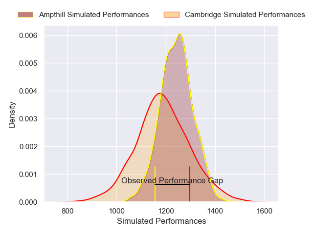
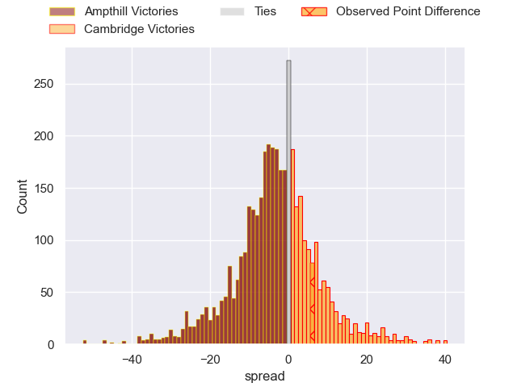
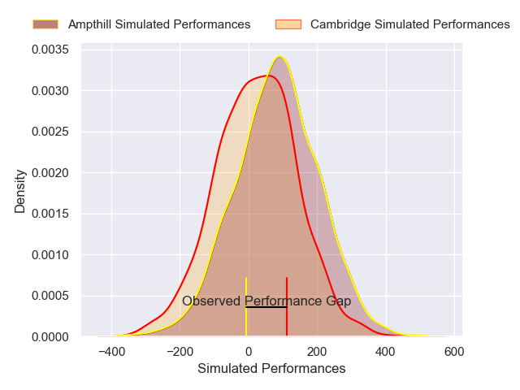
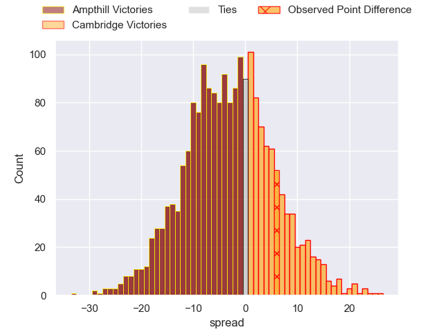

---  
layout: page  
title: Ampthill at Cambridge; 7-13  
date: 2024-12-21 18:00:00 -0500  
categories: "RFU Championship 2024" match review  
---
# Ampthill at Cambridge; 7-13

# Club Level Predictions

The first set of predictions treats a club as the smallest object, as the club develops its members, organizes a gameplan, and deploys its players as needed for each match. This club model has a prediction of 0.425, which translates to predicting Ampthill to win by 2.7.

Our Over/Under is 48.5 - and combined with the spread above, we have a predicted scoreline of 25 to 23

Each club has a rating and a rating deviation (similar to a Glicko rating), and expected performances can be generated. This allows for simulated matches and spreads like the ones below.
## Projected Performances - Club Model

## Projected Spreads - Club Model

## Projected Results - Club Model

# Player Level Predictions

Treating teams instead as an entity made up of the currently active players, I have ratings for each player in an altogether different system. These can be combined to form team ratings once teamsheets are announced, weighting starters a bit higher than the reserves. After the match is played, players can be weighted by their minutes on the field, allowing for an accurate measure of the team's composition. With these compiled team ratings, we can make predictions, measure inaccuracy, and update the individual player ratings.
## Prediction without Player Minutes: Ampthill by 4.2

Ampthill by 6.7 on a neutral pitch

## Projected Performances - Player Model

## Projected Spreads - Player Model

## Projected Results - Player Model

|   Away Minutes | Away Player                 |   Away Percentile |   Number |   Home Percentile | Home Player       |   Home Minutes |
|---------------:|:----------------------------|------------------:|---------:|------------------:|:------------------|---------------:|
|             66 | Harrison Courtney           |             44.89 |        1 |             25.96 | Zac Nearchou      |             18 |
|             80 | Luke Thompson               |             41.93 |        2 |             13.98 | Benjamin Brownlie |             25 |
|             80 | James Johnston              |             11.6  |        3 |              5.89 | Billy Walker      |             14 |
|             80 | Kennedy Sylvester           |             38.59 |        4 |             52.12 | Kayde Sylvester   |             22 |
|             54 | Kaden Pearce-Paul           |             46.75 |        5 |             19.6  | Gareth Baxter     |             80 |
|             55 | Olamide Sodeke              |             72.62 |        6 |             30.19 | Archie Benson     |             18 |
|             80 | Reggie Hammick              |             45.58 |        7 |             11.99 | Ben Adams         |             22 |
|             80 | Lekima Ravuvu               |             18.77 |        8 |             21.63 | Jack Bartlett     |             80 |
|             25 | Charlie Bracken             |             59.26 |        9 |             92.91 | Peter White       |             80 |
|             19 | Josh Barton                 |             13.94 |       10 |             13.54 | Louis Grimoldby   |             55 |
|             80 | Sione Va'enuku              |             24.39 |       11 |             10.82 | Elias Caven       |             80 |
|             52 | Fraser James Kevin Strachan |             81.07 |       12 |             11.9  | Matthew Hema      |             80 |
|             61 | Sam Spink                   |             33.76 |       13 |              1.85 | Sam Hanks         |             80 |
|             52 | Josh Hallett                |             52.74 |       14 |             43.52 | William Glister   |             67 |
|             10 | Oran McNulty                |             13.15 |       15 |             19.81 | Joseph Tarrant    |             58 |
|              6 | James Flynn                 |              6.02 |       16 |             66.51 | Ruaridh Dawson    |             80 |
|             26 | James Isaacs                |             55.43 |       17 |            nan    | Ollie Scola       |             62 |
|             33 | Harvey Beaton               |             41.38 |       18 |              7.76 | Archie Vanes      |             48 |
|             33 | Karl Main                   |             24.49 |       19 |             15.74 | Jake Bridges      |             47 |
|              1 | Charles Rylands             |             15.99 |       20 |              9.69 | Jared Cardew      |             75 |
|             61 | Rory Morgan                 |             20.93 |       21 |             17.48 | Matthew Dawson    |             64 |
|             80 | Wilson Ijeh                 |             46.95 |       22 |            nan    | nan               |            nan |

