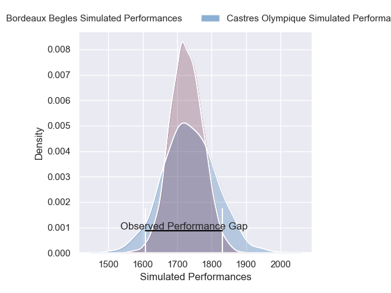
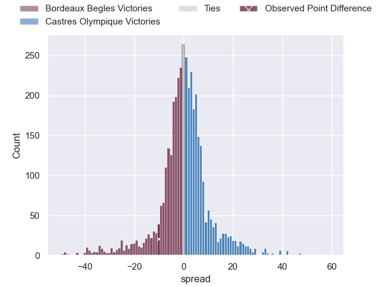
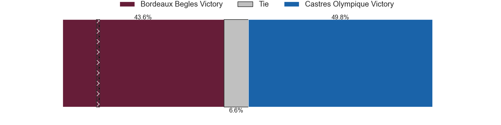
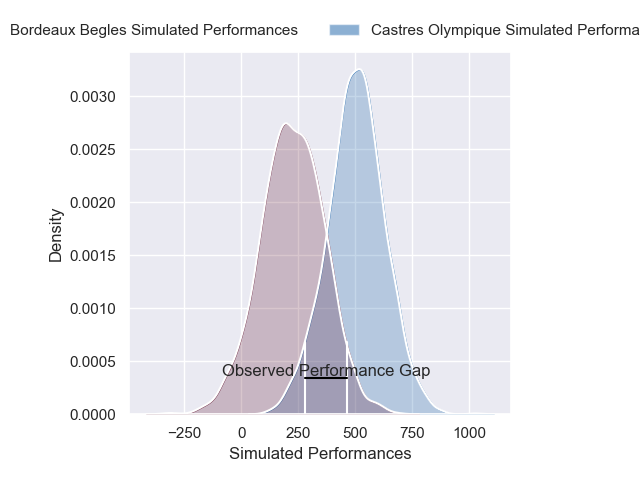
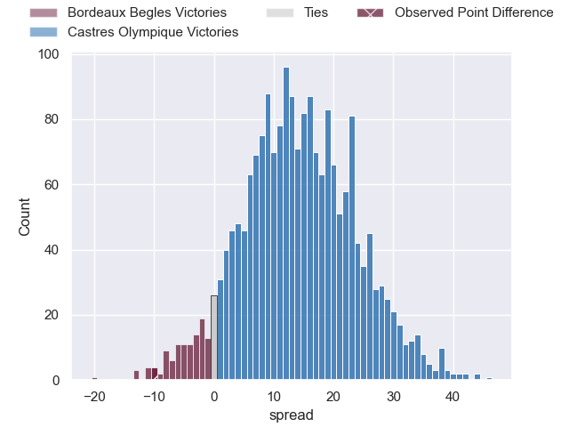
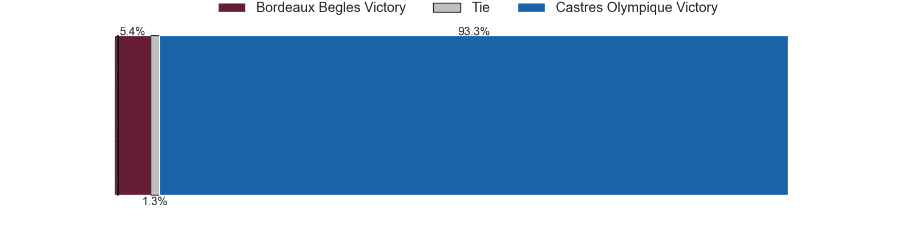

---  
layout: page  
title: Bordeaux Begles at Castres Olympique; 13-3  
date: 2024-12-21 18:00:00 -0500  
categories: "Top 14 Orange 2024" match review  
---
# Bordeaux Begles at Castres Olympique; 13-3

# Club Level Predictions

The first set of predictions treats a club as the smallest object, as the club develops its members, organizes a gameplan, and deploys its players as needed for each match. This club model has a prediction of 0.509, which translates to predicting Castres Olympique to win by 0.3.

Our Over/Under is 42.5 - and combined with the spread above, we have a predicted scoreline of 21 to 22

Each club has a rating and a rating deviation (similar to a Glicko rating), and expected performances can be generated. This allows for simulated matches and spreads like the ones below.
## Projected Performances - Club Model

## Projected Spreads - Club Model

## Projected Results - Club Model

# Player Level Predictions

Treating teams instead as an entity made up of the currently active players, I have ratings for each player in an altogether different system. These can be combined to form team ratings once teamsheets are announced, weighting starters a bit higher than the reserves. After the match is played, players can be weighted by their minutes on the field, allowing for an accurate measure of the team's composition. With these compiled team ratings, we can make predictions, measure inaccuracy, and update the individual player ratings.
## Prediction without Player Minutes: Castres Olympique by 16.3

Castres Olympique by 2.1 on a neutral pitch

## Projected Performances - Player Model

## Projected Spreads - Player Model

## Projected Results - Player Model

|   Away Minutes | Away Player               |   Away Percentile |   Number |   Home Percentile | Home Player          |   Home Minutes |
|---------------:|:--------------------------|------------------:|---------:|------------------:|:---------------------|---------------:|
|             13 | Ugo Boniface              |             78.62 |        1 |             43.32 | Quentin Walcker      |             81 |
|             22 | Connor Sa                 |             29.97 |        2 |             90.68 | Gaetan Barlot        |             24 |
|             19 | Carlu Sadie               |             66.71 |        3 |             63.45 | Levan Chilachava     |             81 |
|             28 | Guido Petti               |             92.28 |        4 |             10.23 | Guillaume Ducat      |             59 |
|             80 | Adam Coleman              |             99.39 |        5 |             94.62 | Leone Nakarawa       |             81 |
|             22 | Mahamadou Diaby           |             76.7  |        6 |             16.84 | Mathieu Babillot     |             62 |
|             80 | Temo Matiu                |             13.69 |        7 |             71.17 | Tyler Ardron         |             59 |
|             80 | Tevita Tatafu             |             72.06 |        8 |             11.75 | Abraham Papali'i     |             62 |
|             17 | Yann Lesgourgues          |              9.66 |        9 |             66.83 | Santiago Arata       |             48 |
|             80 | Joey Carbery              |             83.03 |       10 |             78.18 | Louis Le Brun        |             81 |
|             22 | Enzo Reybier              |             70.58 |       11 |             88.87 | Remy Baget           |             24 |
|             80 | Rohan Janse van Rensburg  |             86.73 |       12 |             79.61 | Adrea Cocagi         |             33 |
|             19 | Yoram Moefana             |             90.63 |       13 |             94.63 | Jack Goodhue         |             33 |
|             22 | Damian Penaud             |             94.74 |       14 |             96.57 | Geoffrey Palis       |             20 |
|             68 | Mateo Garcia              |             79.26 |       15 |             62.04 | Julien Dumora        |             20 |
|             80 | Romain Latterrade         |             49.69 |       16 |             20.03 | Loris Zarantonello   |             64 |
|             80 | Zinedine Aouad            |            nan    |       17 |             53.23 | Wayan de Benedittis  |             59 |
|             80 | Cyril Cazeaux             |             88.64 |       18 |             82.65 | Florent Vanverberghe |             81 |
|             80 | Alexandre Ricard          |             75.02 |       19 |              4.94 | Gauthier Maravat     |             81 |
|             80 | Bastien Vergnes Taillefer |             79.93 |       20 |             68.6  | Jeremy Fernandez     |             81 |
|             80 | Paul Abadie               |              0.97 |       21 |             64.44 | Pierre Popelin       |             81 |
|             80 | Nicolas Depoortere        |             86.54 |       22 |             12    | Adrien Seguret       |             70 |
|             80 | Toma'akino Taufa          |             35.86 |       23 |             71.41 | Will Collier         |             53 |

