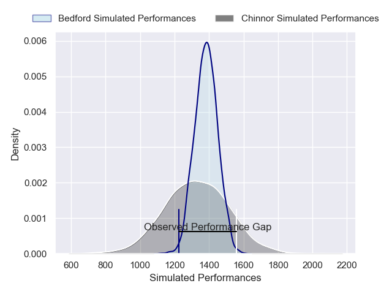
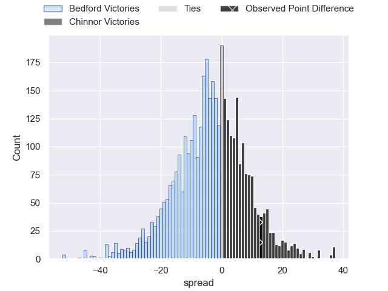
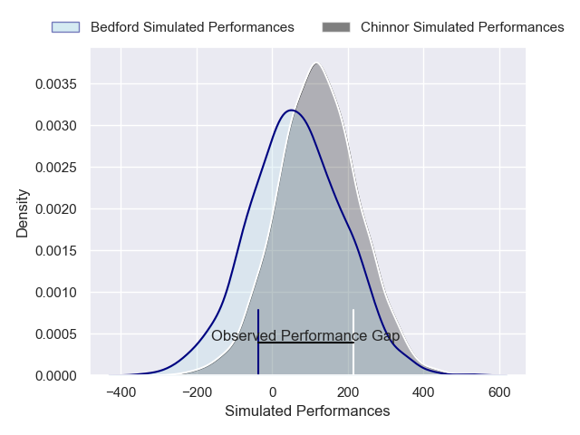
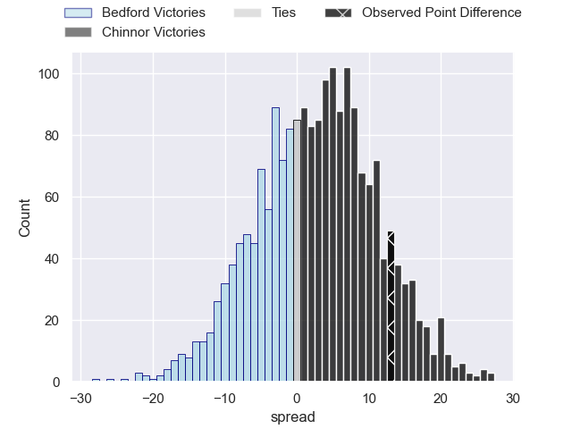

---  
layout: page  
title: Bedford at Chinnor; 5-18  
date: 2024-12-21 18:00:00 -0500  
categories: "RFU Championship 2024" match review  
---
# Bedford at Chinnor; 5-18

# Club Level Predictions

The first set of predictions treats a club as the smallest object, as the club develops its members, organizes a gameplan, and deploys its players as needed for each match. This club model has a prediction of 0.415, which translates to predicting Bedford to win by 3.1.

Our Over/Under is 51.5 - and combined with the spread above, we have a predicted scoreline of 27 to 24

Each club has a rating and a rating deviation (similar to a Glicko rating), and expected performances can be generated. This allows for simulated matches and spreads like the ones below.
## Projected Performances - Club Model

## Projected Spreads - Club Model

## Projected Results - Club Model

# Player Level Predictions

Treating teams instead as an entity made up of the currently active players, I have ratings for each player in an altogether different system. These can be combined to form team ratings once teamsheets are announced, weighting starters a bit higher than the reserves. After the match is played, players can be weighted by their minutes on the field, allowing for an accurate measure of the team's composition. With these compiled team ratings, we can make predictions, measure inaccuracy, and update the individual player ratings.
## Prediction without Player Minutes: Chinnor by 4.5

Chinnor by 2.3 on a neutral pitch

## Projected Performances - Player Model

## Projected Spreads - Player Model

## Projected Results - Player Model

|   Away Minutes | Away Player             |   Away Percentile |   Number |   Home Percentile | Home Player    |   Home Minutes |
|---------------:|:------------------------|------------------:|---------:|------------------:|:---------------|---------------:|
|              3 | Joey Conway             |             64.26 |        1 |             42.45 | Keston Lines   |             48 |
|             50 | Tommy Herman            |             66.15 |        2 |             96.58 | Alun Walker    |              5 |
|             22 | Oisin Heffernan         |             75.36 |        3 |             59.62 | Rob Hardwick   |             80 |
|             53 | Luke Frost              |              8.67 |        4 |             19.34 | Scott Hall     |             64 |
|             13 | Alex Woolford           |             70.69 |        5 |             63.92 | Charlie Irvine |             80 |
|             32 | Fyn Brown               |             27.72 |        6 |             73.64 | Harry Dugmore  |             61 |
|             62 | Joe Howard              |             16.07 |        7 |             59.78 | Izzy Wharton   |             80 |
|             80 | Cameron King            |              6.88 |        8 |             62.32 | Willie Ryan    |             80 |
|             80 | Jonny Weimann           |             14.01 |        9 |             65.7  | Callum Pascoe  |             64 |
|             75 | George Makepeace-Cubitt |             70.51 |       10 |             44.24 | Connor Slevin  |              7 |
|             35 | Dean Adamson            |             80.95 |       11 |             65.93 | Kieran Goss    |             80 |
|             80 | Josh Matavesi           |             10.54 |       12 |             49.95 | Morgan Passman |             19 |
|             75 | Michael Le Bourgeois    |             69.07 |       13 |             51.51 | Grant Hughes   |             48 |
|             30 | Alfie Garside           |             62.27 |       14 |             18.45 | Joe Browning   |             80 |
|             50 | Louis James             |             32.41 |       15 |             44.07 | William Feeney |             30 |
|             58 | Jamie Jack              |             29.28 |       16 |             87.92 | Luke Carter    |              1 |
|             50 | Johnny Stewart          |             38.82 |       17 |             48.22 | Alfie North    |             50 |
|             80 | Beltus Nonleh           |             46.71 |       18 |             77.37 | George Worboys |             30 |
|             56 | Shay Kerry              |             16.39 |       19 |            nan    | Ethan Clarke   |             27 |
|             80 | Freddie Tuilagi         |             10.17 |       20 |            nan    | Will Cave      |             27 |
|             77 | James Lennon            |             20.13 |       21 |            nan    | Ted Johnson    |             19 |
|             59 | William Maisey          |             88.89 |       22 |            nan    | Charlie Watson |             53 |
|             81 | Matt Worley             |             84.15 |       23 |            nan    | nan            |            nan |

