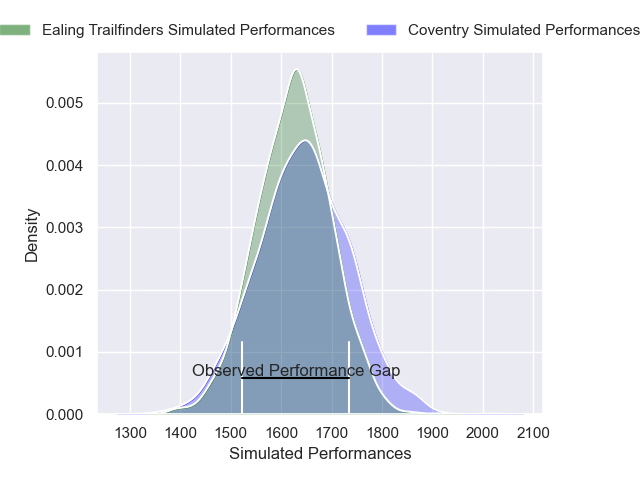
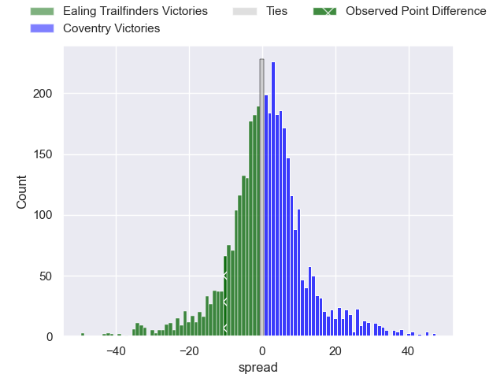
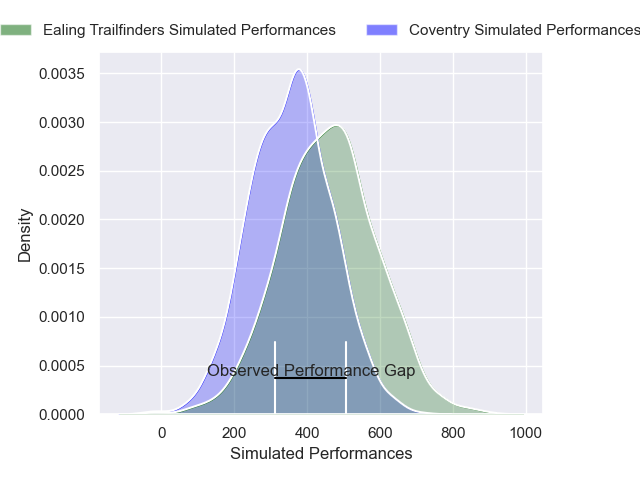
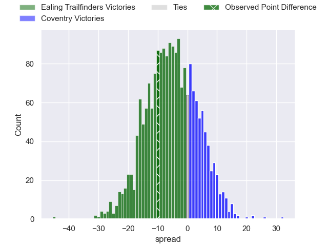

---  
layout: page  
title: Ealing Trailfinders at Coventry; 35-25  
date: 2024-12-21 18:00:00 -0500  
categories: "RFU Championship 2024" match review  
---
# Ealing Trailfinders at Coventry; 35-25

# Club Level Predictions

The first set of predictions treats a club as the smallest object, as the club develops its members, organizes a gameplan, and deploys its players as needed for each match. This club model has a prediction of 0.522, which translates to predicting Coventry to win by 0.8.

Our Over/Under is 50.5 - and combined with the spread above, we have a predicted scoreline of 25 to 26

Each club has a rating and a rating deviation (similar to a Glicko rating), and expected performances can be generated. This allows for simulated matches and spreads like the ones below.
## Projected Performances - Club Model

## Projected Spreads - Club Model

## Projected Results - Club Model

# Player Level Predictions

Treating teams instead as an entity made up of the currently active players, I have ratings for each player in an altogether different system. These can be combined to form team ratings once teamsheets are announced, weighting starters a bit higher than the reserves. After the match is played, players can be weighted by their minutes on the field, allowing for an accurate measure of the team's composition. With these compiled team ratings, we can make predictions, measure inaccuracy, and update the individual player ratings.
## Prediction without Player Minutes: Coventry by 4.4

Coventry by 0.9 on a neutral pitch

## Projected Performances - Player Model

## Projected Spreads - Player Model

## Projected Results - Player Model

|   Away Minutes | Away Player         |   Away Percentile |   Number |   Home Percentile | Home Player          |   Home Minutes |
|---------------:|:--------------------|------------------:|---------:|------------------:|:---------------------|---------------:|
|             67 | Kyle John Whyte     |             68.84 |        1 |             79.18 | Toby Trinder         |             13 |
|              5 | Matthew Cornish     |             76.4  |        2 |             80.75 | Jordon Poole         |             80 |
|              5 | George Davis        |             68.09 |        3 |             71.66 | Steven Longwell      |             16 |
|             18 | Bobby de Wee        |             95.32 |        4 |             73.03 | Obinna Nkwocha       |             50 |
|             30 | Sean Lonsdale       |             52.56 |        5 |             98.44 | Senitiki Nayalo      |             16 |
|             45 | Rob Farrar          |             87.76 |        6 |             91.58 | Tom Ball             |             13 |
|             30 | Jordy Reid          |             77.21 |        7 |             19.64 | Aaron Hinkley        |             24 |
|             80 | Ryan Smid           |             77.79 |        8 |             52.01 | Matt Kvesic          |             13 |
|             80 | Lloyd Williams      |             90.18 |        9 |             51.69 | Josh Barton          |             81 |
|             81 | Dan Jones           |             78.59 |       10 |             29.29 | Liam Richman         |             53 |
|             80 | Michael Dykes       |             82.39 |       11 |             88.57 | James Martin         |             67 |
|             80 | Jordan Holgate      |             84.98 |       12 |             73.56 | Thomas Hitchcock     |             80 |
|             80 | Reuben Bird-Tulloch |             80.59 |       13 |             20.98 | Dafydd-Rhys Tiueti   |             80 |
|             67 | Angus Kernohan      |             91.69 |       14 |             69.59 | Ryan Hutler          |             80 |
|             67 | Tobi Wilson         |             80.74 |       15 |             57.96 | Charlie Robson       |             24 |
|             74 | Daniel Cutmore      |             89.16 |       16 |             27.96 | Eliot Salt           |             80 |
|             27 | Craig Hampson       |             83.25 |       17 |             82.05 | James Tyas           |             81 |
|             61 | Lefty Zigiriadis    |             76.87 |       18 |             53.01 | Chester Owen         |             61 |
|             61 | Biyi Alo            |             77.24 |       19 |             38.59 | Tommy Mathews        |             25 |
|             57 | Craig Willis        |             97.58 |       20 |             18.14 | David Opoku-Fordjour |             55 |
|             57 | Callum Chick        |             17.19 |       21 |            nan    | Will Biggs           |             16 |
|             81 | Francis Moore       |             39.9  |       22 |            nan    | Finlay Ogden         |             30 |
|             57 | Mike Willemse       |             80.28 |       23 |             21.25 | Jevaughn Warren      |             48 |

