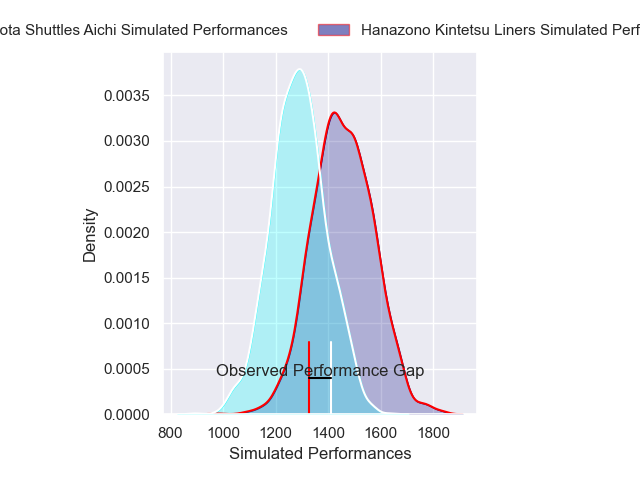
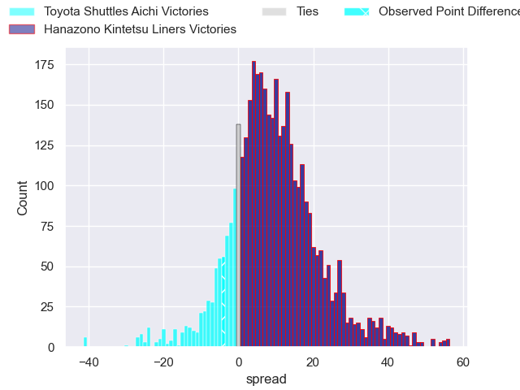
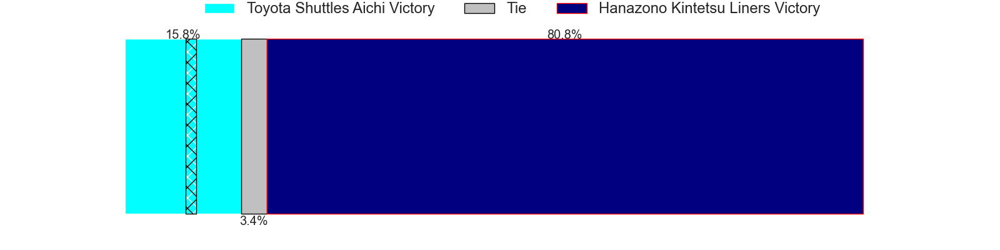
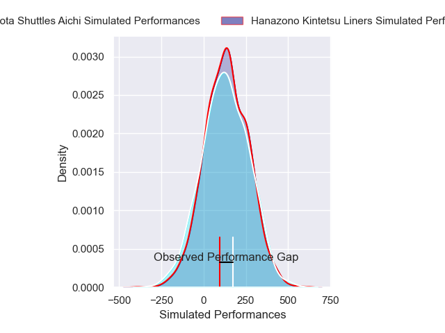
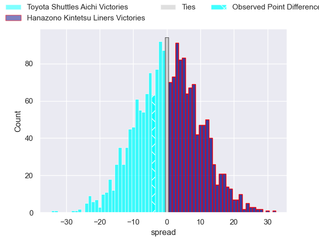
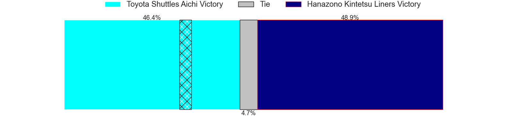

---  
layout: page  
title: Toyota Shuttles Aichi at Hanazono Kintetsu Liners; 24-20  
date: 2024-12-21 18:00:00 -0500  
categories: "Japan Rugby League One D2 2024" match review  
---
# Toyota Shuttles Aichi at Hanazono Kintetsu Liners; 24-20

# Club Level Predictions

The first set of predictions treats a club as the smallest object, as the club develops its members, organizes a gameplan, and deploys its players as needed for each match. This club model has a prediction of 0.712, which translates to predicting Hanazono Kintetsu Liners to win by 8.3.

Our Over/Under is 44.5 - and combined with the spread above, we have a predicted scoreline of 18 to 27

Each club has a rating and a rating deviation (similar to a Glicko rating), and expected performances can be generated. This allows for simulated matches and spreads like the ones below.
## Projected Performances - Club Model

## Projected Spreads - Club Model

## Projected Results - Club Model

# Player Level Predictions

Treating teams instead as an entity made up of the currently active players, I have ratings for each player in an altogether different system. These can be combined to form team ratings once teamsheets are announced, weighting starters a bit higher than the reserves. After the match is played, players can be weighted by their minutes on the field, allowing for an accurate measure of the team's composition. With these compiled team ratings, we can make predictions, measure inaccuracy, and update the individual player ratings.
## Prediction without Player Minutes: Hanazono Kintetsu Liners by 0.3

Toyota Shuttles Aichi by 4.2 on a neutral pitch

## Projected Performances - Player Model

## Projected Spreads - Player Model

## Projected Results - Player Model

|   Away Minutes | Away Player          |   Away Percentile |   Number |   Home Percentile | Home Player      |   Home Minutes |
|---------------:|:---------------------|------------------:|---------:|------------------:|:-----------------|---------------:|
|             80 | Tomoki Yamaguchi     |             37.81 |        1 |              6.83 | Kenta Tanaka     |             80 |
|             80 | Takuma Oyama         |             54.19 |        2 |             41.77 | Reiya Ueyama     |             80 |
|             80 | Ryota Fukamura       |             27.59 |        3 |             16.05 | Kota Mitake      |             80 |
|             80 | Taishi Nakamura      |             68.6  |        4 |             94.28 | Sam Jeffries     |             80 |
|             80 | James Gaskell        |             41.54 |        5 |             37.55 | Sanaila Waqa     |             80 |
|             80 | Tama Kapene          |             71.68 |        6 |             17.77 | James Blackwell  |             80 |
|             80 | Chang Chao Yi        |             58.08 |        7 |             20.41 | Jed Brown        |             80 |
|             80 | Tom Florence         |             59.17 |        8 |             21.78 | Jose Seru        |             80 |
|             80 | Keita Fujiwara       |             91.47 |        9 |             85.83 | Will Genia       |             80 |
|             80 | Freddie Burns        |             91.52 |       10 |              2.63 | Will Harrison    |             80 |
|             80 | Go Nakano            |             29.5  |       11 |             10.67 | Semisi Masirewa  |             80 |
|             80 | Tiaan Thomas-Wheeler |              1.66 |       12 |              3.32 | Koji Okamura     |             80 |
|             80 | Ken Tonobe           |             61.56 |       13 |             25.07 | Tom Hendrickson  |             80 |
|             80 | Hiroaki Saito        |             17.23 |       14 |             83.84 | Takahiro Hayashi |             80 |
|             80 | Josua Kerevi         |             73.52 |       15 |             41.67 | Hiroki Kumoyama  |             80 |

