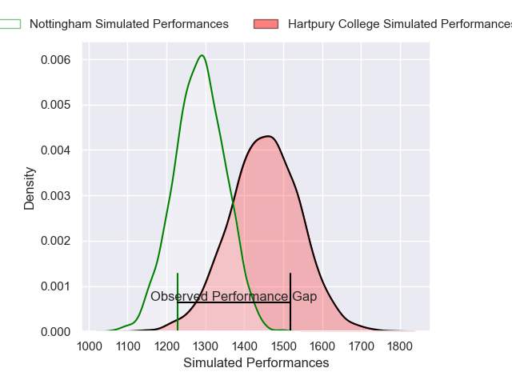
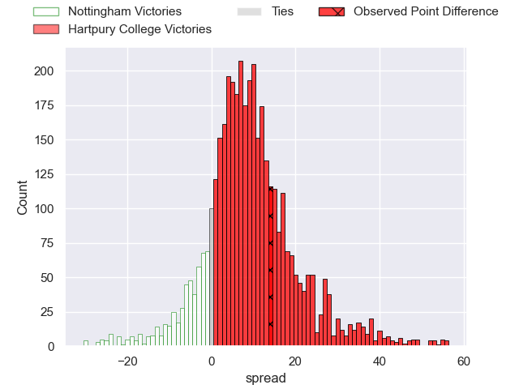
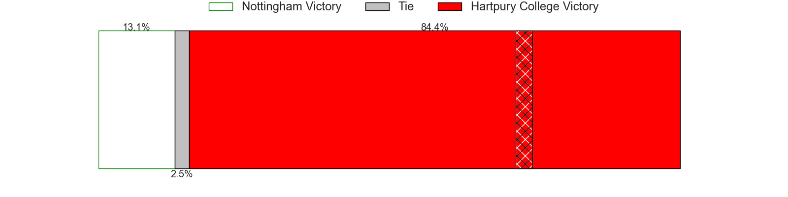
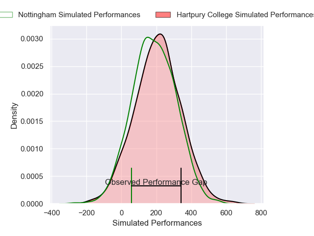
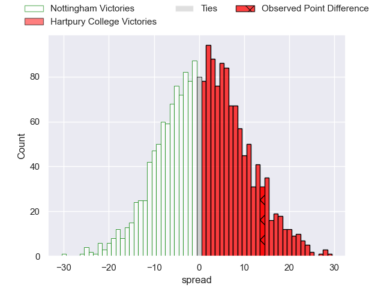

---  
layout: page  
title: Nottingham at Hartpury College; 7-21  
date: 2024-12-21 18:00:00 -0500  
categories: "RFU Championship 2024" match review  
---
# Nottingham at Hartpury College; 7-21

# Club Level Predictions

The first set of predictions treats a club as the smallest object, as the club develops its members, organizes a gameplan, and deploys its players as needed for each match. This club model has a prediction of 0.721, which translates to predicting Hartpury College to win by 8.4.

Our Over/Under is 64.5 - and combined with the spread above, we have a predicted scoreline of 28 to 36

Each club has a rating and a rating deviation (similar to a Glicko rating), and expected performances can be generated. This allows for simulated matches and spreads like the ones below.
## Projected Performances - Club Model

## Projected Spreads - Club Model

## Projected Results - Club Model

# Player Level Predictions

Treating teams instead as an entity made up of the currently active players, I have ratings for each player in an altogether different system. These can be combined to form team ratings once teamsheets are announced, weighting starters a bit higher than the reserves. After the match is played, players can be weighted by their minutes on the field, allowing for an accurate measure of the team's composition. With these compiled team ratings, we can make predictions, measure inaccuracy, and update the individual player ratings.
## Prediction without Player Minutes: Hartpury College by 2.2

Nottingham by 2.0 on a neutral pitch

## Projected Performances - Player Model

## Projected Spreads - Player Model

## Projected Results - Player Model

|   Away Minutes | Away Player          |   Away Percentile |   Number |   Home Percentile | Home Player           |   Home Minutes |
|---------------:|:---------------------|------------------:|---------:|------------------:|:----------------------|---------------:|
|             28 | Kai Owen             |             32.41 |        1 |             77.43 | Aristot Benz-Salomon  |             60 |
|             61 | Jack Dickinson       |             56.99 |        2 |             64.44 | William Crane         |             80 |
|             80 | Dan Richardson       |             72.35 |        3 |             73.61 | Jonathan Benz-Salomon |             28 |
|             80 | Jack Shine           |             67.3  |        4 |             74.93 | Dale Lemon            |             80 |
|             80 | Lewis Chessum        |             26.28 |        5 |             75.37 | Jack Davies           |             52 |
|             28 | Sam Green            |             31.55 |        6 |             57.57 | Samuel Lewis          |             80 |
|             18 | Jacob Wright         |             30.61 |        7 |             84.01 | Harry Short           |             80 |
|              7 | James Cherry         |             63.04 |        8 |             16.48 | Jarrad Hayler         |             52 |
|             20 | Will Yarnell         |             63.61 |        9 |             64.09 | Michael Austin        |             72 |
|             80 | Matthew Arden        |             81.21 |       10 |             90.1  | Harry Bazalgette      |             80 |
|             12 | Harry Graham         |             82.24 |       11 |             40.09 | Oliver Holliday       |             28 |
|             60 | Gwyn Parks           |             13.95 |       12 |             31.51 | Robbie Smith          |             80 |
|              8 | Kegan Christian-Goss |             70.24 |       13 |             36.59 | Josiah Edwards-Giraud |              4 |
|             28 | David Williams       |             40.78 |       14 |             76.52 | Bradley Denty         |             15 |
|             32 | Ryan Olowofela       |             72.96 |       15 |             61.85 | Alex Morgan           |             80 |
|             80 | Sam Mercer           |             45.35 |       16 |             61.02 | Ethan Hunt            |             64 |
|             75 | Aman Johal           |            nan    |       17 |             35.74 | Archie McArthur       |             32 |
|             80 | Kody Vereti          |             78.49 |       18 |              4.01 | Joe Rees              |             80 |
|             20 | Aniseko Sio          |             66.77 |       19 |             27.06 | Cameron Cobbett       |             80 |
|             80 | Ale Loman            |             77.12 |       20 |            nan    | Carn Richards-Farr    |             79 |
|             50 | Harry Clayton        |             84.63 |       21 |             87.59 | Ioan Jones            |             80 |
|             52 | Josh Goodwin         |             30.11 |       22 |             40.85 | Alex Forrester        |             80 |
|             80 | Xavier Valentine     |             26.21 |       23 |             78.38 | Rory Taylor           |             70 |

