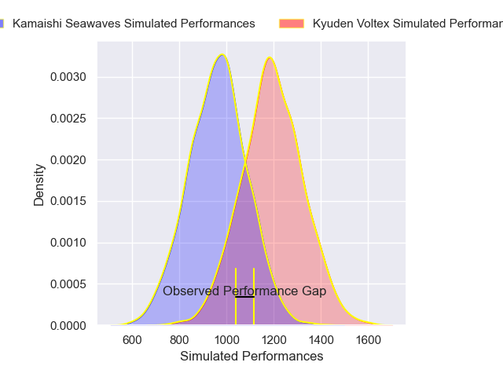
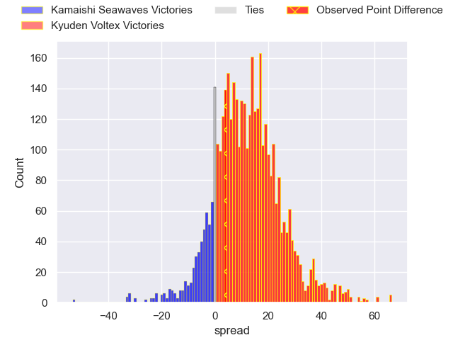
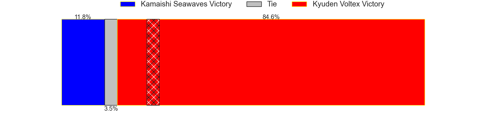
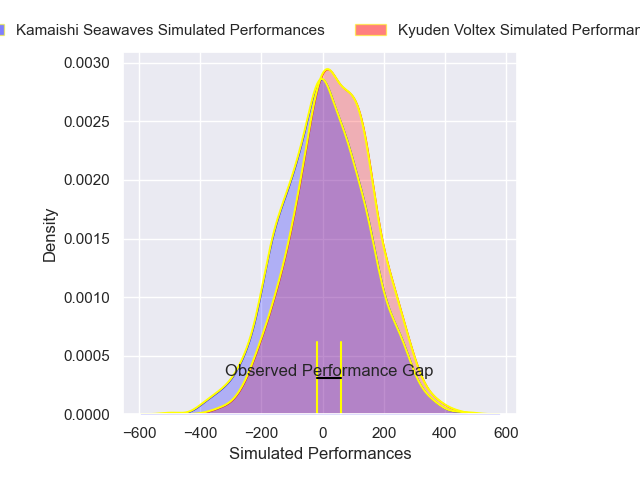
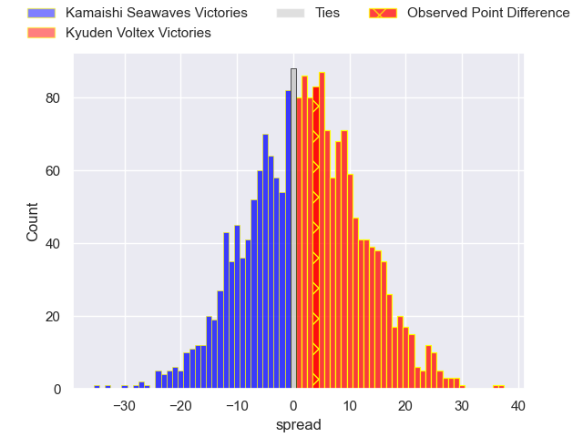
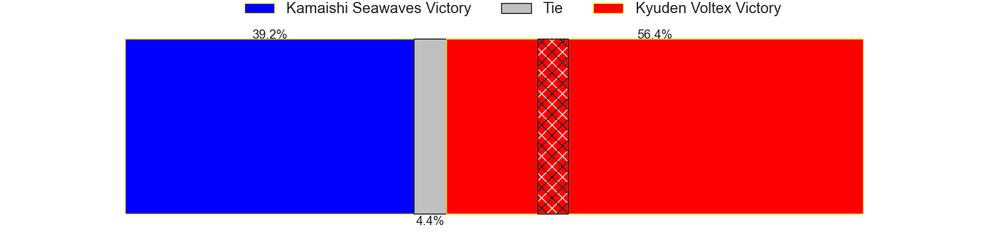

---  
layout: page  
title: Kamaishi Seawaves at Kyuden Voltex; 23-27  
date: 2024-12-21 18:00:00 -0500  
categories: "Japan Rugby League One D2 2024" match review  
---
# Kamaishi Seawaves at Kyuden Voltex; 23-27

# Club Level Predictions

The first set of predictions treats a club as the smallest object, as the club develops its members, organizes a gameplan, and deploys its players as needed for each match. This club model has a prediction of 0.774, which translates to predicting Kyuden Voltex to win by 11.5.

Our Over/Under is 48.5 - and combined with the spread above, we have a predicted scoreline of 19 to 30

Each club has a rating and a rating deviation (similar to a Glicko rating), and expected performances can be generated. This allows for simulated matches and spreads like the ones below.
## Projected Performances - Club Model

## Projected Spreads - Club Model

## Projected Results - Club Model

# Player Level Predictions

Treating teams instead as an entity made up of the currently active players, I have ratings for each player in an altogether different system. These can be combined to form team ratings once teamsheets are announced, weighting starters a bit higher than the reserves. After the match is played, players can be weighted by their minutes on the field, allowing for an accurate measure of the team's composition. With these compiled team ratings, we can make predictions, measure inaccuracy, and update the individual player ratings.
## Prediction without Player Minutes: Kyuden Voltex by 1.3

Kamaishi Seawaves by 1.7 on a neutral pitch

## Projected Performances - Player Model

## Projected Spreads - Player Model

## Projected Results - Player Model

|   Away Minutes | Away Player         |   Away Percentile |   Number |   Home Percentile | Home Player            |   Home Minutes |
|---------------:|:--------------------|------------------:|---------:|------------------:|:-----------------------|---------------:|
|             80 | Yusuke Yamada       |             22.57 |        1 |             27.9  | Samuel Nozomu Faialaga |             80 |
|             80 | Daiki Ito           |              3.42 |        2 |              2.48 | Kyungmun Wang          |             80 |
|             80 | Satoshi Ueda        |             61.38 |        3 |             28.4  | Kosuke Oike            |             80 |
|             80 | Satoshi Hatazawa    |             45.53 |        4 |             68.17 | Tomotaka Ishimatsu     |             80 |
|             80 | Hamish Dalzell      |             12.84 |        5 |             17.87 | Ray Tatafu             |             80 |
|             80 | Ben Nee Nee         |             21.94 |        6 |             60.03 | Masahiro Eriguchi      |             80 |
|             80 | Ryota Kono          |             33.25 |        7 |             55.7  | Keisuke Yamzoe         |             80 |
|             80 | Sam Henwood         |              6.02 |        8 |              5.87 | Colby Fainga'a         |             80 |
|             80 | Atsushi Minami      |             22.06 |        9 |             64.25 | Spencer Jeans          |             80 |
|             80 | Mitch Hunt          |             69.9  |       10 |             47.07 | Kohei Kire             |             80 |
|             80 | Ryuji Abe           |             19.05 |       11 |             27.13 | Ren Hagiwara           |             80 |
|             80 | Gerdus van der Walt |             15.71 |       12 |             24    | Hayato Kojo            |             80 |
|             80 | Katsuto Hatanaka    |             39.51 |       13 |             18.93 | Sione Likuata          |             80 |
|             80 | Gousuke Kawakami    |             20.58 |       14 |             24.54 | Yasunari Isoda         |             80 |
|             80 | Kaisei Takai        |             40.19 |       15 |              2.96 | Makoto Kato            |             80 |

