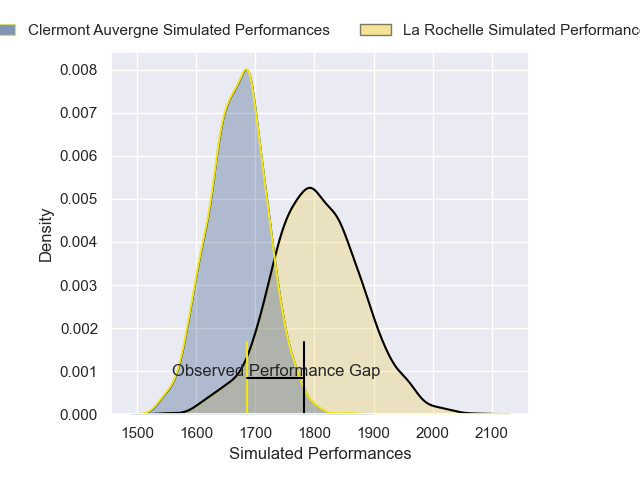
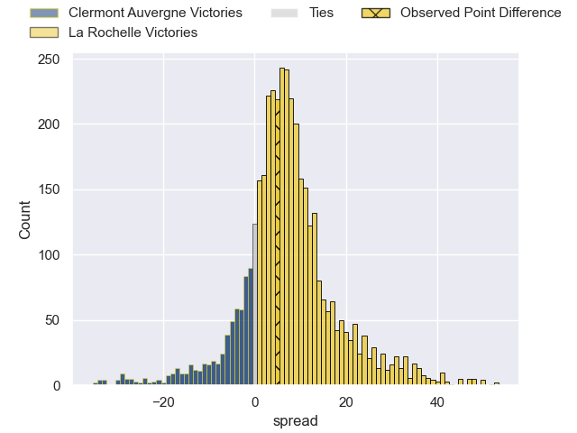
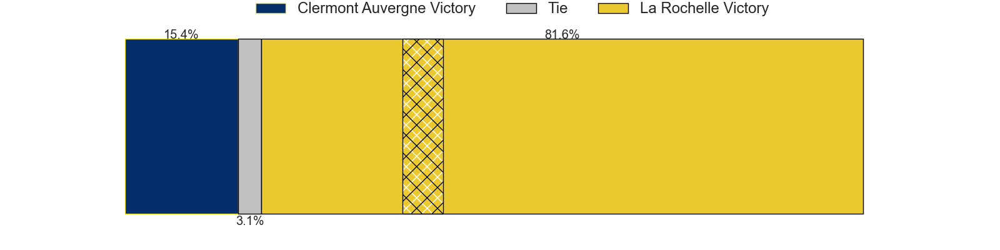
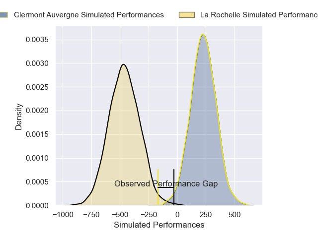
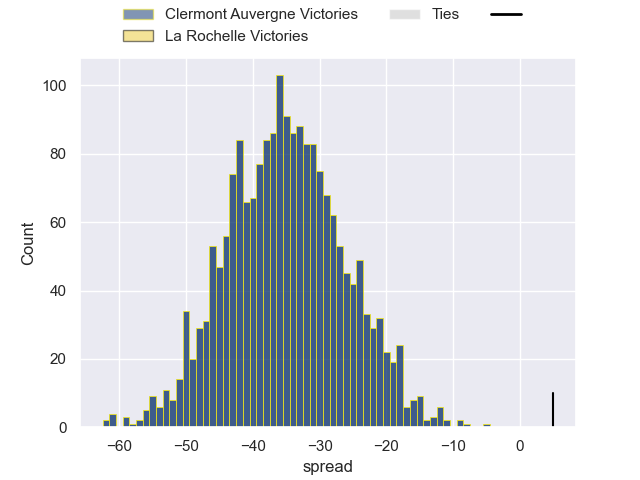

---  
layout: page  
title: Clermont Auvergne at La Rochelle; 15-20  
date: 2024-12-21 18:00:00 -0500  
categories: "Top 14 Orange 2024" match review  
---
# Clermont Auvergne at La Rochelle; 15-20

# Club Level Predictions

The first set of predictions treats a club as the smallest object, as the club develops its members, organizes a gameplan, and deploys its players as needed for each match. This club model has a prediction of 0.682, which translates to predicting La Rochelle to win by 6.7.

Our Over/Under is 47.5 - and combined with the spread above, we have a predicted scoreline of 21 to 27

Each club has a rating and a rating deviation (similar to a Glicko rating), and expected performances can be generated. This allows for simulated matches and spreads like the ones below.
## Projected Performances - Club Model

## Projected Spreads - Club Model

## Projected Results - Club Model

# Player Level Predictions

Treating teams instead as an entity made up of the currently active players, I have ratings for each player in an altogether different system. These can be combined to form team ratings once teamsheets are announced, weighting starters a bit higher than the reserves. After the match is played, players can be weighted by their minutes on the field, allowing for an accurate measure of the team's composition. With these compiled team ratings, we can make predictions, measure inaccuracy, and update the individual player ratings.
## Prediction without Player Minutes: Clermont Auvergne by 4.0

Clermont Auvergne by 15.7 on a neutral pitch

## Projected Performances - Player Model

## Projected Spreads - Player Model

## Projected Results - Player Model

|   Away Minutes | Away Player          |   Away Percentile |   Number |   Home Percentile | Home Player        |   Home Minutes |
|---------------:|:---------------------|------------------:|---------:|------------------:|:-------------------|---------------:|
|             65 | Sacha Lotrian        |             17.87 |        1 |             65.64 | Louis Penverne     |             27 |
|              0 | Etienne Fourcade     |             88.04 |        2 |             85.4  | Quentin Lespiaucq  |              3 |
|             40 | Cristian Ojovan      |             34.29 |        3 |             84.51 | Uini Atonio        |             29 |
|             47 | Rob Simmons          |             88.55 |        4 |             80.31 | Ultan Dillane      |             34 |
|             65 | Thomas Ceyte         |             51.69 |        5 |             81.44 | Will Skelton       |             41 |
|             65 | Thomas Ceyte         |             51.69 |        5 |             81.44 | Will Skelton       |             65 |
|             65 | Thomas Ceyte         |             51.69 |        5 |             81.44 | Will Skelton       |             25 |
|             65 | Thomas Ceyte         |             51.69 |        5 |             81.44 | Will Skelton       |             54 |
|             65 | Alexandre Fischer    |             82.48 |        6 |             16.33 | Judicael Cancoriet |             11 |
|             29 | Marcos Kremer        |             94.47 |        7 |             97.36 | Levani Botia       |             81 |
|             21 | Peceli Yato          |             26.93 |        8 |             78.37 | Gregory Alldritt   |             25 |
|             65 | Baptiste Jauneau     |             76.01 |        9 |             94.69 | Thomas Berjon      |             34 |
|             53 | Benjamin Urdapilleta |             80.4  |       10 |             58.18 | Ihaia West         |             80 |
|             21 | Alivereti Raka       |             13.41 |       11 |             92    | Jules Favre        |             26 |
|             21 | Irae Simone          |             47.61 |       12 |             89.17 | Ulupano Seuteni    |             81 |
|             77 | Mathys Belaubre      |             31.9  |       13 |             91.8  | Teddy Thomas       |             53 |
|             80 | Lucas Tauzin         |             85.67 |       14 |             97.48 | Dillyn Leyds       |             16 |
|             51 | Alex Newsome         |             65.19 |       15 |             98.89 | Brice Dulin        |             56 |
|             34 | Barnabe Massa        |             83.07 |       16 |             70.19 | Tolu Latu          |             56 |
|             23 | Giorgi Akhaladze     |             16.8  |       17 |            nan    | Thierry Paiva      |             40 |
|             23 | Thibaud Lanen        |             88.12 |       18 |             71.21 | Kane Douglas       |             81 |
|             76 | Killian Tixeront     |             85.2  |       19 |             80.27 | Matthias Haddad    |             70 |
|             58 | Sebastien Bezy       |             77.62 |       20 |             84.61 | Oscar Jegou        |             81 |
|             80 | Theo Giral           |            nan    |       21 |            nan    | Hoani Bosmorin     |             81 |
|             46 | Pierre Fouyssac      |             29.85 |       22 |             58.79 | Antoine Hastoy     |             81 |
|             23 | Regis Montagne       |             68.71 |       23 |             81    | Joel Sclavi        |             65 |

