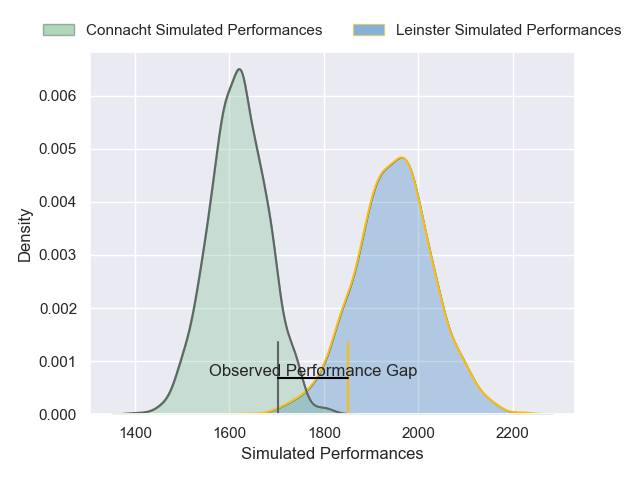
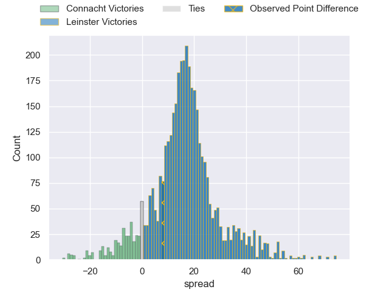
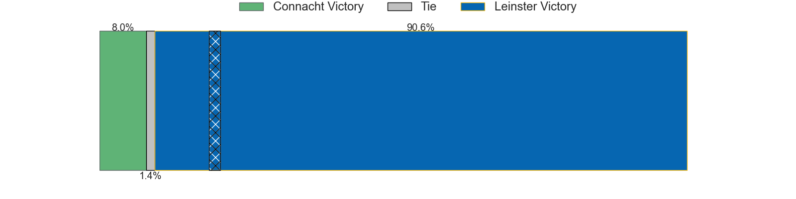
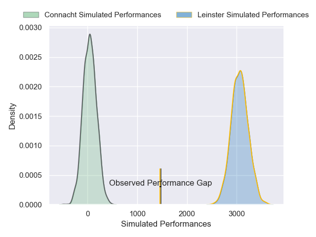
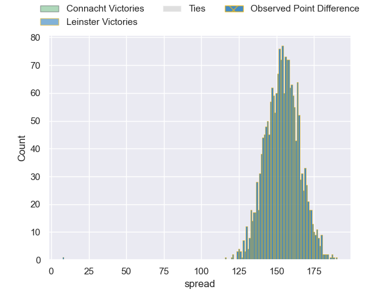

---  
layout: page  
title: Connacht at Leinster; 12-20  
date: 2024-12-21 18:00:00 -0500  
categories: "United Rugby Championship 2024" match review  
---
# Connacht at Leinster; 12-20

# Club Level Predictions

The first set of predictions treats a club as the smallest object, as the club develops its members, organizes a gameplan, and deploys its players as needed for each match. This club model has a prediction of 0.865, which translates to predicting Leinster to win by 16.4.

Our Over/Under is 48.5 - and combined with the spread above, we have a predicted scoreline of 16 to 33

Each club has a rating and a rating deviation (similar to a Glicko rating), and expected performances can be generated. This allows for simulated matches and spreads like the ones below.
## Projected Performances - Club Model

## Projected Spreads - Club Model

## Projected Results - Club Model

# Player Level Predictions

Treating teams instead as an entity made up of the currently active players, I have ratings for each player in an altogether different system. These can be combined to form team ratings once teamsheets are announced, weighting starters a bit higher than the reserves. After the match is played, players can be weighted by their minutes on the field, allowing for an accurate measure of the team's composition. With these compiled team ratings, we can make predictions, measure inaccuracy, and update the individual player ratings.
## Prediction without Player Minutes: Leinster by 87.6

Leinster by 77.5 on a neutral pitch

## Projected Performances - Player Model

## Projected Spreads - Player Model

## Projected Results - Player Model

|   Away Minutes | Away Player           |   Away Percentile |   Number |   Home Percentile | Home Player         |   Home Minutes |
|---------------:|:----------------------|------------------:|---------:|------------------:|:--------------------|---------------:|
|             30 | Denis Buckley         |             64.01 |        1 |             73.42 | Jack Boyle          |             44 |
|             30 | Dave Heffernan        |             12.27 |        2 |             99.69 | Gus McCarthy        |             59 |
|             30 | Dave Heffernan        |             12.27 |        2 |             99.69 | Gus McCarthy        |             17 |
|             30 | Dave Heffernan        |             12.27 |        2 |             99.69 | Gus McCarthy        |             29 |
|             30 | Dave Heffernan        |             12.27 |        2 |             99.69 | Gus McCarthy        |             81 |
|             81 | Finlay Bealham        |             59.69 |        3 |             86.21 | Rabah Slimani       |             81 |
|             81 | Finlay Bealham        |             59.69 |        3 |             86.21 | Rabah Slimani       |             49 |
|             81 | Finlay Bealham        |             59.69 |        3 |             86.21 | Rabah Slimani       |             29 |
|             81 | Finlay Bealham        |             59.69 |        3 |             86.21 | Rabah Slimani       |              6 |
|             70 | Josh Murphy           |             92.63 |        4 |             64.18 | Diarmuid Mangan     |             20 |
|             81 | Darragh Murray        |             73.37 |        5 |             99.83 | RG Snyman           |             41 |
|             62 | Cian Prendergast      |             21.17 |        6 |             35.46 | Alex Soroka         |             81 |
|             81 | Shamus Hurley-Langton |             84.1  |        7 |             91.16 | Scott Penny         |             81 |
|             51 | Paul Boyle            |             13.9  |        8 |             77.65 | Jack Conan          |             81 |
|             30 | Ben Murphy            |             79.39 |        9 |             99.19 | Luke McGrath        |             81 |
|              9 | Josh Ioane            |             32.32 |       10 |             98.18 | Ross Byrne          |             81 |
|             48 | Shane Jennings        |             78.89 |       11 |             68.83 | Andrew Osborne      |             81 |
|             37 | Bundee Aki            |             97.17 |       12 |             89.76 | Jordie Barrett      |             51 |
|              6 | Cathal Forde          |              2.93 |       13 |             39.12 | Charlie Tector      |             81 |
|             34 | Mack Hansen           |             64.41 |       14 |             36.74 | Aitzol King         |             75 |
|             72 | Piers O'Conor         |             11.48 |       15 |             92.22 | Jimmy O'Brien       |             51 |
|             74 | Piers O'Conor         |             11.48 |       15 |             92.22 | Jimmy O'Brien       |             51 |
|             81 | Dylan Tierney-Martin  |             15.99 |       16 |             73.76 | Lee Barron          |             80 |
|             20 | Jordan Duggan         |             34.36 |       17 |             58.5  | Michael Milne       |             32 |
|             81 | Jack Aungier          |             19.94 |       18 |             78.06 | Cian Healy          |              5 |
|             51 | Oisin Dowling         |             60.02 |       19 |             88.46 | Brian Deeny         |             80 |
|             57 | Sean Jansen           |             10.46 |       20 |             90.63 | Ryan Baird          |             80 |
|             62 | Caolin Blade          |             38.65 |       21 |             93.24 | Jamison Gibson-Park |             22 |
|             53 | Santiago Cordero      |             98.15 |       22 |             89.49 | Harry Byrne         |             34 |
|             32 | Conor Oliver          |             87.84 |       23 |             98.38 | Max Deegan          |             81 |

