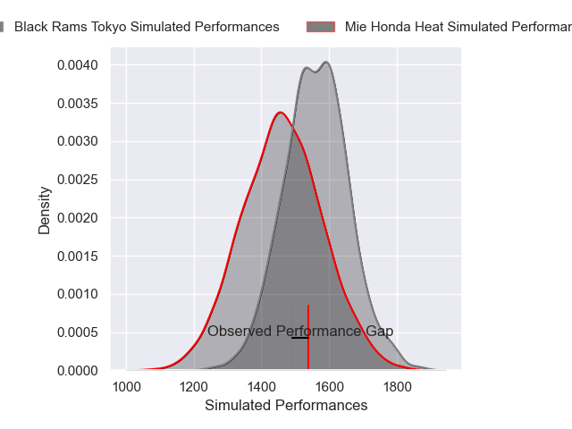
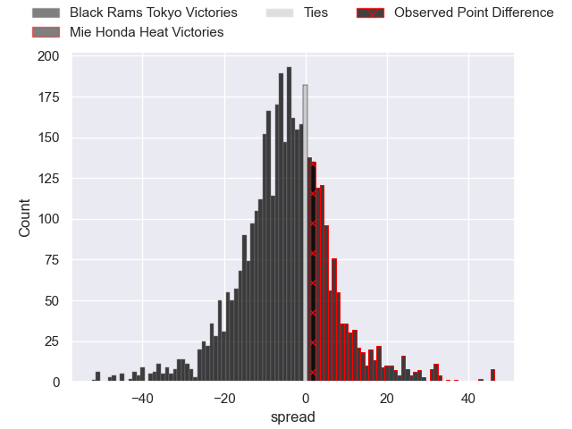
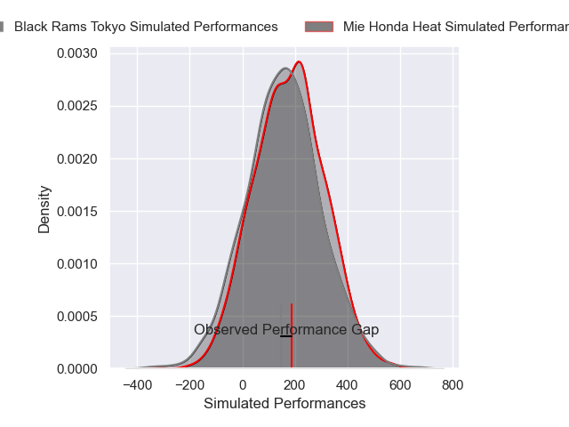
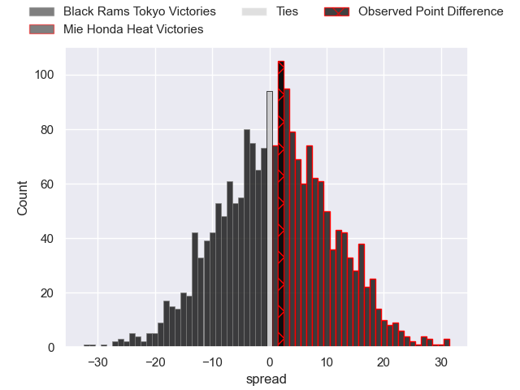

---  
layout: page  
title: Black Rams Tokyo at Mie Honda Heat; 21-23  
date: 2024-12-21 18:00:00 -0500  
categories: "Japan Rugby League One 2024" match review  
---
# Black Rams Tokyo at Mie Honda Heat; 21-23

# Club Level Predictions

The first set of predictions treats a club as the smallest object, as the club develops its members, organizes a gameplan, and deploys its players as needed for each match. This club model has a prediction of 0.373, which translates to predicting Black Rams Tokyo to win by 4.7.

Our Over/Under is 54.5 - and combined with the spread above, we have a predicted scoreline of 29 to 25

Each club has a rating and a rating deviation (similar to a Glicko rating), and expected performances can be generated. This allows for simulated matches and spreads like the ones below.
## Projected Performances - Club Model

## Projected Spreads - Club Model

## Projected Results - Club Model

# Player Level Predictions

Treating teams instead as an entity made up of the currently active players, I have ratings for each player in an altogether different system. These can be combined to form team ratings once teamsheets are announced, weighting starters a bit higher than the reserves. After the match is played, players can be weighted by their minutes on the field, allowing for an accurate measure of the team's composition. With these compiled team ratings, we can make predictions, measure inaccuracy, and update the individual player ratings.
## Prediction without Player Minutes: Mie Honda Heat by 1.3

Black Rams Tokyo by 2.2 on a neutral pitch

## Projected Performances - Player Model

## Projected Spreads - Player Model

## Projected Results - Player Model

|   Away Minutes | Away Player       |   Away Percentile |   Number |   Home Percentile | Home Player          |   Home Minutes |
|---------------:|:------------------|------------------:|---------:|------------------:|:---------------------|---------------:|
|             80 | Kazuma Nishi      |             39.87 |        1 |              6.08 | Tatsuhiko Tsurukawa  |             80 |
|             80 | Hinata Takei      |             28.73 |        2 |             32.45 | Koki Hida            |             80 |
|             80 | Paddy Ryan        |             57.18 |        3 |             21.69 | Katsuyuki Hoshino    |             80 |
|             80 | Mike Stolberg     |              3.47 |        4 |             28.97 | Mark Abbott          |             80 |
|             80 | Josh Goodhue      |             34.52 |        5 |             94.02 | Franco Mostert       |             80 |
|             80 | Brodi McCurran    |             64.29 |        6 |             98.98 | Pablo Matera         |             80 |
|             80 | Shuhei Matsuhashi |             67.18 |        7 |             10.54 | Ryota Kobayashi      |             80 |
|             80 | Liam Gill         |             61.03 |        8 |             28.94 | Talifolofola Tangipa |             80 |
|             80 | TJ Perenara       |             97.1  |        9 |             16.59 | Taichi Takenaka      |             80 |
|             80 | Ichigo Nakakusu   |             41.41 |       10 |             43.84 | Manu Vunipola        |             80 |
|             80 | Netani Vakayalia  |             64.25 |       11 |             59.07 | Larry Steven Sulunga |             80 |
|             80 | Yuki Ikeda        |             52.1  |       12 |              4.49 | Fraser Quirk         |             80 |
|             80 | Ryohei Isoda      |             66.44 |       13 |             44.29 | Kyogo Okano          |             80 |
|             80 | Viliami Lolohea   |             16.39 |       14 |             17.68 | Haruhiko Uemura      |             80 |
|             80 | Kotaro Ito        |             37.59 |       15 |             80.37 | Tom Banks            |             80 |

