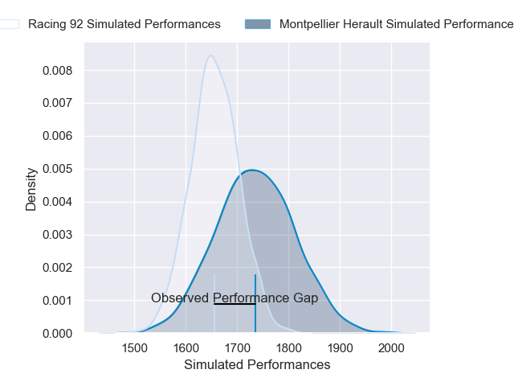
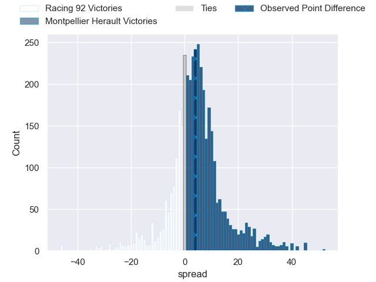
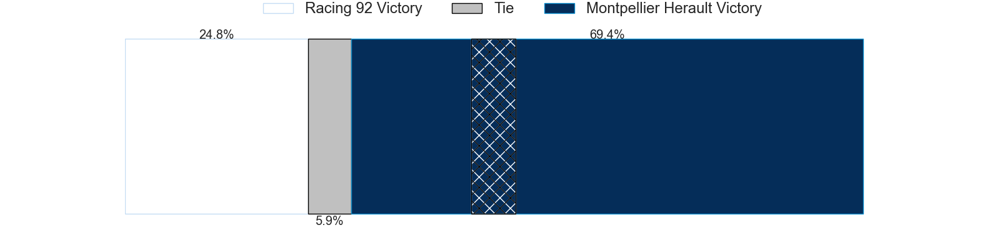
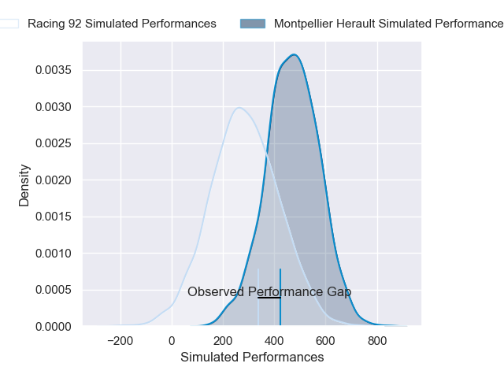
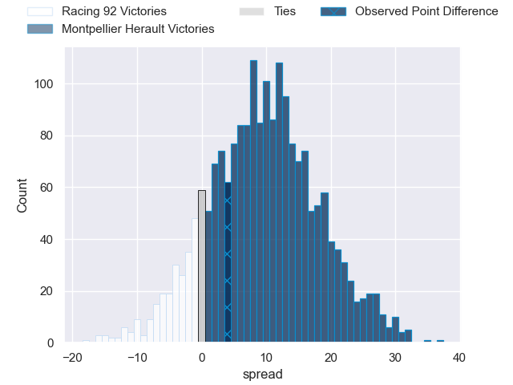
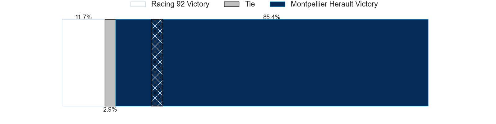

---  
layout: page  
title: Racing 92 at Montpellier Herault; 17-21  
date: 2024-12-21 18:00:00 -0500  
categories: "Top 14 Orange 2024" match review  
---
# Racing 92 at Montpellier Herault; 17-21

# Club Level Predictions

The first set of predictions treats a club as the smallest object, as the club develops its members, organizes a gameplan, and deploys its players as needed for each match. This club model has a prediction of 0.614, which translates to predicting Montpellier Herault to win by 4.1.

Our Over/Under is 46.5 - and combined with the spread above, we have a predicted scoreline of 21 to 25

Each club has a rating and a rating deviation (similar to a Glicko rating), and expected performances can be generated. This allows for simulated matches and spreads like the ones below.
## Projected Performances - Club Model

## Projected Spreads - Club Model

## Projected Results - Club Model

# Player Level Predictions

Treating teams instead as an entity made up of the currently active players, I have ratings for each player in an altogether different system. These can be combined to form team ratings once teamsheets are announced, weighting starters a bit higher than the reserves. After the match is played, players can be weighted by their minutes on the field, allowing for an accurate measure of the team's composition. With these compiled team ratings, we can make predictions, measure inaccuracy, and update the individual player ratings.
## Prediction without Player Minutes: Montpellier Herault by 10.5

Racing 92 by 1.6 on a neutral pitch

## Projected Performances - Player Model

## Projected Spreads - Player Model

## Projected Results - Player Model

|   Away Minutes | Away Player         |   Away Percentile |   Number |   Home Percentile | Home Player         |   Home Minutes |
|---------------:|:--------------------|------------------:|---------:|------------------:|:--------------------|---------------:|
|             52 | Eddy Ben Arous      |             80.63 |        1 |              6.77 | Baptiste Erdocio    |             18 |
|             84 | Feleti Kaitu'u      |             28.42 |        2 |             16.3  | Jordan Uelese       |             74 |
|             21 | Thomas Laclayat     |             60.88 |        3 |             66.52 | Wilfrid Hounkpatin  |             38 |
|             40 | Will Rowlands       |              8.33 |        4 |             71.12 | Florian Verhaeghe   |             82 |
|             81 | Romain Taofifenua   |             45.1  |        5 |             84.82 | Tyler Duguid        |             11 |
|             65 | Cameron Woki        |             92.26 |        6 |             91.84 | Yacouba Camara      |             30 |
|             82 | Ibrahim Diallo      |             43.28 |        7 |             93.62 | Lenni Nouchi        |             15 |
|             82 | Jordan Joseph       |             64.47 |        8 |             78.08 | Billy Vunipola      |             30 |
|             31 | Nolann Le Garrec    |             61.19 |        9 |             43.48 | Leo Coly            |             73 |
|             30 | Antoine Gibert      |             88.69 |       10 |             95.56 | Stuart Hogg         |             10 |
|             17 | Wame Naituvi        |             70.05 |       11 |             92.23 | Madosh Tambwe       |             81 |
|             46 | Josua Tuisova       |             95.51 |       12 |             67.61 | Jan Serfontein      |             66 |
|             82 | Gael Fickou         |             97.27 |       13 |             26.83 | Auguste Cadot       |             46 |
|             72 | Vinaya Habosi       |             56.78 |       14 |             26.98 | Mael Moustin        |             18 |
|             17 | Sam James           |             90.19 |       15 |             74.63 | Joshua Moorby       |             16 |
|             22 | Robin Couly         |             66.93 |       16 |             87.58 | Christopher Tolofua |             17 |
|             82 | Guram Gogichashvili |             23.26 |       17 |             29.03 | Luca Tabarot        |             11 |
|             81 | Fabien Sanconnie    |             53.69 |       18 |             77.19 | Bastien Chalureau   |             63 |
|             81 | Boris Palu          |             85.78 |       19 |             52.98 | Alexandre Becognee  |             82 |
|             81 | Maxime Baudonne     |             79.17 |       20 |             94.52 | Cobus Reinach       |             64 |
|             81 | Dan Lancaster       |              1.01 |       21 |             29.95 | Thomas Darmon       |             72 |
|             50 | Max Spring          |             11.66 |       22 |             87.78 | Julien Tisseron     |             84 |
|             56 | Lee-Marvin Mazibuko |            nan    |       23 |             75.42 | Luka Japaridze      |             81 |

