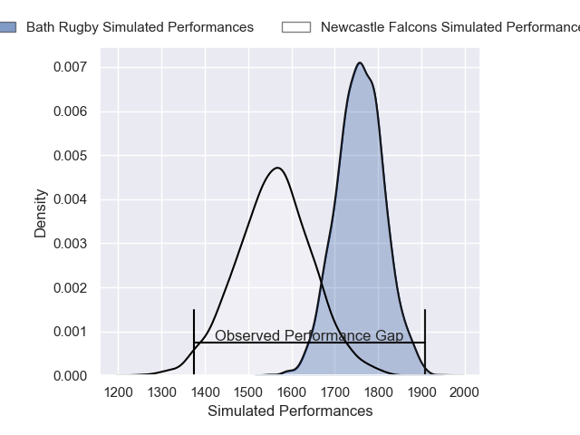
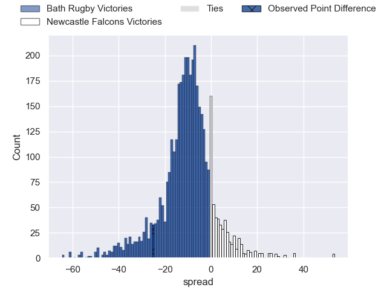
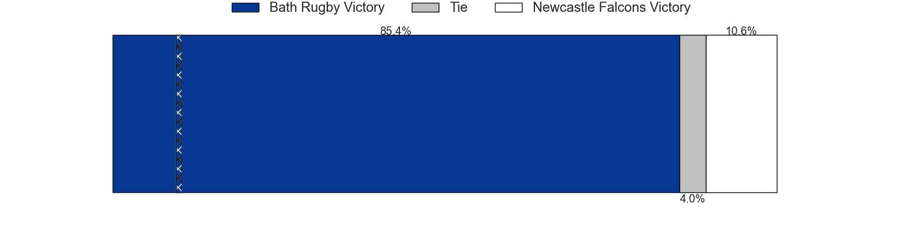
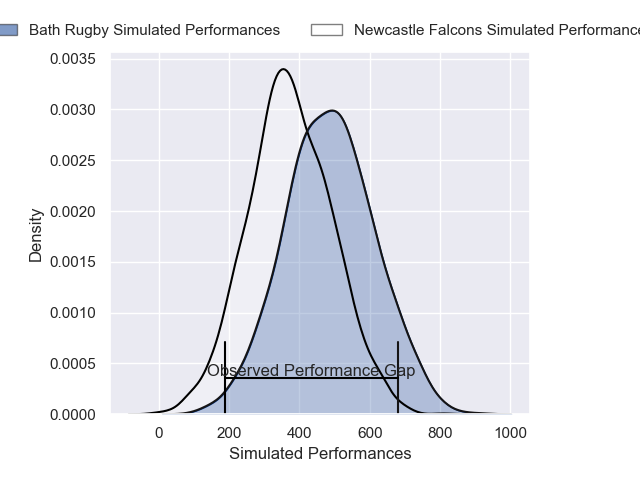
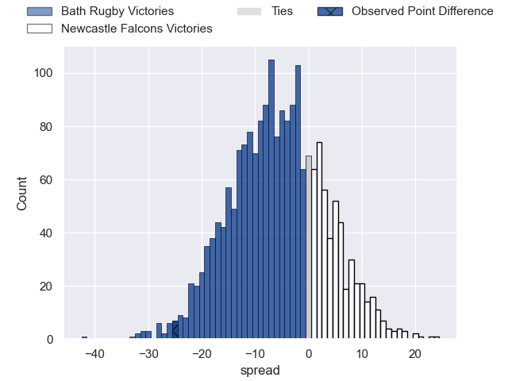

---  
layout: page  
title: Bath Rugby at Newcastle Falcons; 40-15  
date: 2024-12-21 18:00:00 -0500  
categories: "Gallagher Premiership 2024" match review  
---
# Bath Rugby at Newcastle Falcons; 40-15

# Club Level Predictions

The first set of predictions treats a club as the smallest object, as the club develops its members, organizes a gameplan, and deploys its players as needed for each match. This club model has a prediction of 0.245, which translates to predicting Bath Rugby to win by 9.9.

Our Over/Under is 35.5 - and combined with the spread above, we have a predicted scoreline of 23 to 13

Each club has a rating and a rating deviation (similar to a Glicko rating), and expected performances can be generated. This allows for simulated matches and spreads like the ones below.
## Projected Performances - Club Model

## Projected Spreads - Club Model

## Projected Results - Club Model

# Player Level Predictions

Treating teams instead as an entity made up of the currently active players, I have ratings for each player in an altogether different system. These can be combined to form team ratings once teamsheets are announced, weighting starters a bit higher than the reserves. After the match is played, players can be weighted by their minutes on the field, allowing for an accurate measure of the team's composition. With these compiled team ratings, we can make predictions, measure inaccuracy, and update the individual player ratings.
## Prediction without Player Minutes: Bath Rugby by 4.6

Bath Rugby by 18.4 on a neutral pitch

## Projected Performances - Player Model

## Projected Spreads - Player Model

## Projected Results - Player Model

|   Away Minutes | Away Player      |   Away Percentile |   Number |   Home Percentile | Home Player         |   Home Minutes |
|---------------:|:-----------------|------------------:|---------:|------------------:|:--------------------|---------------:|
|             58 | Francois van Wyk |             69.91 |        1 |             49.72 | Murray McCallum     |             51 |
|             51 | Tom Dunn         |             96.27 |        2 |              0.62 | Jamie Blamire       |             51 |
|             82 | Will Stuart      |             37.68 |        3 |             35.11 | Richard Palframan   |             81 |
|             22 | Quinn Roux       |             95.49 |        4 |              2.6  | Sebastian de Chaves |             81 |
|             81 | Charlie Ewels    |             81.53 |        5 |             17.69 | Kiran McDonald      |             23 |
|             76 | Josh Bayliss     |             29.85 |        6 |             57.65 | Freddie Lockwood    |              0 |
|              9 | Guy Pepper       |             15.05 |        7 |             97.62 | Tom Gordon          |             52 |
|             10 | Alfie Barbeary   |             68.05 |        8 |             17.19 | Callum Chick        |             82 |
|             10 | Alfie Barbeary   |             68.05 |        8 |             17.19 | Callum Chick        |             62 |
|             72 | Ben Spencer      |             89.37 |        9 |              0.32 | Sam Stuart          |             29 |
|             72 | Finn Russell     |             99.6  |       10 |              1.41 | Brett Connon        |             51 |
|              6 | Will Muir        |             28.89 |       11 |             47.18 | Ben Stevenson       |             10 |
|             72 | Cameron Redpath  |              8.1  |       12 |             63.51 | Cameron Hutchison   |             82 |
|             72 | Ollie Lawrence   |             90.05 |       13 |             46.73 | Alex Hearle         |             51 |
|             62 | Joe Cokanasiga   |             93.75 |       14 |             19.74 | Adam Radwan         |             51 |
|             62 | Tom de Glanville |             45    |       15 |             81.85 | Ben Redshaw         |             51 |
|             82 | Niall Annett     |             64.13 |       16 |             41.61 | Ollie Fletcher      |             81 |
|             50 | Beno Obano       |             81.63 |       17 |            nan    | Mike Rewcastle      |             64 |
|             23 | Thomas du Toit   |             77.37 |       18 |             31.72 | Callum Hancock      |             52 |
|             81 | Thomas du Toit   |             77.37 |       18 |             31.72 | Callum Hancock      |             52 |
|             58 | Ted Hill         |             95.49 |       19 |             11.8  | Philip van der Walt |             22 |
|              5 | Sam Underhill    |             96.77 |       20 |            nan    | Ollie Leatherbarrow |             29 |
|             51 | Tom Carr-Smith   |            nan    |       21 |             44.28 | Hugh O'Sullivan     |             18 |
|             11 | Will Butt        |             73.07 |       22 |             70.91 | Kieran Wilkinson    |             76 |
|             76 | Jaco Coetzee     |             46.99 |       23 |             75.69 | Oliver Spencer      |             62 |

