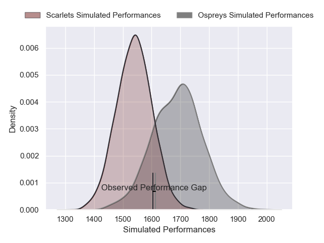
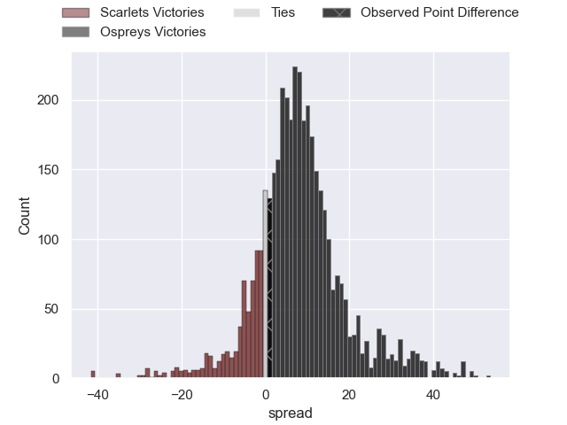
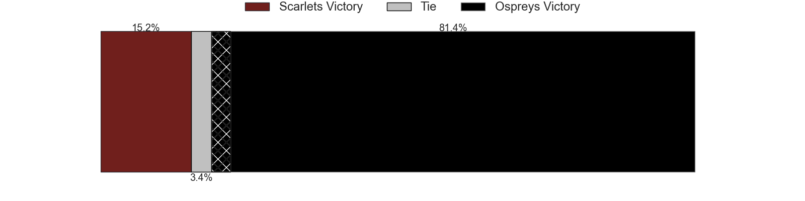
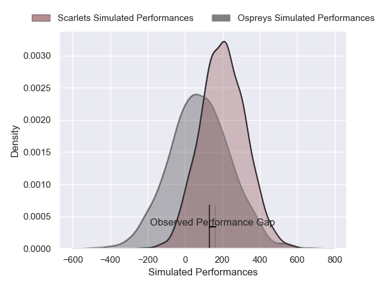
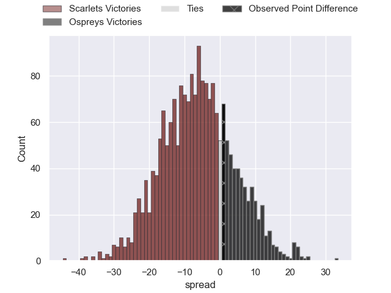

---  
layout: page  
title: Scarlets at Ospreys; 22-23  
date: 2024-12-21 18:00:00 -0500  
categories: "United Rugby Championship 2024" match review  
---
# Scarlets at Ospreys; 22-23

# Club Level Predictions

The first set of predictions treats a club as the smallest object, as the club develops its members, organizes a gameplan, and deploys its players as needed for each match. This club model has a prediction of 0.699, which translates to predicting Ospreys to win by 7.5.

Our Over/Under is 39.5 - and combined with the spread above, we have a predicted scoreline of 16 to 23

Each club has a rating and a rating deviation (similar to a Glicko rating), and expected performances can be generated. This allows for simulated matches and spreads like the ones below.
## Projected Performances - Club Model

## Projected Spreads - Club Model

## Projected Results - Club Model

# Player Level Predictions

Treating teams instead as an entity made up of the currently active players, I have ratings for each player in an altogether different system. These can be combined to form team ratings once teamsheets are announced, weighting starters a bit higher than the reserves. After the match is played, players can be weighted by their minutes on the field, allowing for an accurate measure of the team's composition. With these compiled team ratings, we can make predictions, measure inaccuracy, and update the individual player ratings.
## Prediction without Player Minutes: Ospreys by 8.6

Scarlets by 1.0 on a neutral pitch

## Projected Performances - Player Model

## Projected Spreads - Player Model

## Projected Results - Player Model

|   Away Minutes | Away Player          |   Away Percentile |   Number |   Home Percentile | Home Player            |   Home Minutes |
|---------------:|:---------------------|------------------:|---------:|------------------:|:-----------------------|---------------:|
|              3 | Kemsley Mathias      |             75.67 |        1 |             32.92 | Gareth Thomas          |             81 |
|              3 | Marnus van der Merwe |             93.32 |        2 |             35.4  | Sam Parry              |             71 |
|              9 | Henry Thomas         |             67.21 |        3 |             60.44 | Tom Botha              |             76 |
|             83 | Max Douglas          |             90.46 |        4 |             57.42 | Will Spencer           |             81 |
|             80 | Sam Lousi            |             91.93 |        5 |             57.24 | James Fender           |             58 |
|             22 | Taine Plumtree       |             89.37 |        6 |             87.5  | Jac Morgan             |             72 |
|             83 | Josh MacLeod         |             41.92 |        7 |             97.96 | Justin Tipuric         |             74 |
|             83 | Vaea Fifita          |             74.36 |        8 |              6.59 | Morgan Morris          |             23 |
|              3 | Gareth Davies        |             49.92 |        9 |             74.88 | Reuben Morgan-Williams |             23 |
|              3 | Sam Costelow         |             44.85 |       10 |             70.3  | Dan Edwards            |             59 |
|             15 | Ellis Mee            |             39.25 |       11 |             25.76 | Keelan Giles           |             81 |
|              9 | Eddie James          |             40.1  |       12 |             87.8  | Keiran Williams        |              9 |
|             83 | Johnny Williams      |             90.44 |       13 |             96.78 | Owen Watkin            |             74 |
|             83 | Tom Rogers           |             47.94 |       14 |             93.37 | Daniel Kasende         |             15 |
|             42 | Ioan Lloyd           |             13.33 |       15 |             54.44 | Jack Walsh             |             83 |
|             42 | Ioan Lloyd           |             13.33 |       15 |             54.44 | Jack Walsh             |             31 |
|             52 | Shaun Evans          |              5.12 |       16 |             65.48 | Lewis Lloyd            |             23 |
|             68 | Alec Hepburn         |             76.68 |       17 |             56.8  | Garyn Phillips         |             62 |
|             52 | Archer Holz          |            nan    |       18 |             75.05 | Rhys Henry             |             58 |
|             79 | Alex Craig           |             66.52 |       19 |            nan    | William Griffiths      |             52 |
|             68 | Jarrod Taylor        |             62.41 |       20 |             31.09 | Morgan Morse           |             83 |
|             68 | Archie Hughes        |             18.84 |       21 |             43.96 | Kieran Hardy           |             83 |
|             83 | Joe Roberts          |             36.1  |       22 |              2.24 | Evardi Boshoff         |             74 |
|             83 | Joe Roberts          |             36.1  |       22 |              2.24 | Evardi Boshoff         |             61 |
|             83 | Joe Roberts          |             36.1  |       22 |              2.24 | Evardi Boshoff         |             41 |
|             83 | Joe Roberts          |             36.1  |       22 |              2.24 | Evardi Boshoff         |             83 |
|             23 | Ioan Nicholas        |             21.48 |       23 |             67    | Iestyn Hopkins         |             68 |

