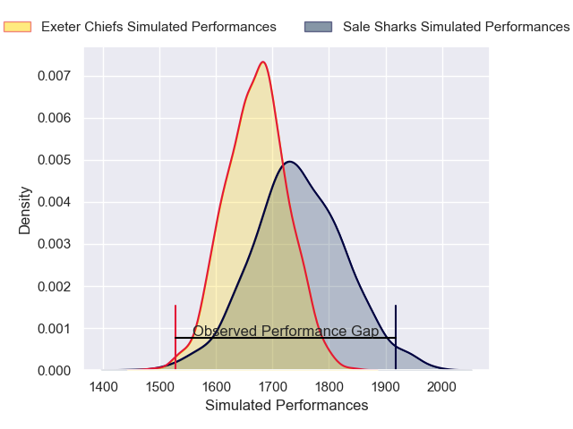
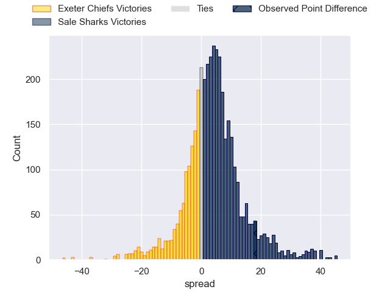
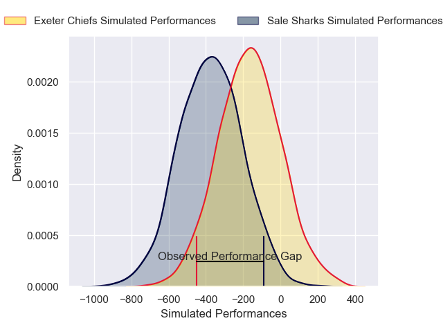
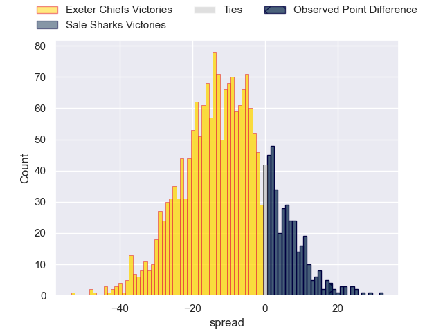

---  
layout: page  
title: Exeter Chiefs at Sale Sharks; 10-28  
date: 2024-12-21 18:00:00 -0500  
categories: "Gallagher Premiership 2024" match review  
---
# Exeter Chiefs at Sale Sharks; 10-28

# Club Level Predictions

The first set of predictions treats a club as the smallest object, as the club develops its members, organizes a gameplan, and deploys its players as needed for each match. This club model has a prediction of 0.604, which translates to predicting Sale Sharks to win by 3.7.

Our Over/Under is 48.5 - and combined with the spread above, we have a predicted scoreline of 23 to 26

Each club has a rating and a rating deviation (similar to a Glicko rating), and expected performances can be generated. This allows for simulated matches and spreads like the ones below.
## Projected Performances - Club Model

## Projected Spreads - Club Model

## Projected Results - Club Model

# Player Level Predictions

Treating teams instead as an entity made up of the currently active players, I have ratings for each player in an altogether different system. These can be combined to form team ratings once teamsheets are announced, weighting starters a bit higher than the reserves. After the match is played, players can be weighted by their minutes on the field, allowing for an accurate measure of the team's composition. With these compiled team ratings, we can make predictions, measure inaccuracy, and update the individual player ratings.
## Prediction without Player Minutes: Exeter Chiefs by 6.7

Exeter Chiefs by 20.3 on a neutral pitch

## Projected Performances - Player Model

## Projected Spreads - Player Model

## Projected Results - Player Model

|   Away Minutes | Away Player          |   Away Percentile |   Number |   Home Percentile | Home Player                    |   Home Minutes |
|---------------:|:---------------------|------------------:|---------:|------------------:|:-------------------------------|---------------:|
|             25 | Scott Sio            |             77.62 |        1 |             83.07 | Bevan Rodd                     |             82 |
|             23 | Dan Frost            |             87.73 |        2 |            100    | Luke Cowan-Dickie              |             82 |
|             29 | Marcus Street        |             10.53 |        3 |             76.8  | Asher Opoku-Fordjour           |             81 |
|             11 | Dafydd Jenkins       |             87.94 |        4 |             89.94 | Ernst van Rhyn                 |             82 |
|             20 | Franco Molina        |             21.42 |        5 |             36.25 | Jonny Hill                     |             51 |
|             82 | Franco Molina        |             21.42 |        5 |             36.25 | Jonny Hill                     |             51 |
|             25 | Franco Molina        |             21.42 |        5 |             36.25 | Jonny Hill                     |             51 |
|             52 | Ethan Roots          |              7.48 |        6 |             99.74 | Jean-Luc du Preez              |              4 |
|             64 | Ethan Roots          |              7.48 |        6 |             99.74 | Jean-Luc du Preez              |              4 |
|             58 | Ethan Roots          |              7.48 |        6 |             99.74 | Jean-Luc du Preez              |              4 |
|             17 | Ethan Roots          |              7.48 |        6 |             99.74 | Jean-Luc du Preez              |              4 |
|             32 | Ross Vintcent        |             32.31 |        7 |             82.4  | Ben Curry                      |             82 |
|             81 | Greg Fisilau         |             64.61 |        8 |             75.07 | Daniel du Preez                |             82 |
|             82 | Stu Townsend         |             87.28 |        9 |             90.98 | Raffi Quirke                   |             51 |
|             53 | Henry Slade          |             95.96 |       10 |             97.98 | George Ford                    |             82 |
|             82 | Olly Woodburn        |             55.72 |       11 |             97.33 | Arron Reed                     |             20 |
|             82 | Olly Woodburn        |             55.72 |       11 |             97.33 | Arron Reed                     |             76 |
|             82 | Olly Woodburn        |             55.72 |       11 |             97.33 | Arron Reed                     |             81 |
|             16 | Tamati Tua           |             77.66 |       12 |             72.68 | Luke James                     |             61 |
|             80 | Ben Hammersley       |             30.34 |       13 |             98.15 | Robert du Preez                |             81 |
|             80 | Ben Hammersley       |             30.34 |       13 |             98.15 | Robert du Preez                |             77 |
|             13 | Immanuel Feyi-Waboso |             16.23 |       14 |             79.65 | Tom Roebuck                    |             77 |
|             58 | Immanuel Feyi-Waboso |             16.23 |       14 |             79.65 | Tom Roebuck                    |             77 |
|             30 | Tom Wyatt            |             29.81 |       15 |             97.96 | Joe Carpenter                  |              5 |
|             30 | Tom Wyatt            |             29.81 |       15 |             97.96 | Joe Carpenter                  |             81 |
|             30 | Tom Wyatt            |             29.81 |       15 |             97.96 | Joe Carpenter                  |             40 |
|             30 | Tom Wyatt            |             29.81 |       15 |             97.96 | Joe Carpenter                  |              7 |
|             81 | Jack Innard          |            nan    |       16 |             67.86 | Tadgh McElroy                  |             82 |
|             81 | Kwenzo Blose         |            nan    |       17 |             77.55 | Simon McIntyre                 |             62 |
|              0 | Jimmy Roots          |            nan    |       18 |            nan    | WillGriff John                 |             48 |
|             81 | Richard Capstick     |              7.29 |       19 |             22.12 | Ben Bamber                     |             62 |
|             81 | Jacques Vermeulen    |             92.35 |       20 |              9.86 | Sam Dugdale                    |             29 |
|             81 | Will Becconsall      |            nan    |       21 |             86.63 | Gus Warr                       |             58 |
|             82 | Will Haydon-Wood     |             23.43 |       22 |             96.8  | Tom O'Flaherty                 |             19 |
|             80 | Josh Hodge           |              1.48 |       23 |             83.71 | Waisea Nayacalevu Vuidravuwalu |             82 |

