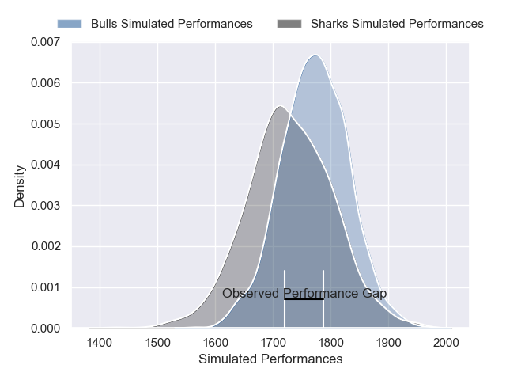
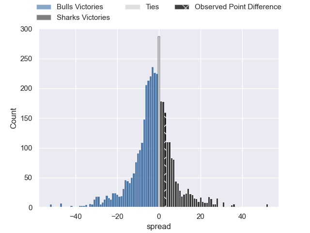
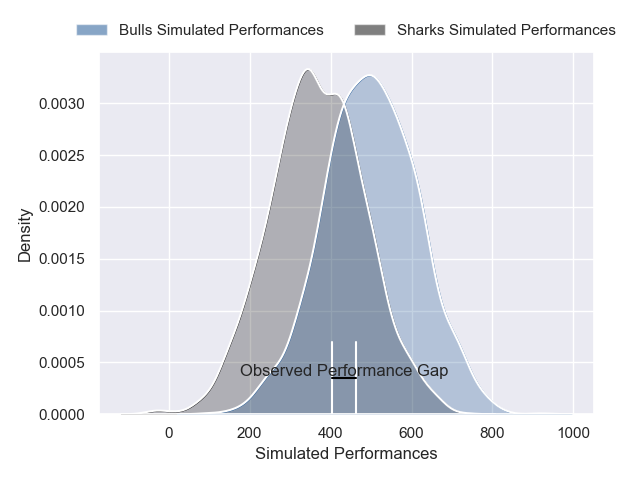
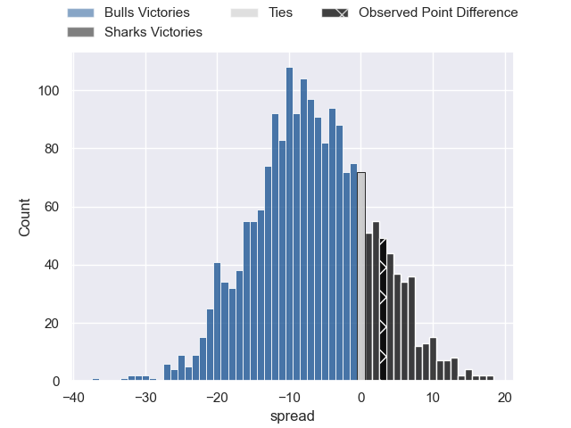
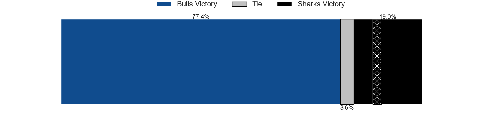

---  
layout: page  
title: Bulls at Sharks; 17-20  
date: 2024-12-21 18:00:00 -0500  
categories: "United Rugby Championship 2024" match review  
---
# Bulls at Sharks; 17-20

# Club Level Predictions

The first set of predictions treats a club as the smallest object, as the club develops its members, organizes a gameplan, and deploys its players as needed for each match. This club model has a prediction of 0.438, which translates to predicting Bulls to win by 2.2.

Our Over/Under is 60.5 - and combined with the spread above, we have a predicted scoreline of 31 to 29

Each club has a rating and a rating deviation (similar to a Glicko rating), and expected performances can be generated. This allows for simulated matches and spreads like the ones below.
## Projected Performances - Club Model

## Projected Spreads - Club Model

## Projected Results - Club Model

# Player Level Predictions

Treating teams instead as an entity made up of the currently active players, I have ratings for each player in an altogether different system. These can be combined to form team ratings once teamsheets are announced, weighting starters a bit higher than the reserves. After the match is played, players can be weighted by their minutes on the field, allowing for an accurate measure of the team's composition. With these compiled team ratings, we can make predictions, measure inaccuracy, and update the individual player ratings.
## Prediction without Player Minutes: Bulls by 2.2

Bulls by 10.4 on a neutral pitch

## Projected Performances - Player Model

## Projected Spreads - Player Model

## Projected Results - Player Model

|   Away Minutes | Away Player         |   Away Percentile |   Number |   Home Percentile | Home Player         |   Home Minutes |
|---------------:|:--------------------|------------------:|---------:|------------------:|:--------------------|---------------:|
|             23 | Gerhard Steenekamp  |             81.19 |        1 |             85.96 | Ox Nche             |              0 |
|             23 | Akker van der Merwe |             96.89 |        2 |             53.57 | Ethan Bester        |             81 |
|             81 | Wilco Louw          |             84.33 |        3 |             74.67 | Vincent Koch        |              0 |
|             83 | Ruan Vermaak        |             12.75 |        4 |             15.87 | Corne Rahl          |             78 |
|             72 | JF van Heerden      |             26.19 |        5 |             69.38 | Jason Jenkins       |             63 |
|             40 | Cameron Hanekom     |             80.1  |        6 |             68.71 | Phepsi Buthelezi    |             15 |
|             83 | Cobus Wiese         |             96.6  |        7 |             74.49 | Emmanuel Tshituka   |             58 |
|             83 | Cobus Wiese         |             96.6  |        7 |             74.49 | Emmanuel Tshituka   |              0 |
|             83 | Elrigh Louw         |             75.21 |        8 |             45.99 | Nick Hatton         |             81 |
|              3 | Embrose Papier      |             91.3  |        9 |             92.59 | Jaden Hendrikse     |              0 |
|             15 | Johan Goosen        |             68.08 |       10 |             82.63 | Jordan Hendrikse    |              9 |
|             81 | Canan Moodie        |             98.93 |       11 |             98.7  | Makazole Mapimpi    |             15 |
|             15 | Harold Vorster      |             93.27 |       12 |             98.54 | Andre Esterhuizen   |             35 |
|             31 | Stedman Gans        |             87.51 |       13 |             52.2  | Ethan Hooker        |              9 |
|             31 | Sebastian de Klerk  |             94.21 |       14 |             58.77 | Yaw Penxe           |             81 |
|             40 | Willie le Roux      |             98.33 |       15 |             95.74 | Aphelele Fassi      |             63 |
|              0 | Johan Grobbelaar    |             90.37 |       16 |            nan    | Bryce Calvert       |             41 |
|             83 | Jan-Hendrik Wessels |             62.13 |       17 |             83.82 | Ruan Dreyer         |             58 |
|             83 | Francois Klopper    |             52.85 |       18 |             75.86 | Trevor Nyakane      |             74 |
|             83 | Sintu Manjezi       |             90.98 |       19 |             25.68 | Jeandre Labuschagne |             81 |
|              4 | Marcell Coetzee     |             96.09 |       20 |             78.15 | Tinotenda Mavesere  |             81 |
|             20 | Keagan Johannes     |             57.37 |       21 |              3.54 | Cameron Wright      |             81 |
|              7 | Sergeal Petersen    |             95.12 |       22 |             69.7  | Siya Masuku         |             49 |
|             81 | Devon Williams      |             89.48 |       23 |             76.98 | Jurenzo Julius      |             66 |

