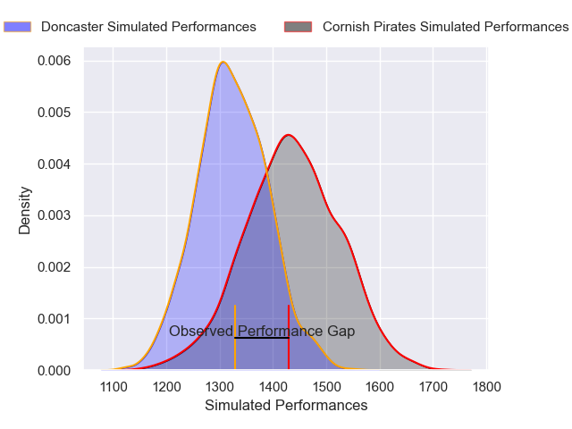
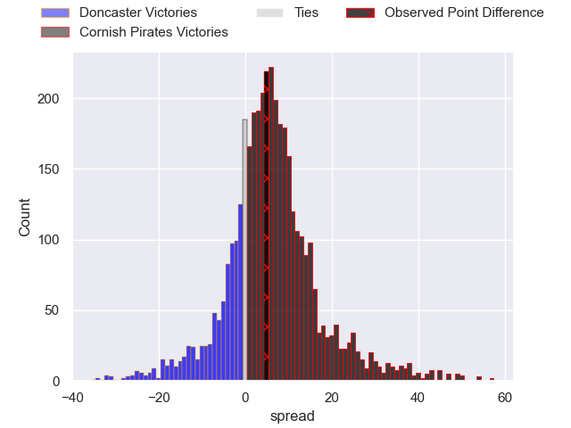
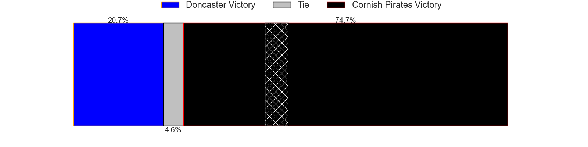
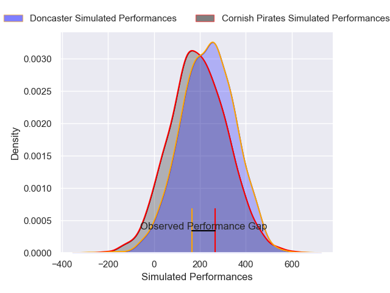
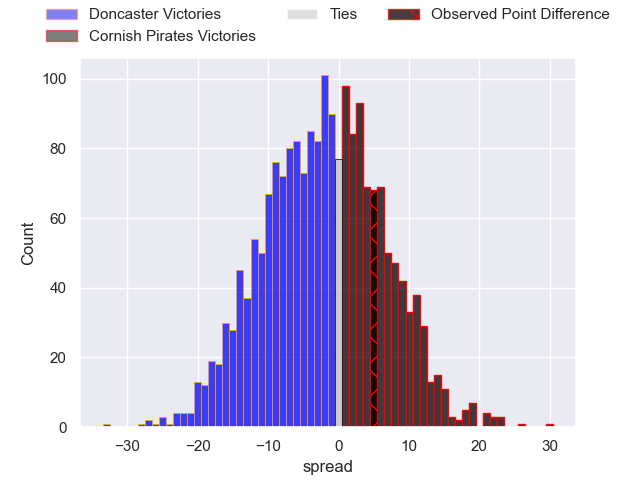

---  
layout: page  
title: Doncaster at Cornish Pirates; 14-19  
date: 2024-12-22 18:00:00 -0500  
categories: "RFU Championship 2024" match review  
---
# Doncaster at Cornish Pirates; 14-19

# Club Level Predictions

The first set of predictions treats a club as the smallest object, as the club develops its members, organizes a gameplan, and deploys its players as needed for each match. This club model has a prediction of 0.655, which translates to predicting Cornish Pirates to win by 5.7.

Our Over/Under is 49.5 - and combined with the spread above, we have a predicted scoreline of 22 to 27

Each club has a rating and a rating deviation (similar to a Glicko rating), and expected performances can be generated. This allows for simulated matches and spreads like the ones below.
## Projected Performances - Club Model

## Projected Spreads - Club Model

## Projected Results - Club Model

# Player Level Predictions

Treating teams instead as an entity made up of the currently active players, I have ratings for each player in an altogether different system. These can be combined to form team ratings once teamsheets are announced, weighting starters a bit higher than the reserves. After the match is played, players can be weighted by their minutes on the field, allowing for an accurate measure of the team's composition. With these compiled team ratings, we can make predictions, measure inaccuracy, and update the individual player ratings.
## Prediction without Player Minutes: Cornish Pirates by 1.3

Doncaster by 3.3 on a neutral pitch

## Projected Performances - Player Model

## Projected Spreads - Player Model

## Projected Results - Player Model

|   Away Minutes | Away Player       |   Away Percentile |   Number |   Home Percentile | Home Player       |   Home Minutes |
|---------------:|:------------------|------------------:|---------:|------------------:|:------------------|---------------:|
|             80 | Andrew Turner     |             19.56 |        1 |             30.47 | Billy Young       |             28 |
|             71 | George Roberts    |             14.44 |        2 |             73.91 | Harry Hocking     |             23 |
|             32 | Joe Jones         |             30.03 |        3 |              8.78 | Alfie Petch       |             14 |
|             66 | Ben Murphy        |              3.21 |        4 |             25.24 | Matt Cannon       |              9 |
|             80 | Adam Hopkinson    |             35.04 |        5 |             93.41 | Lewis Pearson     |             39 |
|             33 | Thom Smith        |              7.99 |        6 |             95.41 | Martin Moloney    |             66 |
|             23 | Rhys Tait         |             56.38 |        7 |             90.05 | Will Gibson       |             76 |
|             17 | Morgan Strong     |             58.74 |        8 |             63.61 | Hugh Bokenham     |             80 |
|             48 | Alex Dolly        |             59.58 |        9 |             53.3  | Dan Hiscocks      |             80 |
|             80 | Russell Bennett   |             89.9  |       10 |             83.64 | Bruce Houston     |             80 |
|             41 | Maliq Holden      |             81.33 |       11 |             29.27 | Matthew McNab     |             71 |
|             17 | Connor Edwards    |              6.63 |       12 |             61.95 | Harry Yates       |             80 |
|             80 | Zach Kerr         |             19.9  |       13 |             57.56 | Charlie McCaig    |             14 |
|             80 | Semesa Rokoduguni |             90.47 |       14 |             84.6  | Arthur Relton     |             80 |
|             80 | Telusa Veainu     |             98.52 |       15 |             80.93 | Will Trewin       |             80 |
|             80 | Logovi'i Mulipola |             74.98 |       16 |            nan    | Oisin Michel      |             80 |
|              9 | Fred Davies       |             15.37 |       17 |             11.02 | Sol Moody         |             80 |
|             66 | Lewis Thiede      |             83.51 |       18 |             26.62 | Tomiwa Agbongbon  |             76 |
|             41 | Josh Williams     |             77.36 |       19 |            nan    | Craig Williams    |             46 |
|             17 | Archie Smeaton    |             27.04 |       20 |             70.15 | Josh King         |             48 |
|             12 | Arthur Green      |             70.83 |       21 |             11.76 | Cam Jones         |             52 |
|             39 | Ollie Fox         |              2.58 |       22 |             14.95 | Iwan Jenkins      |             46 |
|             14 | Will Parry        |             64.49 |       23 |              7.78 | Iwan Price-Thomas |             14 |

