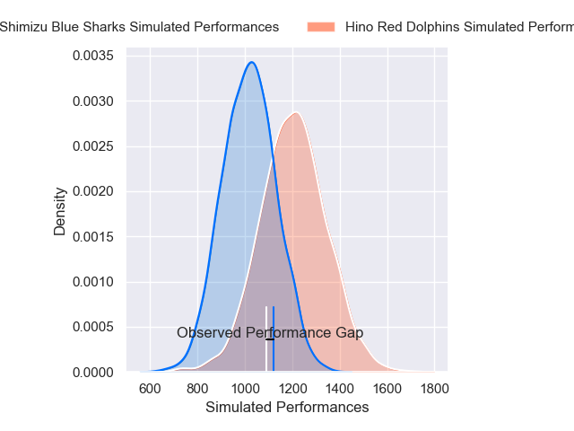
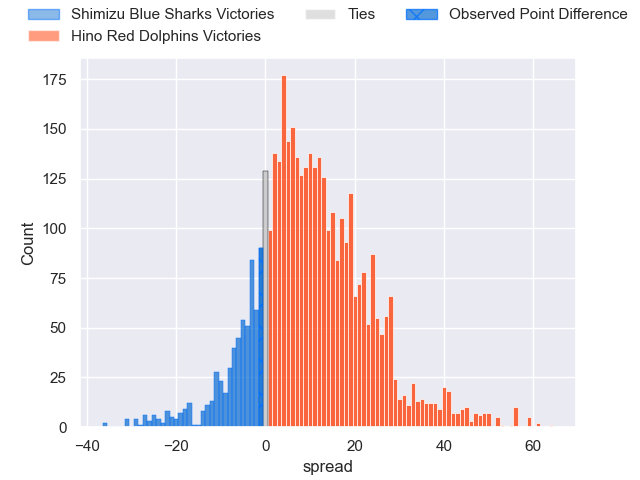
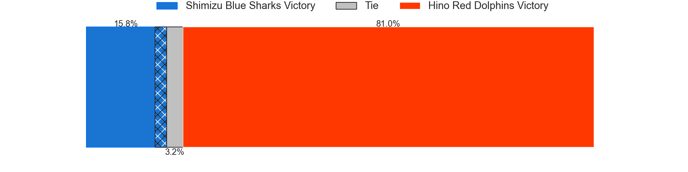
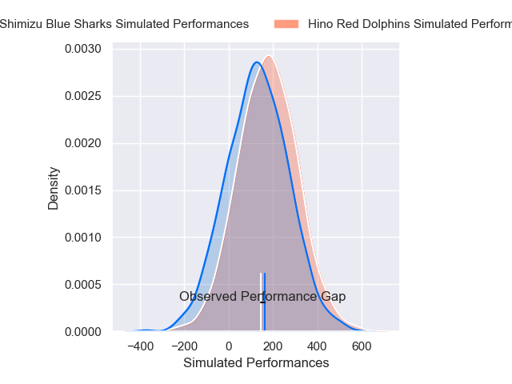
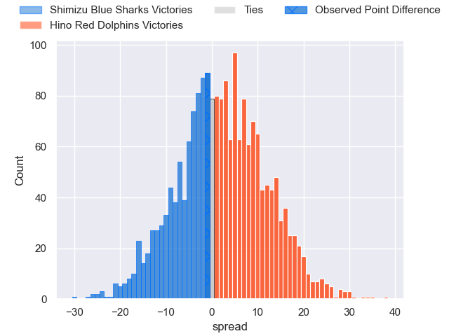
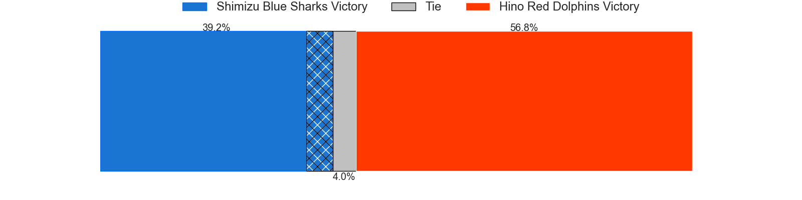

---  
layout: page  
title: Shimizu Blue Sharks at Hino Red Dolphins; 25-24  
date: 2024-12-22 18:00:00 -0500  
categories: "Japan Rugby League One D2 2024" match review  
---
# Shimizu Blue Sharks at Hino Red Dolphins; 25-24

# Club Level Predictions

The first set of predictions treats a club as the smallest object, as the club develops its members, organizes a gameplan, and deploys its players as needed for each match. This club model has a prediction of 0.74, which translates to predicting Hino Red Dolphins to win by 9.6.

Our Over/Under is 64.5 - and combined with the spread above, we have a predicted scoreline of 27 to 37

Each club has a rating and a rating deviation (similar to a Glicko rating), and expected performances can be generated. This allows for simulated matches and spreads like the ones below.
## Projected Performances - Club Model

## Projected Spreads - Club Model

## Projected Results - Club Model

# Player Level Predictions

Treating teams instead as an entity made up of the currently active players, I have ratings for each player in an altogether different system. These can be combined to form team ratings once teamsheets are announced, weighting starters a bit higher than the reserves. After the match is played, players can be weighted by their minutes on the field, allowing for an accurate measure of the team's composition. With these compiled team ratings, we can make predictions, measure inaccuracy, and update the individual player ratings.
## Prediction without Player Minutes: Hino Red Dolphins by 2.7

Shimizu Blue Sharks by 0.0 on a neutral pitch

## Projected Performances - Player Model

## Projected Spreads - Player Model

## Projected Results - Player Model

|   Away Minutes | Away Player         |   Away Percentile |   Number |   Home Percentile | Home Player    |   Home Minutes |
|---------------:|:--------------------|------------------:|---------:|------------------:|:---------------|---------------:|
|             80 | Sanshiro Nomura     |             63.32 |        1 |             46.83 | Yuto Tokuda    |             80 |
|             80 | Naomichi Tatekawa   |             68.32 |        2 |             38.2  | Towa Taniguchi |             80 |
|             80 | Uha Lee             |             69.22 |        3 |             16.49 | Shosuke Funaki |             80 |
|             80 | Ed Holmes           |             58.98 |        4 |             38.68 | Noah Tovio     |             80 |
|             80 | Tom Rowe            |             57.76 |        5 |             94.36 | Rory Arnold    |             80 |
|             80 | Koyo Adachi         |             66.84 |        6 |             43.71 | Shun Nakashika |             80 |
|             80 | Haruki Matsudo      |             73.21 |        7 |             64.03 | Shun Tomonaga  |             80 |
|             80 | Michael Va'a Toloke |             14.47 |        8 |              5.44 | Josh Fenner    |             80 |
|             80 | Kayne Hammington    |             69.73 |        9 |             40.42 | Kotaro Hatada  |             80 |
|             80 | Lima Sopoaga        |             94.34 |       10 |             34.95 | Keita Doi      |             80 |
|             80 | Naoki Moriya        |             13.95 |       11 |             57.85 | Moeki Fukushi  |             80 |
|             80 | Soichiro Kuwata     |             13.37 |       12 |             58.73 | Augustine Pulu |             80 |
|             80 | Terrence Hepetema   |             19.41 |       13 |             14.93 | Shogo Tokota   |             80 |
|             80 | Tatsuhiro Ozaki     |             12.2  |       14 |             65.17 | Ko Kojima      |             80 |
|             80 | Coenie van Wyk      |             73.89 |       15 |             19.63 | Kyoji Takano   |             80 |

