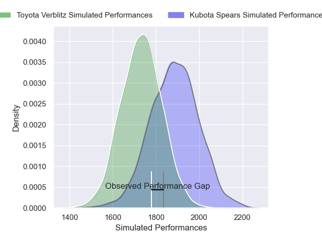
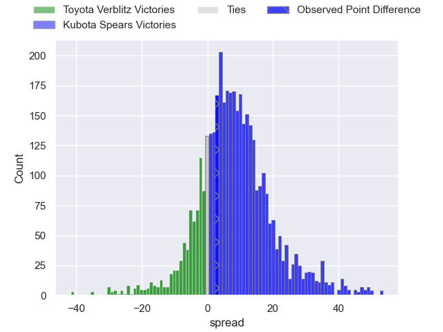
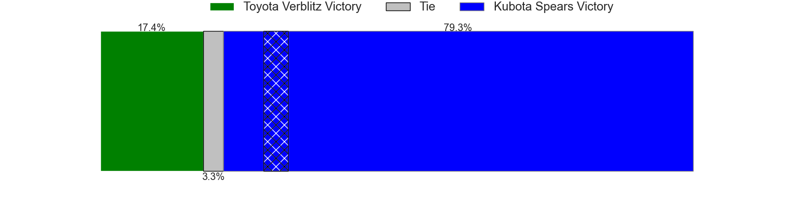
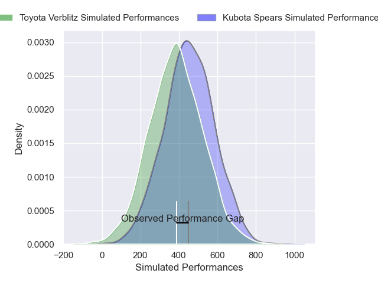
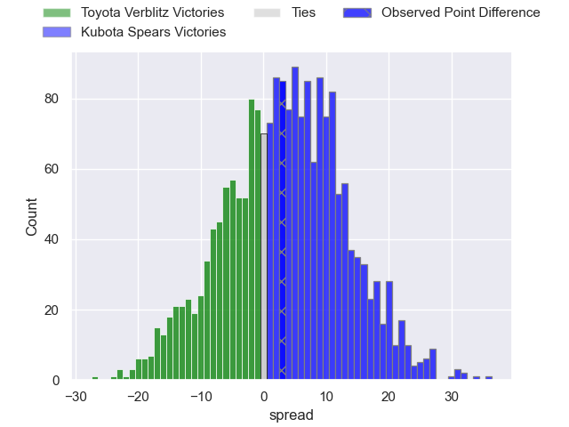
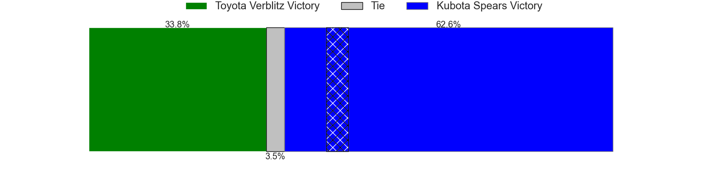

---  
layout: page  
title: Toyota Verblitz at Kubota Spears; 27-30  
date: 2024-12-22 18:00:00 -0500  
categories: "Japan Rugby League One 2024" match review  
---
# Toyota Verblitz at Kubota Spears; 27-30

# Club Level Predictions

The first set of predictions treats a club as the smallest object, as the club develops its members, organizes a gameplan, and deploys its players as needed for each match. This club model has a prediction of 0.696, which translates to predicting Kubota Spears to win by 7.5.

Our Over/Under is 54.5 - and combined with the spread above, we have a predicted scoreline of 23 to 31

Each club has a rating and a rating deviation (similar to a Glicko rating), and expected performances can be generated. This allows for simulated matches and spreads like the ones below.
## Projected Performances - Club Model

## Projected Spreads - Club Model

## Projected Results - Club Model

# Player Level Predictions

Treating teams instead as an entity made up of the currently active players, I have ratings for each player in an altogether different system. These can be combined to form team ratings once teamsheets are announced, weighting starters a bit higher than the reserves. After the match is played, players can be weighted by their minutes on the field, allowing for an accurate measure of the team's composition. With these compiled team ratings, we can make predictions, measure inaccuracy, and update the individual player ratings.
## Prediction without Player Minutes: Kubota Spears by 5.4

Kubota Spears by 1.3 on a neutral pitch

## Projected Performances - Player Model

## Projected Spreads - Player Model

## Projected Results - Player Model

|   Away Minutes | Away Player         |   Away Percentile |   Number |   Home Percentile | Home Player      |   Home Minutes |
|---------------:|:--------------------|------------------:|---------:|------------------:|:-----------------|---------------:|
|             80 | Shogo Miura         |             79.06 |        1 |             74.61 | Kota Kaishi      |             80 |
|             80 | Yoshikatsu Hikosaka |             91.93 |        2 |             47.67 | Hayate Era       |             80 |
|             80 | Yusuke Kizu         |             62.45 |        3 |             50.53 | Keijiro Tamefusa |             80 |
|             80 | Richie Gray         |             91.59 |        4 |             76.58 | Merwe Olivier    |             80 |
|             80 | Daichi Akiyama      |             78.14 |        5 |             80.49 | David Bulbring   |             80 |
|             80 | Will Tupou          |             30.87 |        6 |             97.28 | Tyler Paul       |             80 |
|             80 | Kosei Miki          |             53.66 |        7 |             89.12 | Takeo Suenaga    |             80 |
|             80 | Kazuki Himeno       |             44.13 |        8 |             63.9  | Faulua Makisi    |             80 |
|             80 | Aaron Smith         |             96.94 |        9 |             93.72 | Bryn Hall        |             80 |
|             80 | Rikiya Matsuda      |             96.77 |       10 |             98.79 | Bernard Foley    |             80 |
|             80 | Viliame Tuidraki    |             85.9  |       11 |             72.71 | Haruto Kida      |             80 |
|             80 | Siosaia Fifita      |              2.15 |       12 |             40.49 | Yuya Hirose      |             80 |
|             80 | Joseph Manu         |             45.76 |       13 |             28.39 | Rikus Pretorius  |             80 |
|             80 | Taichi Takahashi    |             88.49 |       14 |             76.3  | Halatoa Vailea   |             80 |
|             80 | Tiaan Falcon        |             84.81 |       15 |             28.7  | Yuhei Shimada    |             80 |

