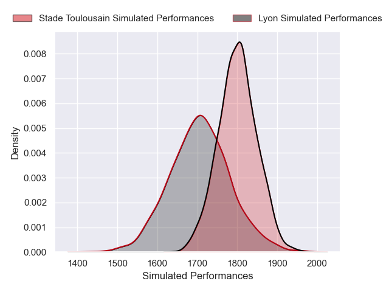
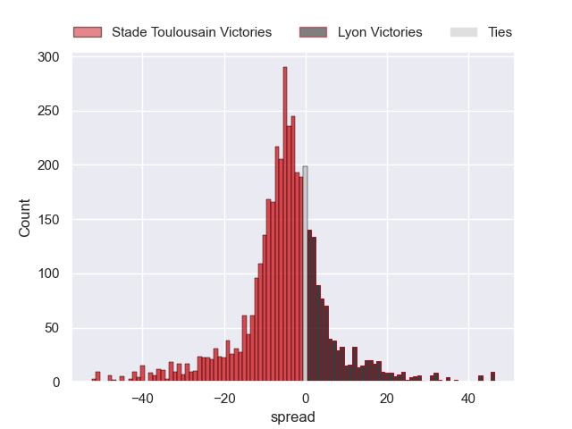
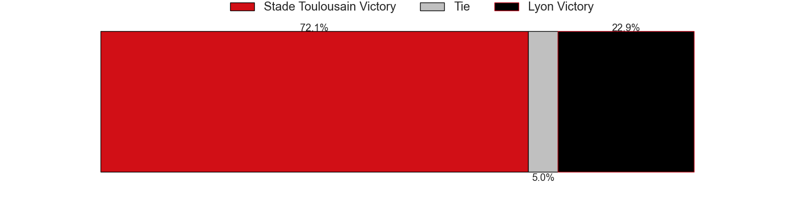
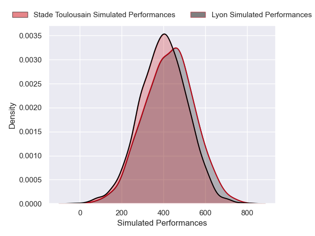
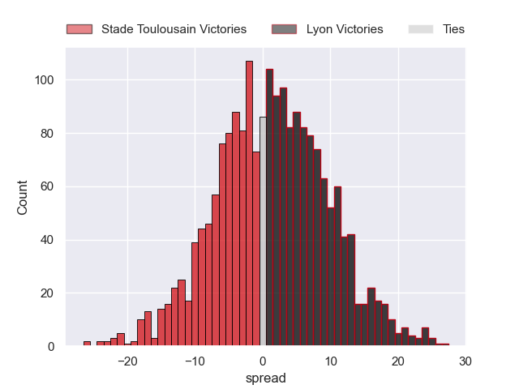

---  
layout: page  
title: Stade Toulousain at Lyon; 17-17  
date: 2024-12-22 18:00:00 -0500  
categories: "Top 14 Orange 2024" match review  
---
# Stade Toulousain at Lyon; 17-17

# Club Level Predictions

The first set of predictions treats a club as the smallest object, as the club develops its members, organizes a gameplan, and deploys its players as needed for each match. This club model has a prediction of 0.372, which translates to predicting Stade Toulousain to win by 4.6.

Our Over/Under is 43.5 - and combined with the spread above, we have a predicted scoreline of 24 to 19

Each club has a rating and a rating deviation (similar to a Glicko rating), and expected performances can be generated. This allows for simulated matches and spreads like the ones below.
## Projected Performances - Club Model

## Projected Spreads - Club Model

## Projected Results - Club Model

# Player Level Predictions

Treating teams instead as an entity made up of the currently active players, I have ratings for each player in an altogether different system. These can be combined to form team ratings once teamsheets are announced, weighting starters a bit higher than the reserves. After the match is played, players can be weighted by their minutes on the field, allowing for an accurate measure of the team's composition. With these compiled team ratings, we can make predictions, measure inaccuracy, and update the individual player ratings.
## Prediction without Player Minutes: Stade Toulousain by 1.4

Stade Toulousain by 13.9 on a neutral pitch

## Projected Performances - Player Model

## Projected Spreads - Player Model

## Projected Results - Player Model

|   Away Minutes | Away Player            |   Away Percentile |   Number |   Home Percentile | Home Player          |   Home Minutes |
|---------------:|:-----------------------|------------------:|---------:|------------------:|:---------------------|---------------:|
|           34   | David Ainu'u           |             81.57 |        1 |             16.74 | Hamza Kaabeche       |             24 |
|           28   | Peato Mauvaka          |             92.7  |        2 |             88.51 | Sam Matavesi         |             52 |
|           80   | Joel Merkler           |             79.69 |        3 |             28.03 | Jermaine Ainsley     |             58 |
|           22   | Joshua Brennan         |             94.8  |        4 |             33.82 | Killian Geraci       |             80 |
|           80   | Clement Verge          |             86.12 |        5 |             93.93 | Tomas Lavanini       |             80 |
|           51   | Leo Banos              |             90.82 |        6 |             58.42 | Dylan Cretin         |             56 |
|           80   | Mathis Castro-Ferreira |             75.09 |        7 |             91.75 | Beka Saghinadze      |             80 |
|           15.5 | Anthony Jelonch        |             77.94 |        8 |             68.19 | Arno Botha           |             80 |
|           56   | Paul Graou             |             60.23 |        9 |             90.34 | Baptiste Couilloud   |             50 |
|           12   | Juan Cruz Mallia       |             99.19 |       10 |             80    | Leo Berdeu           |              4 |
|           52   | Ange Capuozzo          |             97.18 |       11 |             81.78 | Davit Niniashvili    |             34 |
|           52   | Ange Capuozzo          |             97.18 |       11 |             81.78 | Davit Niniashvili    |             28 |
|           24   | Pita Ahki              |             62.15 |       12 |              4.29 | Josiah Maraku        |             34 |
|           31   | Paul Costes            |             90.34 |       13 |             97.66 | Semi Radradra        |             32 |
|           24   | Setareki Bituniyata    |             70.96 |       14 |             92.91 | Monty Ioane          |             22 |
|           59   | Blair Kinghorn         |            100    |       15 |             54.81 | Alexandre Tchaptchet |             25 |
|           15.5 | Thomas Lacombre        |            nan    |       16 |             18.94 | Guillaume Marchand   |             68 |
|           80   | Benjamin Bertrand      |            nan    |       17 |             14.86 | Jerome Rey           |             80 |
|           58   | Emmanuel Meafou        |             88.38 |       18 |             11.88 | Theo William         |             56 |
|           68   | Alexandre Roumat       |             77.36 |       19 |             22.79 | Steeve Blanc-Mappaz  |             56 |
|           80   | Theo Ntamack           |             52.58 |       20 |             35.1  | Martin Page-Relo     |             73 |
|           51   | Naoto Saito            |              9.34 |       21 |              5.45 | Martin Meliande      |             80 |
|           24   | Nelson Epee            |            nan    |       22 |             45.13 | Beka Shvangiradze    |             56 |
|           58   | Malachi Hawkes         |            nan    |       23 |             63.82 | Irakli Aptsiauri     |             80 |

