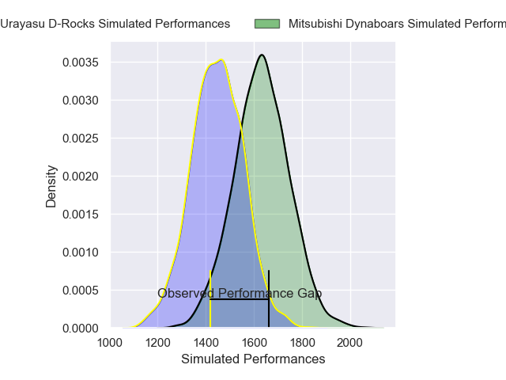
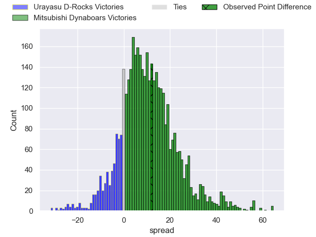
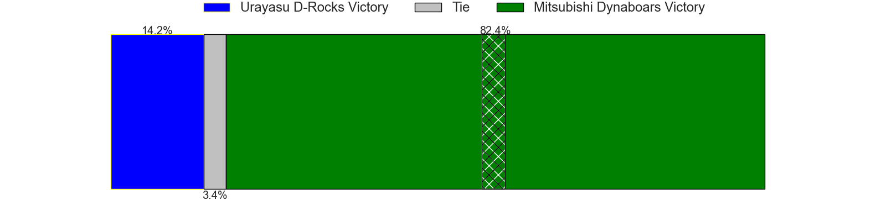
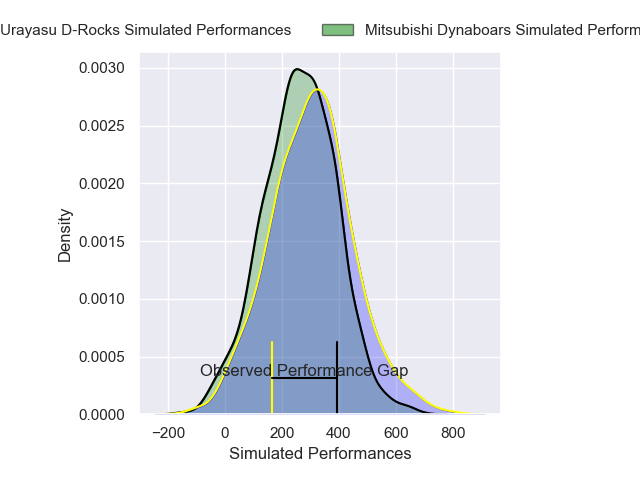
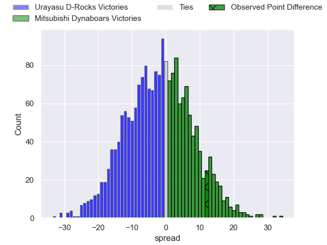
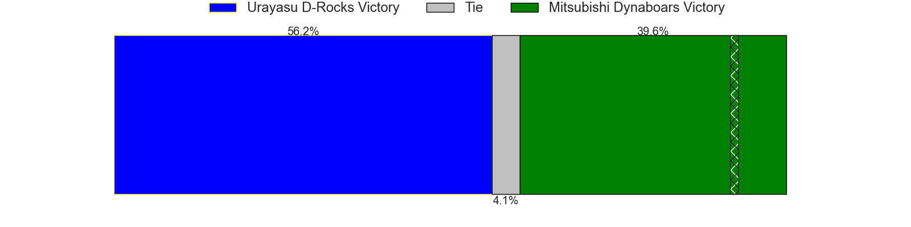

---  
layout: page  
title: Urayasu D-Rocks at Mitsubishi Dynaboars; 19-31  
date: 2024-12-22 18:00:00 -0500  
categories: "Japan Rugby League One 2024" match review  
---
# Urayasu D-Rocks at Mitsubishi Dynaboars; 19-31

# Club Level Predictions

The first set of predictions treats a club as the smallest object, as the club develops its members, organizes a gameplan, and deploys its players as needed for each match. This club model has a prediction of 0.738, which translates to predicting Mitsubishi Dynaboars to win by 9.5.

Our Over/Under is 58.5 - and combined with the spread above, we have a predicted scoreline of 25 to 34

Each club has a rating and a rating deviation (similar to a Glicko rating), and expected performances can be generated. This allows for simulated matches and spreads like the ones below.
## Projected Performances - Club Model

## Projected Spreads - Club Model

## Projected Results - Club Model

# Player Level Predictions

Treating teams instead as an entity made up of the currently active players, I have ratings for each player in an altogether different system. These can be combined to form team ratings once teamsheets are announced, weighting starters a bit higher than the reserves. After the match is played, players can be weighted by their minutes on the field, allowing for an accurate measure of the team's composition. With these compiled team ratings, we can make predictions, measure inaccuracy, and update the individual player ratings.
## Prediction without Player Minutes: Urayasu D-Rocks by 1.5

Urayasu D-Rocks by 4.7 on a neutral pitch

## Projected Performances - Player Model

## Projected Spreads - Player Model

## Projected Results - Player Model

|   Away Minutes | Away Player        |   Away Percentile |   Number |   Home Percentile | Home Player         |   Home Minutes |
|---------------:|:-------------------|------------------:|---------:|------------------:|:--------------------|---------------:|
|             80 | Hidetomo Nabeshima |             14.92 |        1 |             62.26 | Jun Morimoto        |             80 |
|             80 | Ryuji Fujimura     |             54.81 |        2 |              9.63 | Lee Seung Hyok      |             80 |
|             80 | Shuhei Takeuchi    |             46.33 |        3 |             79.31 | Rento Tsukayama     |             80 |
|             80 | Uwe Helu           |             71.29 |        4 |             75.8  | Walt Steenkamp      |             80 |
|             80 | Lourens Erasmus    |             75.54 |        5 |              9.63 | Epineri Uluiviti    |             80 |
|             80 | Tom Parsons        |             83.08 |        6 |             77.72 | Kyo Yoshida         |             80 |
|             80 | Shinya Osugi       |             61.22 |        7 |             65.14 | Kohki Sato          |             80 |
|             80 | Hendrik Tui        |             41.12 |        8 |             29.94 | Marino Mikaele-Tu'u |             80 |
|             80 | Ren Iinuma         |             68.76 |        9 |             80.68 | Kota Iwamura        |             80 |
|             80 | Otere Black        |             67.07 |       10 |             64.65 | James Grayson       |             80 |
|             80 | Kai Ishii          |             29.73 |       11 |             79.12 | Satoshi Koizumi     |             80 |
|             80 | Samu Kerevi        |             95.9  |       12 |             91.9  | Charlie Lawrence    |             80 |
|             80 | Shane Gates        |             57.85 |       13 |             36.78 | Tonishio Vaiahu     |             80 |
|             80 | Takuhei Yasuda     |             89.02 |       14 |             62.88 | Ben Paltridge       |             80 |
|             80 | Israel Folau       |             21.67 |       15 |             99.81 | Kurt-Lee Arendse    |             80 |

