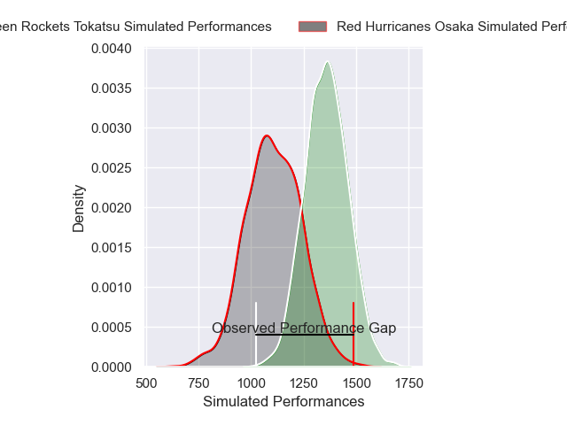
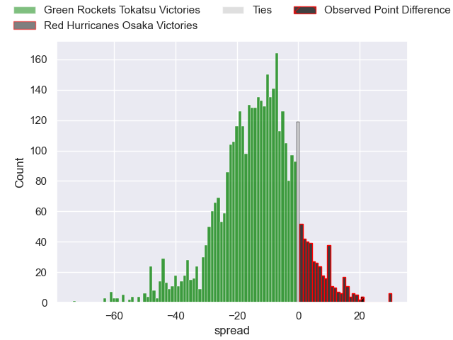
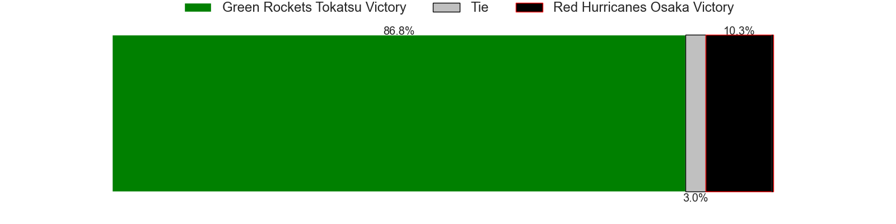
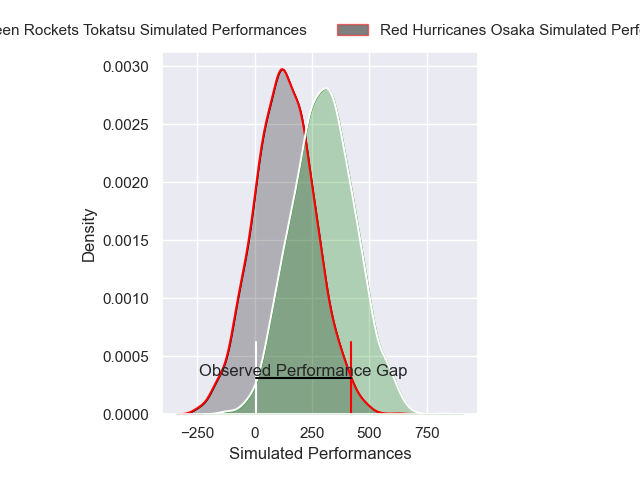
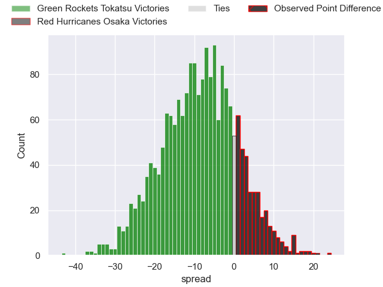
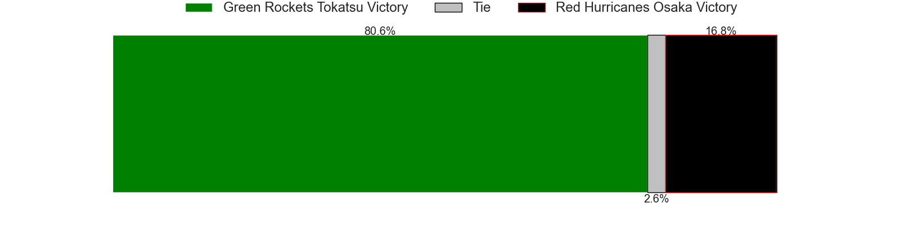

---  
layout: page  
title: Green Rockets Tokatsu at Red Hurricanes Osaka; 13-34  
date: 2024-12-22 18:00:00 -0500  
categories: "Japan Rugby League One D2 2024" match review  
---
# Green Rockets Tokatsu at Red Hurricanes Osaka; 13-34

# Club Level Predictions

The first set of predictions treats a club as the smallest object, as the club develops its members, organizes a gameplan, and deploys its players as needed for each match. This club model has a prediction of 0.198, which translates to predicting Green Rockets Tokatsu to win by 12.8.

Our Over/Under is 45.5 - and combined with the spread above, we have a predicted scoreline of 29 to 16

Each club has a rating and a rating deviation (similar to a Glicko rating), and expected performances can be generated. This allows for simulated matches and spreads like the ones below.
## Projected Performances - Club Model

## Projected Spreads - Club Model

## Projected Results - Club Model

# Player Level Predictions

Treating teams instead as an entity made up of the currently active players, I have ratings for each player in an altogether different system. These can be combined to form team ratings once teamsheets are announced, weighting starters a bit higher than the reserves. After the match is played, players can be weighted by their minutes on the field, allowing for an accurate measure of the team's composition. With these compiled team ratings, we can make predictions, measure inaccuracy, and update the individual player ratings.
## Prediction without Player Minutes: Green Rockets Tokatsu by 8.9

Green Rockets Tokatsu by 12.6 on a neutral pitch

## Projected Performances - Player Model

## Projected Spreads - Player Model

## Projected Results - Player Model

|   Away Minutes | Away Player           |   Away Percentile |   Number |   Home Percentile | Home Player        |   Home Minutes |
|---------------:|:----------------------|------------------:|---------:|------------------:|:-------------------|---------------:|
|             80 | Kosei Yamamoto        |             67.34 |        1 |             14.98 | Hiromichi Sakamoto |             80 |
|             80 | Ren Osawa             |             14.13 |        2 |             71.43 | Kentaro Otsuka     |             80 |
|             80 | Keisuke Kikuta        |             70.34 |        3 |             50.41 | Munekata Sashida   |             80 |
|             80 | Daiki Yamagiwa        |             63.49 |        4 |             18.65 | Michael Allardice  |             80 |
|             80 | Pari Pari Parkinson   |             96.79 |        5 |             92.97 | Elliott Stooke     |             80 |
|             80 | Viliami Lutua Ahofono |             68.45 |        6 |             69.13 | Isono Kaito        |             80 |
|             80 | Ryoi Kamei            |             56.55 |        7 |             86.22 | Blake Gibson       |             80 |
|             80 | Danjalo Ahsui         |             18.34 |        8 |             70.49 | Jack O'Sullivan    |             80 |
|             80 | Nick Phipps           |             90.02 |        9 |             31.56 | Akira Inoue        |             80 |
|             80 | Rhys Patchell         |             95.15 |       10 |             48.08 | Dobashi Fumiya     |             80 |
|             80 | Hiroyuki Miyajima     |              9.38 |       11 |             71.19 | Kenya Nishikawa    |             80 |
|             80 | Orbyn Leger           |              4.88 |       12 |             10.93 | Mifiposeti Paea    |             80 |
|             80 | Maritino Nemani       |              4.1  |       13 |             57.37 | Henry Taefu        |             80 |
|             80 | Christian Laui        |             70.27 |       14 |             25    | Kouki Shigeno      |             80 |
|             80 | Keagan Faria          |             25.74 |       15 |             62.78 | Taiki Yamaguchi    |             80 |

