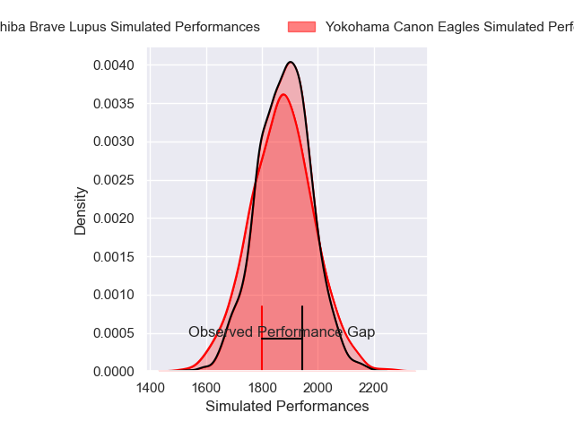
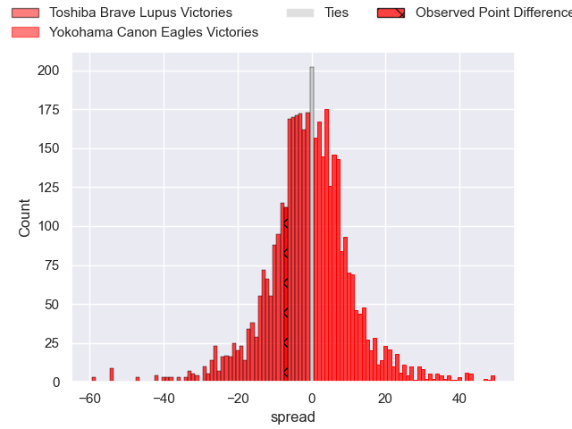
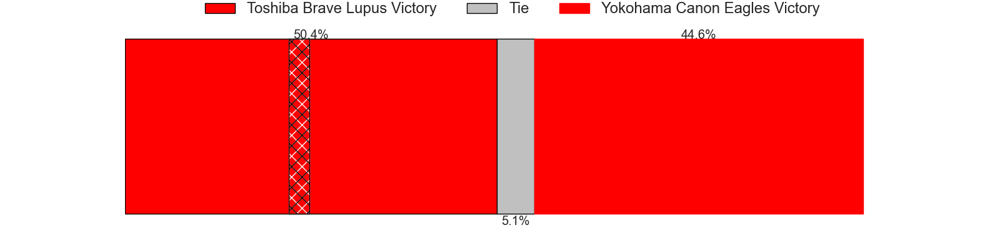
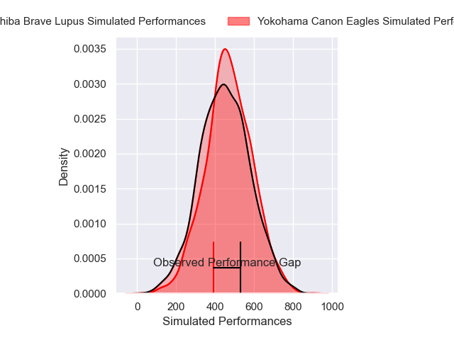
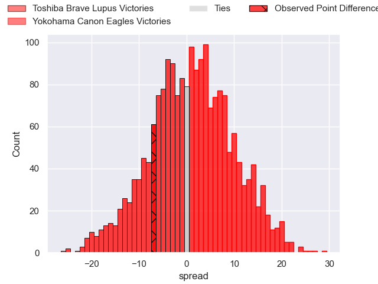
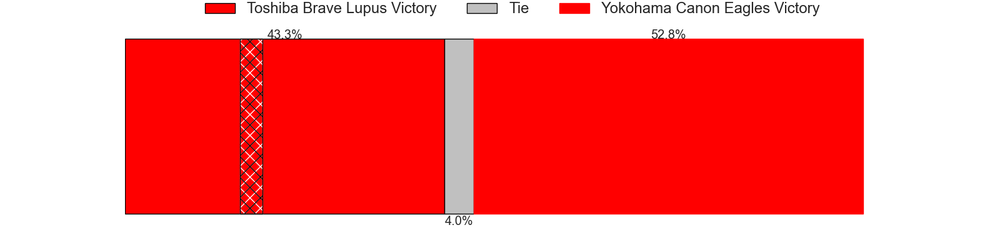

---  
layout: page  
title: Toshiba Brave Lupus at Yokohama Canon Eagles; 28-21  
date: 2024-12-22 18:00:00 -0500  
categories: "Japan Rugby League One 2024" match review  
---
# Toshiba Brave Lupus at Yokohama Canon Eagles; 28-21

# Club Level Predictions

The first set of predictions treats a club as the smallest object, as the club develops its members, organizes a gameplan, and deploys its players as needed for each match. This club model has a prediction of 0.489, which translates to predicting Toshiba Brave Lupus to win by 0.4.

Our Over/Under is 55.5 - and combined with the spread above, we have a predicted scoreline of 28 to 28

Each club has a rating and a rating deviation (similar to a Glicko rating), and expected performances can be generated. This allows for simulated matches and spreads like the ones below.
## Projected Performances - Club Model

## Projected Spreads - Club Model

## Projected Results - Club Model

# Player Level Predictions

Treating teams instead as an entity made up of the currently active players, I have ratings for each player in an altogether different system. These can be combined to form team ratings once teamsheets are announced, weighting starters a bit higher than the reserves. After the match is played, players can be weighted by their minutes on the field, allowing for an accurate measure of the team's composition. With these compiled team ratings, we can make predictions, measure inaccuracy, and update the individual player ratings.
## Prediction without Player Minutes: Yokohama Canon Eagles by 1.5

Toshiba Brave Lupus by 2.7 on a neutral pitch

## Projected Performances - Player Model

## Projected Spreads - Player Model

## Projected Results - Player Model

|   Away Minutes | Away Player      |   Away Percentile |   Number |   Home Percentile | Home Player      |   Home Minutes |
|---------------:|:-----------------|------------------:|---------:|------------------:|:-----------------|---------------:|
|             80 | Sena Kimura      |             74.29 |        1 |             80.38 | Takato Okabe     |             73 |
|             80 | Daigo Hashimoto  |             66.3  |        2 |             85.25 | Shunta Nakamura  |             13 |
|             80 | Yuta Kokaji      |             78.18 |        3 |              6.21 | Tatsuro Sugimoto |             62 |
|             80 | Shin Ito         |             80.66 |        4 |             28.79 | Lekima Nasamila  |             80 |
|             52 | Jacob Pierce     |             98.79 |        5 |             33.39 | Matt Philip      |             81 |
|             45 | Shannon Frizell  |             92.6  |        6 |             77.81 | Billy Harmon     |             80 |
|             45 | Takeshi Sasaki   |             86.56 |        7 |             67.6  | Naoto Shimada    |             80 |
|             81 | Michael Leitch   |             74.5  |        8 |             73.78 | Amanaki Mafi     |             80 |
|              8 | Yuhei Sugiyama   |             80.52 |        9 |             91.95 | Faf de Klerk     |             81 |
|             80 | Richie Mo'unga   |             99.39 |       10 |             79.19 | Yu Tamura        |             81 |
|             80 | Atsuki Kuwayama  |             84.53 |       11 |             91.92 | Viliame Takayawa |             80 |
|             80 | Taichi Mano      |             78.93 |       12 |             92.78 | Yusuke Kajimura  |             47 |
|             81 | Seta Tamanivalu  |             95.61 |       13 |             97.56 | Jesse Kriel      |             80 |
|             80 | Jone Naikabula   |             72.94 |       14 |             37.04 | Kippei Ishida    |             80 |
|             80 | Takuro Matsunaga |             91.67 |       15 |             96.67 | Jumpei Ogura     |             80 |

