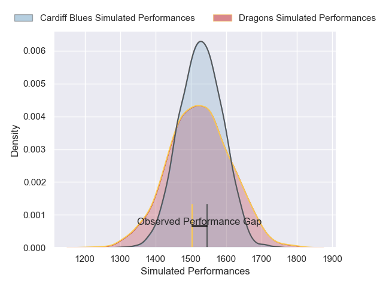
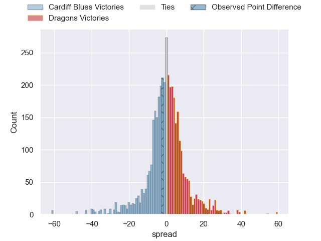
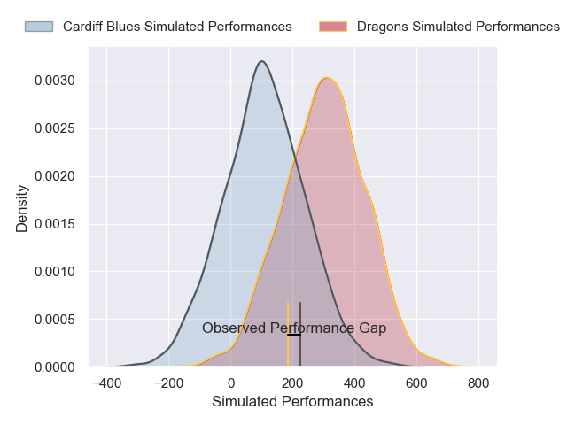
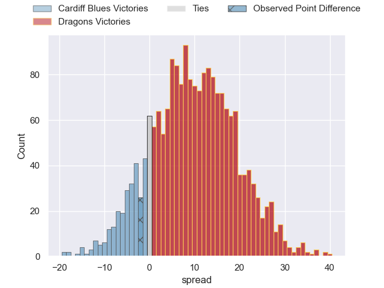

---  
layout: page  
title: Cardiff Blues at Dragons; 24-22  
date: 2024-12-26 18:00:00 -0500  
categories: "United Rugby Championship 2024" match review  
---
# Cardiff Blues at Dragons; 24-22

# Club Level Predictions

The first set of predictions treats a club as the smallest object, as the club develops its members, organizes a gameplan, and deploys its players as needed for each match. This club model has a prediction of 0.496, which translates to predicting Cardiff Blues to win by 0.1.

Our Over/Under is 37.5 - and combined with the spread above, we have a predicted scoreline of 19 to 19

Each club has a rating and a rating deviation (similar to a Glicko rating), and expected performances can be generated. This allows for simulated matches and spreads like the ones below.
## Projected Performances - Club Model

## Projected Spreads - Club Model

## Projected Results - Club Model

# Player Level Predictions

Treating teams instead as an entity made up of the currently active players, I have ratings for each player in an altogether different system. These can be combined to form team ratings once teamsheets are announced, weighting starters a bit higher than the reserves. After the match is played, players can be weighted by their minutes on the field, allowing for an accurate measure of the team's composition. With these compiled team ratings, we can make predictions, measure inaccuracy, and update the individual player ratings.
## Prediction without Player Minutes: Dragons by 10.4

Dragons by 0.4 on a neutral pitch

## Projected Performances - Player Model

## Projected Spreads - Player Model

## Projected Results - Player Model

|   Away Minutes | Away Player        |   Away Percentile |   Number |   Home Percentile | Home Player        |   Home Minutes |
|---------------:|:-------------------|------------------:|---------:|------------------:|:-------------------|---------------:|
|             80 | Corey Domachowski  |             80.68 |        1 |             59.89 | Rodrigo Martinez   |             80 |
|             80 | Dafydd Hughes      |             28.48 |        2 |             54.59 | Brodie Coghlan     |             65 |
|             80 | Keiron Assiratti   |              6.66 |        3 |             79.01 | Dimitri Arhip      |              4 |
|             80 | Josh McNally       |             85.19 |        4 |             10.71 | Joseph Davies      |             11 |
|             21 | Teddy Williams     |             17.33 |        5 |             61.41 | Ryan Woodman       |             11 |
|             51 | James Botham       |             76    |        6 |             39.37 | Dan Lydiate        |             54 |
|             40 | Alex Mann          |             16.99 |        7 |             22.54 | Taine Basham       |             80 |
|             29 | Taulupe Faletau    |             58.58 |        8 |             12.93 | Aaron Wainwright   |             76 |
|             80 | Aled Davies        |             87.6  |        9 |             83.25 | Rhodri Williams    |             80 |
|             75 | Callum Sheedy      |             93.59 |       10 |              7.82 | Angus O'Brien      |             80 |
|             80 | Gabriel Hamer-Webb |             87.65 |       11 |             10.26 | Jared Rosser       |             58 |
|             80 | Ben Thomas         |             59.5  |       12 |             67.43 | Aneurin Owen       |             69 |
|             80 | Rey Lee-Lo         |             91.78 |       13 |             60    | Joe Westwood       |             80 |
|             80 | Josh Adams         |             87.02 |       14 |             20.44 | Rio Dyer           |             29 |
|             63 | Cameron Winnett    |             14.77 |       15 |             30.49 | Huw Anderson       |             80 |
|             65 | Evan Lloyd         |              8.23 |       16 |             85.44 | Elliot Dee         |             80 |
|             22 | Alun Lawrence      |             59.37 |       17 |             22.89 | Shane Lewis-Hughes |             69 |
|             11 | Danny Southworth   |             34.58 |       18 |             40.91 | Aki Seiuli         |             80 |
|             26 | Rhys Litterick     |             20.19 |       19 |            nan    | Paula Latu         |             80 |
|             80 | Rory Jennings      |             42.38 |       20 |             13.07 | Cai Evans          |             80 |
|            nan | nan                |            nan    |       21 |             35.28 | Nick Thomas        |             69 |

