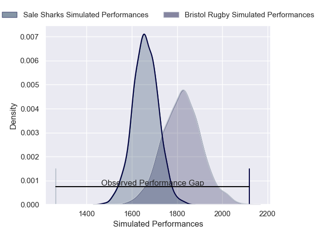
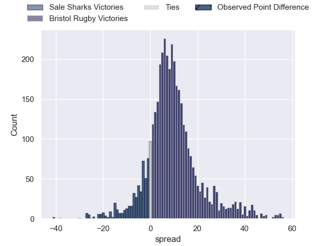
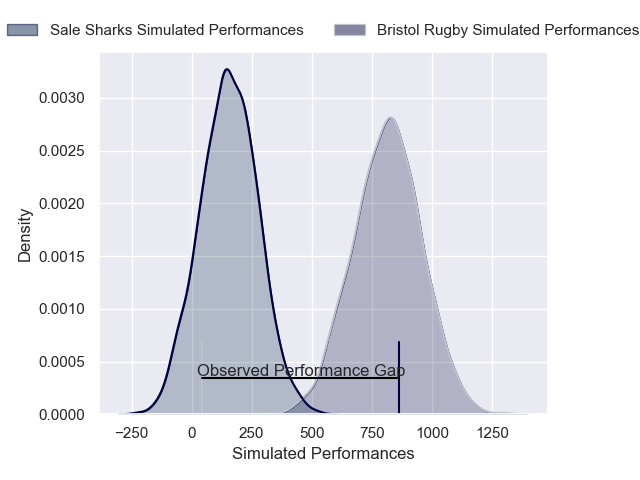
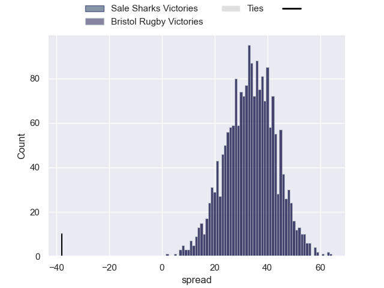

---  
layout: page  
title: Sale Sharks at Bristol Rugby; 38-0  
date: 2024-12-27 18:00:00 -0500  
categories: "Gallagher Premiership 2024" match review  
---
# Sale Sharks at Bristol Rugby; 38-0

# Club Level Predictions

The first set of predictions treats a club as the smallest object, as the club develops its members, organizes a gameplan, and deploys its players as needed for each match. This club model has a prediction of 0.715, which translates to predicting Bristol Rugby to win by 8.1.

Our Over/Under is 55.5 - and combined with the spread above, we have a predicted scoreline of 24 to 32

Each club has a rating and a rating deviation (similar to a Glicko rating), and expected performances can be generated. This allows for simulated matches and spreads like the ones below.
## Projected Performances - Club Model

## Projected Spreads - Club Model

## Projected Results - Club Model

# Player Level Predictions

Treating teams instead as an entity made up of the currently active players, I have ratings for each player in an altogether different system. These can be combined to form team ratings once teamsheets are announced, weighting starters a bit higher than the reserves. After the match is played, players can be weighted by their minutes on the field, allowing for an accurate measure of the team's composition. With these compiled team ratings, we can make predictions, measure inaccuracy, and update the individual player ratings.
## Prediction without Player Minutes: Bristol Rugby by 36.4

Bristol Rugby by 29.0 on a neutral pitch

## Projected Performances - Player Model

## Projected Spreads - Player Model

## Projected Results - Player Model

|   Away Minutes | Away Player          |   Away Percentile |   Number |   Home Percentile | Home Player                |   Home Minutes |
|---------------:|:---------------------|------------------:|---------:|------------------:|:---------------------------|---------------:|
|             58 | Bevan Rodd           |             92.27 |        1 |             76.08 | Jake Woolmore              |             80 |
|             13 | Luke Cowan-Dickie    |            100    |        2 |             67.41 | Harry Thacker              |             36 |
|             22 | Asher Opoku-Fordjour |             88.67 |        3 |              6.53 | Max Lahiff                 |             80 |
|             13 | Ernst van Rhyn       |             88.33 |        4 |             90.24 | James Dun                  |             72 |
|             22 | Jonny Hill           |             35.54 |        5 |             20.38 | Joe Owen                   |             73 |
|             50 | Tom Curry            |            100    |        6 |             98.46 | Steven Luatua              |             80 |
|             22 | Ben Curry            |             93.17 |        7 |             95.56 | Fitz Harding               |             80 |
|             30 | Daniel du Preez      |             67.81 |        8 |             22.16 | Viliame Mata               |             80 |
|              7 | Raffi Quirke         |             96.3  |        9 |             96.14 | Harry Randall              |             58 |
|             80 | George Ford          |             97.6  |       10 |             27.25 | Sam Worsley                |             58 |
|             22 | Tom O'Flaherty       |             95.88 |       11 |             96.04 | Gabriel Ibitoye            |              7 |
|             80 | Luke James           |             79.01 |       12 |             96.34 | Benhard Janse van Rensburg |             80 |
|             80 | Robert du Preez      |             95.45 |       13 |             47.23 | Kalaveti Ravouvou          |             80 |
|             30 | Robert du Preez      |             95.45 |       13 |             47.23 | Kalaveti Ravouvou          |             80 |
|             73 | Tom Roebuck          |             88.5  |       14 |             13.83 | Jack Bates                 |             50 |
|             25 | Joe Carpenter        |            100    |       15 |             41.48 | Richard Lane               |             80 |
|             31 | Simon McIntyre       |             86.21 |       16 |             81.95 | Yann Thomas                |             61 |
|             80 | Ethan Caine          |            nan    |       17 |             89.24 | Gabriel Oghre              |             67 |
|             80 | WillGriff John       |            nan    |       18 |             79.95 | George Kloska              |             67 |
|             56 | Josh Beaumont        |             80.49 |       19 |             53.83 | Benjamin Grondona          |             80 |
|             80 | Jean-Luc du Preez    |             99.91 |       20 |             92.77 | Jamie Hodgson              |             80 |
|             11 | Sam Dugdale          |              8.8  |       21 |             95.33 | Kieran Marmion             |             80 |
|             22 | Sam Bedlow           |              0.1  |       22 |             80.89 | James Williams             |             69 |
|             13 | Gus Warr             |             71.01 |       23 |             31.06 | Benjamin Elizalde          |             80 |

