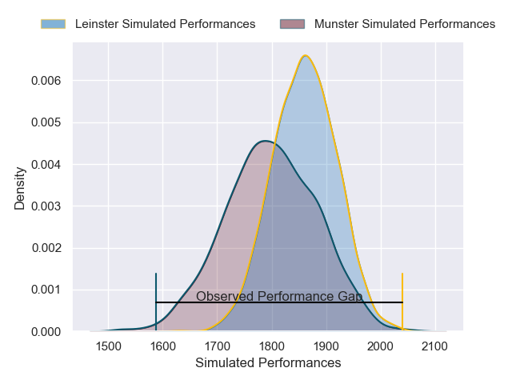
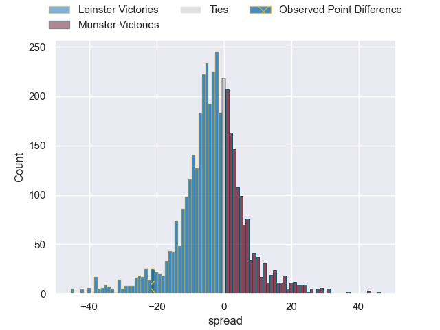
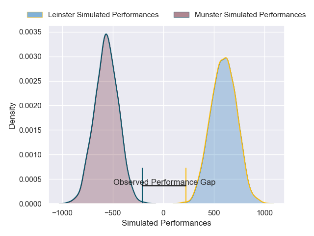
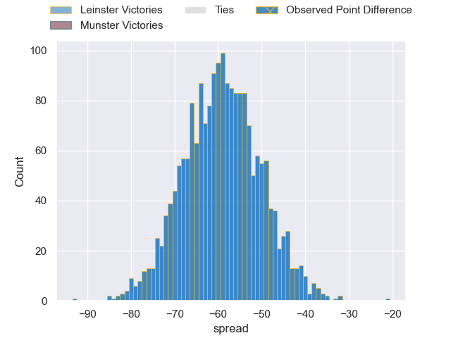

---  
layout: page  
title: Leinster at Munster; 28-7  
date: 2024-12-27 18:00:00 -0500  
categories: "United Rugby Championship 2024" match review  
---
# Leinster at Munster; 28-7

# Club Level Predictions

The first set of predictions treats a club as the smallest object, as the club develops its members, organizes a gameplan, and deploys its players as needed for each match. This club model has a prediction of 0.409, which translates to predicting Leinster to win by 3.3.

Our Over/Under is 41.5 - and combined with the spread above, we have a predicted scoreline of 22 to 19

Each club has a rating and a rating deviation (similar to a Glicko rating), and expected performances can be generated. This allows for simulated matches and spreads like the ones below.
## Projected Performances - Club Model

## Projected Spreads - Club Model

## Projected Results - Club Model

# Player Level Predictions

Treating teams instead as an entity made up of the currently active players, I have ratings for each player in an altogether different system. These can be combined to form team ratings once teamsheets are announced, weighting starters a bit higher than the reserves. After the match is played, players can be weighted by their minutes on the field, allowing for an accurate measure of the team's composition. With these compiled team ratings, we can make predictions, measure inaccuracy, and update the individual player ratings.
## Prediction without Player Minutes: Leinster by 14.7

Leinster by 24.5 on a neutral pitch

## Projected Performances - Player Model

## Projected Spreads - Player Model

## Projected Results - Player Model

|   Away Minutes | Away Player        |   Away Percentile |   Number |   Home Percentile | Home Player      |   Home Minutes |
|---------------:|:-------------------|------------------:|---------:|------------------:|:-----------------|---------------:|
|             28 | Jack Boyle         |             73.28 |        1 |             94    | Dian Bleuler     |             17 |
|              7 | Ronan Kelleher     |             78.01 |        2 |             75.95 | Niall Scannell   |             75 |
|             31 | Rabah Slimani      |             89.67 |        3 |             84.08 | Oli Jager        |             17 |
|             17 | Joe McCarthy       |             28.75 |        4 |             44.77 | Fineen Wycherley |             58 |
|             49 | James Ryan         |             94.6  |        5 |             94.86 | Tadhg Beirne     |             30 |
|             41 | Ryan Baird         |             88.9  |        6 |             14.43 | Thomas Ahern     |             15 |
|             58 | Josh van der Flier |             96.5  |        7 |             89.41 | Alex Kendellen   |             15 |
|             67 | Caelan Doris       |             62.8  |        8 |             48.55 | Gavin Coombes    |             80 |
|             52 | Gus McCarthy       |             98.07 |        9 |             55.39 | Ethan Coughlan   |             73 |
|             39 | Sam Prendergast    |              8.02 |       10 |             17.03 | Billy Burns      |             28 |
|             80 | Jimmy O'Brien      |             89.12 |       11 |             96.66 | Shane Daly       |             73 |
|             80 | Robbie Henshaw     |             86.14 |       12 |             92.48 | Rory Scannell    |             63 |
|             80 | Garry Ringrose     |             99.11 |       13 |             70.89 | Tom Farrell      |              7 |
|              5 | Tommy O'Brien      |             66.36 |       14 |             87.49 | Calvin Nash      |              7 |
|             50 | Jamie Osborne      |             90.53 |       15 |             37.31 | Mike Haley       |             80 |
|             26 | Andrew Porter      |             83.28 |       16 |             58.41 | John Hodnett     |             80 |
|             54 | Cian Healy         |             84.68 |       17 |            nan    | Paddy Patterson  |             73 |
|             75 | Fintan Gunne       |            nan    |       18 |              6.46 | John Ryan        |             80 |
|             80 | Lee Barron         |             75.63 |       19 |             11.62 | Tony Butler      |              5 |
|             55 | Ross Byrne         |             96.19 |       20 |             27.97 | Brian Gleeson    |              5 |
|             80 | Scott Penny        |             87.28 |       21 |              6.46 | John Ryan        |             63 |
|             80 | Jordan Larmour     |             83.29 |       22 |            nan    | Eoghan Clarke    |             40 |
|             67 | Brian Deeny        |             80.4  |       23 |             41.29 | Ben O'Connor     |             52 |

