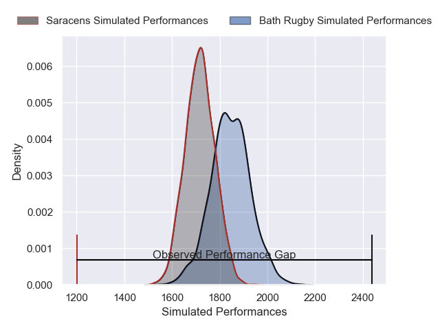
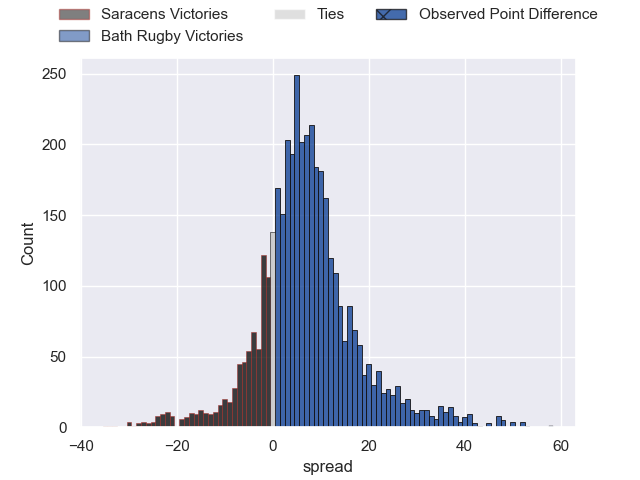
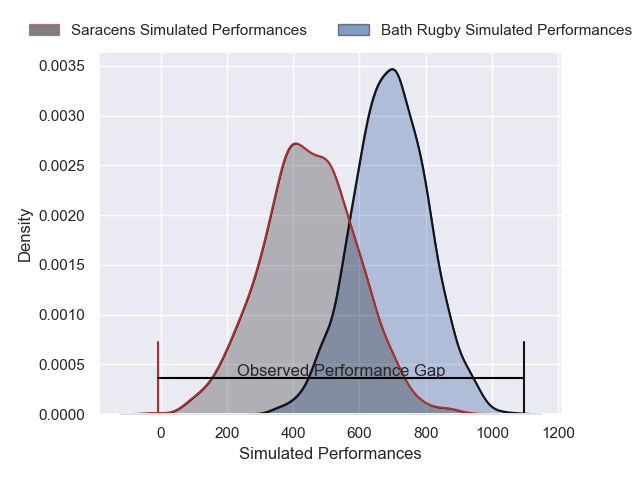
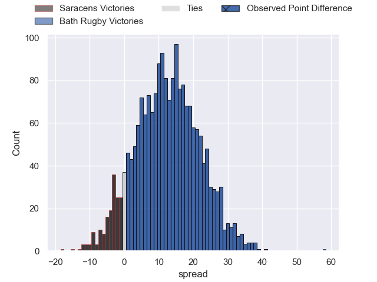

---  
layout: page  
title: Saracens at Bath Rugby; 10-68  
date: 2024-12-28 18:00:00 -0500  
categories: "Gallagher Premiership 2024" match review  
---
# Saracens at Bath Rugby; 10-68

# Club Level Predictions

The first set of predictions treats a club as the smallest object, as the club develops its members, organizes a gameplan, and deploys its players as needed for each match. This club model has a prediction of 0.679, which translates to predicting Bath Rugby to win by 6.6.

Our Over/Under is 39.5 - and combined with the spread above, we have a predicted scoreline of 16 to 23

Each club has a rating and a rating deviation (similar to a Glicko rating), and expected performances can be generated. This allows for simulated matches and spreads like the ones below.
## Projected Performances - Club Model

## Projected Spreads - Club Model

## Projected Results - Club Model

# Player Level Predictions

Treating teams instead as an entity made up of the currently active players, I have ratings for each player in an altogether different system. These can be combined to form team ratings once teamsheets are announced, weighting starters a bit higher than the reserves. After the match is played, players can be weighted by their minutes on the field, allowing for an accurate measure of the team's composition. With these compiled team ratings, we can make predictions, measure inaccuracy, and update the individual player ratings.
## Prediction without Player Minutes: Bath Rugby by 18.5

Bath Rugby by 4.4 on a neutral pitch

## Projected Performances - Player Model

## Projected Spreads - Player Model

## Projected Results - Player Model

|   Away Minutes | Away Player      |   Away Percentile |   Number |   Home Percentile | Home Player      |   Home Minutes |
|---------------:|:-----------------|------------------:|---------:|------------------:|:-----------------|---------------:|
|             29 | Phil Brantingham |             17.92 |        1 |             90.21 | Beno Obano       |             26 |
|             40 | Jamie George     |             99.05 |        2 |             98.73 | Tom Dunn         |             80 |
|             76 | Fraser Balmain   |             13.59 |        3 |             87.81 | Thomas du Toit   |             21 |
|             20 | Maro Itoje       |             98.43 |        4 |             96.69 | Quinn Roux       |             80 |
|             80 | Nick Isiekwe     |             94.16 |        5 |             82.23 | Charlie Ewels    |             13 |
|             40 | Theo McFarland   |             42.7  |        6 |             95.22 | Ted Hill         |             52 |
|             80 | Toby Knight      |             69.68 |        7 |             23.14 | Guy Pepper       |             59 |
|             80 | Ben Earl         |             71.5  |        8 |             66.09 | Alfie Barbeary   |             40 |
|             57 | Gareth Simpson   |             24.64 |        9 |             90.34 | Ben Spencer      |             80 |
|             56 | Fergus Burke     |             70.34 |       10 |             99    | Finn Russell     |             63 |
|             80 | Rotimi Segun     |             73.27 |       11 |             30.77 | Will Muir        |             51 |
|             57 | Olly Hartley     |             31.49 |       12 |              4.46 | Cameron Redpath  |             80 |
|             57 | Alex Lozowski    |             89.8  |       13 |             85.45 | Ollie Lawrence   |             23 |
|             57 | Tobias Elliott   |             69.93 |       14 |             93.63 | Joe Cokanasiga   |             40 |
|             80 | Liam Williams    |             98.11 |       15 |             45.45 | Tom de Glanville |             27 |
|             80 | Eroni Mawi       |             90.54 |       16 |             81.88 | Francois van Wyk |             80 |
|             80 | Kapeli Pifeleti  |              3.32 |       17 |             78.64 | Niall Annett     |             80 |
|             24 | Alec Clarey      |             76.42 |       18 |             21.59 | Will Stuart      |             60 |
|             57 | Harry Wilson     |             22.74 |       19 |             89.29 | Ross Molony      |             75 |
|             80 | Nathan Michelow  |             62.14 |       20 |             66.75 | Miles Reid       |             32 |
|             54 | Ivan van Zyl     |             88.57 |       21 |             97.27 | Sam Underhill    |              5 |
|             80 | Angus Hall       |             69.13 |       22 |             55.56 | Louis Schreuder  |             48 |
|             80 | Sam Spink        |             38.02 |       23 |             92.87 | Max Ojomoh       |             17 |

