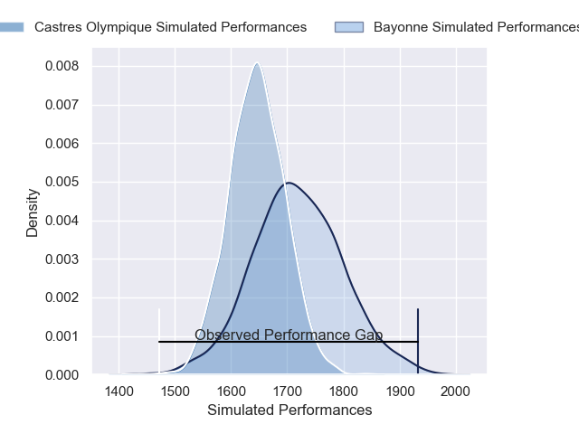
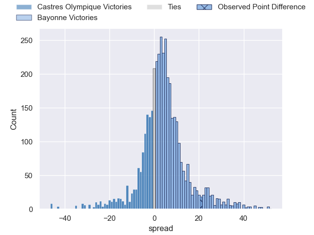
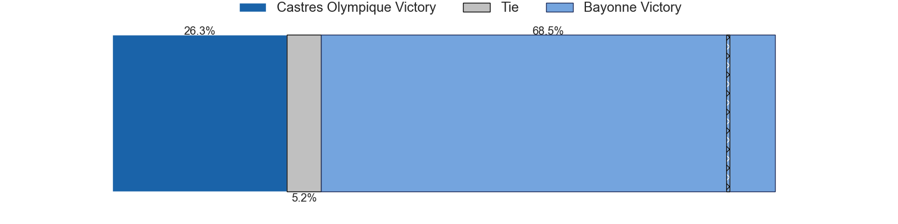
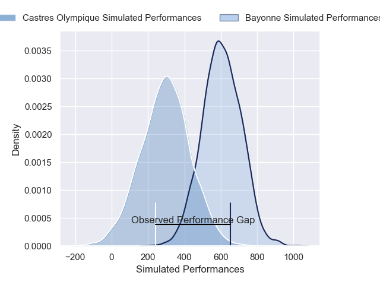
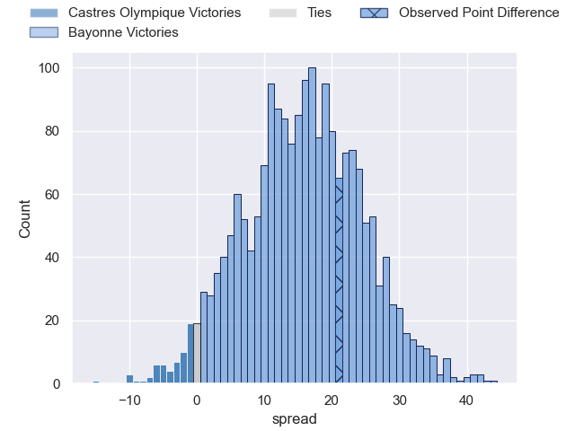
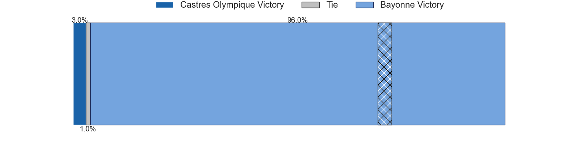

---  
layout: page  
title: Castres Olympique at Bayonne; 12-33  
date: 2024-12-28 18:00:00 -0500  
categories: "Top 14 Orange 2024" match review  
---
# Castres Olympique at Bayonne; 12-33

# Club Level Predictions

The first set of predictions treats a club as the smallest object, as the club develops its members, organizes a gameplan, and deploys its players as needed for each match. This club model has a prediction of 0.608, which translates to predicting Bayonne to win by 3.9.

Our Over/Under is 37.5 - and combined with the spread above, we have a predicted scoreline of 17 to 21

Each club has a rating and a rating deviation (similar to a Glicko rating), and expected performances can be generated. This allows for simulated matches and spreads like the ones below.
## Projected Performances - Club Model

## Projected Spreads - Club Model

## Projected Results - Club Model

# Player Level Predictions

Treating teams instead as an entity made up of the currently active players, I have ratings for each player in an altogether different system. These can be combined to form team ratings once teamsheets are announced, weighting starters a bit higher than the reserves. After the match is played, players can be weighted by their minutes on the field, allowing for an accurate measure of the team's composition. With these compiled team ratings, we can make predictions, measure inaccuracy, and update the individual player ratings.
## Prediction without Player Minutes: Bayonne by 22.8

Bayonne by 9.4 on a neutral pitch

## Projected Performances - Player Model

## Projected Spreads - Player Model

## Projected Results - Player Model

|   Away Minutes | Away Player          |   Away Percentile |   Number |   Home Percentile | Home Player             |   Home Minutes |
|---------------:|:---------------------|------------------:|---------:|------------------:|:------------------------|---------------:|
|             62 | Antoine Tichit       |             70.89 |        1 |             72.95 | Swan Cormenier          |             58 |
|             57 | Pierre Colonna       |             26.74 |        2 |             92.25 | Facundo Bosch           |             30 |
|             25 | Nicolas Corato       |             20.45 |        3 |             14.19 | Pascal Cotet            |             67 |
|             31 | Guillaume Ducat      |             12.98 |        4 |             92.94 | Baptiste Chouzenoux     |             67 |
|             25 | Florent Vanverberghe |             73.69 |        5 |             15.16 | Lucas Paulos            |             26 |
|             27 | Mathieu Babillot     |             11.96 |        6 |             99.06 | Rodrigo Bruni           |             57 |
|             47 | Feibyan Tukino       |             52.95 |        7 |             94.62 | Remi Bourdeau           |             61 |
|             31 | Abraham Papali'i     |              6.46 |        8 |             43.4  | Uzair Cassiem           |             66 |
|             31 | Gauthier Doubrere    |             17.07 |        9 |             95.97 | Maxime Machenaud        |             80 |
|             80 | Pierre Popelin       |             57.72 |       10 |             69.54 | Joris Segonds           |             60 |
|             80 | Remy Baget           |             83.37 |       11 |             70.4  | Mateo Carreras          |             80 |
|             80 | Jack Goodhue         |             93.56 |       12 |             98.61 | Manu Tuilagi            |             22 |
|              1 | Vilimoni Botitu      |             43.37 |       13 |             36.73 | Sireli Maqala           |             29 |
|             80 | Nathanael Hulleu     |             77.39 |       14 |             12.9  | Tom Spring              |             80 |
|             80 | Geoffrey Palis       |             96.4  |       15 |             12.31 | Cheikh Tiberghien       |             33 |
|             70 | Quentin Walcker      |             23.52 |       16 |             82.32 | Baptiste Heguy          |             56 |
|             80 | Levan Chilachava     |             65.02 |       17 |             61.08 | Giovanni Habel-Kueffner |             21 |
|             80 | Theo Chabouni        |             54.36 |       18 |             76.28 | Luke Tagi               |             40 |
|             80 | Santiago Arata       |             33.98 |       19 |             85.97 | Camille Lopez           |             39 |
|             80 | Loris Zarantonello   |             22.94 |       20 |             92.41 | Lucas Martin            |             48 |
|             20 | Leone Nakarawa       |             93.47 |       21 |             83.01 | Andy Bordelai           |             43 |
|             20 | Paul Jedrasiak       |             45.64 |       22 |              7.75 | Veikoso Poloniati       |             65 |
|             70 | Louis Le Brun        |             79.56 |       23 |             17.87 | Guillaume Rouet Piffard |             31 |

