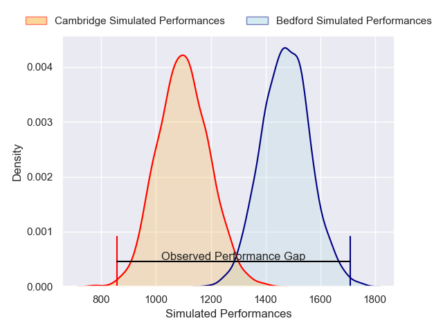
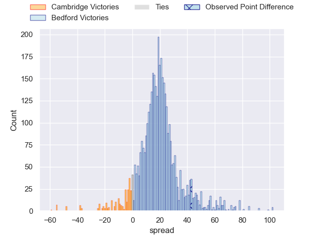
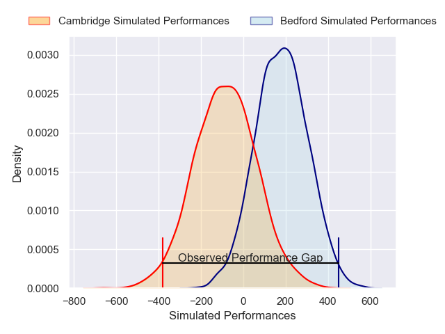
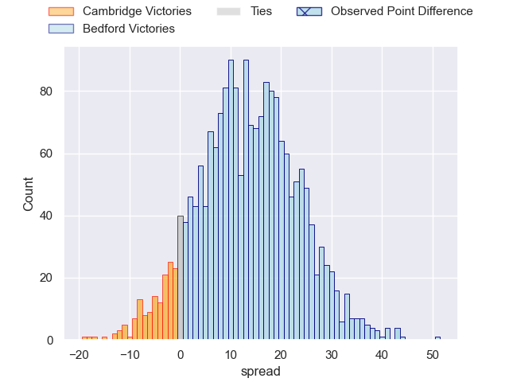
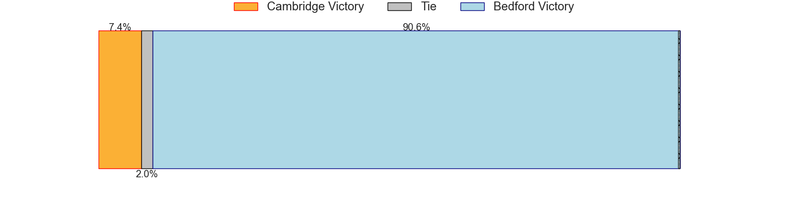

---  
layout: page  
title: Cambridge at Bedford; 7-50  
date: 2024-12-28 18:00:00 -0500  
categories: "RFU Championship 2024" match review  
---
# Cambridge at Bedford; 7-50

# Club Level Predictions

The first set of predictions treats a club as the smallest object, as the club develops its members, organizes a gameplan, and deploys its players as needed for each match. This club model has a prediction of 0.888, which translates to predicting Bedford to win by 18.8.

Our Over/Under is 54.5 - and combined with the spread above, we have a predicted scoreline of 18 to 37

Each club has a rating and a rating deviation (similar to a Glicko rating), and expected performances can be generated. This allows for simulated matches and spreads like the ones below.
## Projected Performances - Club Model

## Projected Spreads - Club Model

## Projected Results - Club Model

# Player Level Predictions

Treating teams instead as an entity made up of the currently active players, I have ratings for each player in an altogether different system. These can be combined to form team ratings once teamsheets are announced, weighting starters a bit higher than the reserves. After the match is played, players can be weighted by their minutes on the field, allowing for an accurate measure of the team's composition. With these compiled team ratings, we can make predictions, measure inaccuracy, and update the individual player ratings.
## Prediction without Player Minutes: Bedford by 12.4

Bedford by 7.8 on a neutral pitch

## Projected Performances - Player Model

## Projected Spreads - Player Model

## Projected Results - Player Model

|   Away Minutes | Away Player          |   Away Percentile |   Number |   Home Percentile | Home Player             |   Home Minutes |
|---------------:|:---------------------|------------------:|---------:|------------------:|:------------------------|---------------:|
|             61 | Zac Nearchou         |             34.11 |        1 |             48.03 | Joey Conway             |             80 |
|             80 | Benjamin Brownlie    |             11.08 |        2 |             34.49 | Johnny Stewart          |             15 |
|             80 | Jake Bridges         |             17.19 |        3 |             81.35 | Oisin Heffernan         |             80 |
|             41 | Kayde Sylvester      |             38.5  |        4 |             10.8  | Luke Frost              |             80 |
|             80 | Gareth Baxter        |             15.51 |        5 |             75.78 | Alex Woolford           |             80 |
|             52 | Ben Adams            |             10.42 |        6 |             26.39 | Fyn Brown               |             58 |
|             80 | Jared Cardew         |              8.97 |        7 |             18.62 | Joe Howard              |             80 |
|             52 | Jack Bartlett        |             11.61 |        8 |              9.5  | Freddie Tuilagi         |             68 |
|             61 | Peter White          |             92.59 |        9 |             22.38 | James Lennon            |             50 |
|             80 | Louis Grimoldby      |              7.41 |       10 |             89.78 | William Maisey          |             23 |
|             75 | Elias Caven          |              9.56 |       11 |             78.17 | Dean Adamson            |             60 |
|             61 | Ollie Betteridge     |             63.56 |       12 |             11.58 | Josh Matavesi           |             80 |
|             58 | Sam Hanks            |              1.39 |       13 |             74.06 | Michael Le Bourgeois    |             55 |
|             51 | Josh Skelcey         |             14.37 |       14 |             81.27 | Matt Worley             |             80 |
|             80 | Joseph Tarrant       |             11.36 |       15 |             23.11 | Louis James             |             58 |
|             47 | Sebastian Brownhill  |             24.65 |       16 |             34.04 | Jamie Jack              |             51 |
|             66 | Archie Vanes         |              7.28 |       17 |             29.43 | Nathan Langdon          |             51 |
|             80 | George Bretag-Norris |             12.89 |       18 |             47.9  | Beltus Nonleh           |             47 |
|             80 | Ollie Marsters       |            nan    |       19 |             65.16 | Ed Prowse               |             50 |
|             51 | Matthew Dawson       |             15.04 |       20 |              6.99 | Cameron King            |             57 |
|             65 | Ruaridh Dawson       |             55.88 |       21 |             67.44 | Alfie Garside           |             51 |
|             62 | Matt Williams        |             11.03 |       22 |             59.9  | Lucas Titherington      |             68 |
|             29 | Josef Green          |             21.52 |       23 |             74.15 | George Makepeace-Cubitt |             40 |

