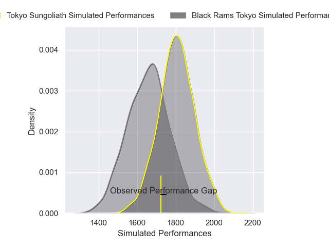
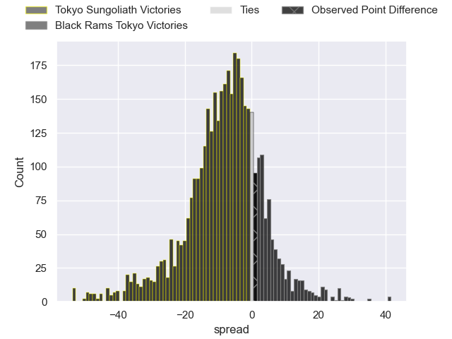
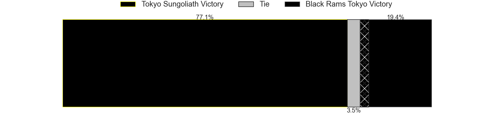
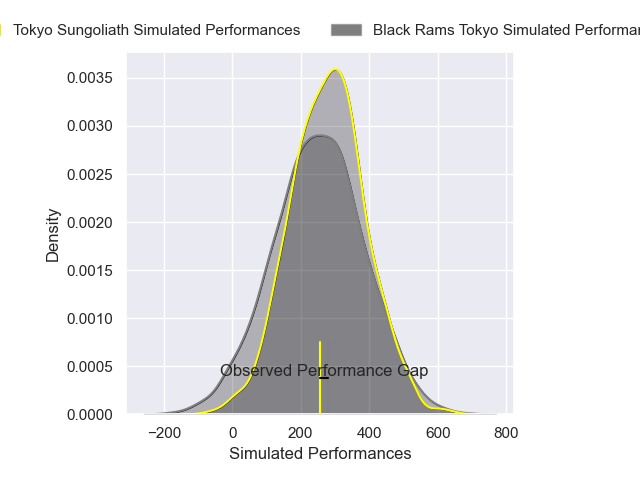
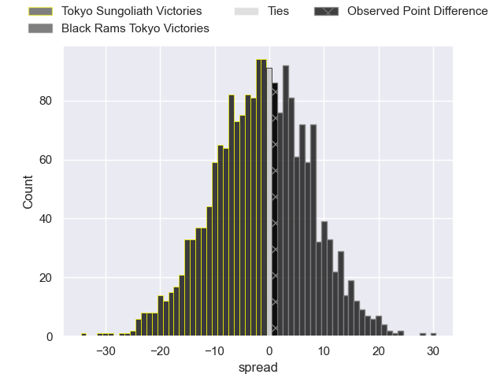

---  
layout: page  
title: Tokyo Sungoliath at Black Rams Tokyo; 32-33  
date: 2024-12-28 18:00:00 -0500  
categories: "Japan Rugby League One 2024" match review  
---
# Tokyo Sungoliath at Black Rams Tokyo; 32-33

# Club Level Predictions

The first set of predictions treats a club as the smallest object, as the club develops its members, organizes a gameplan, and deploys its players as needed for each match. This club model has a prediction of 0.302, which translates to predicting Tokyo Sungoliath to win by 7.6.

Our Over/Under is 52.5 - and combined with the spread above, we have a predicted scoreline of 30 to 22

Each club has a rating and a rating deviation (similar to a Glicko rating), and expected performances can be generated. This allows for simulated matches and spreads like the ones below.
## Projected Performances - Club Model

## Projected Spreads - Club Model

## Projected Results - Club Model

# Player Level Predictions

Treating teams instead as an entity made up of the currently active players, I have ratings for each player in an altogether different system. These can be combined to form team ratings once teamsheets are announced, weighting starters a bit higher than the reserves. After the match is played, players can be weighted by their minutes on the field, allowing for an accurate measure of the team's composition. With these compiled team ratings, we can make predictions, measure inaccuracy, and update the individual player ratings.
## Prediction without Player Minutes: Tokyo Sungoliath by 4.8

Tokyo Sungoliath by 8.9 on a neutral pitch

## Projected Performances - Player Model

## Projected Spreads - Player Model

## Projected Results - Player Model

|   Away Minutes | Away Player      |   Away Percentile |   Number |   Home Percentile | Home Player       |   Home Minutes |
|---------------:|:-----------------|------------------:|---------:|------------------:|:------------------|---------------:|
|              6 | Yukio Morikawa   |             82.15 |        1 |             50.97 | Kazuma Nishi      |             23 |
|             24 | Kosuke Horikoshi |             72.63 |        2 |             33.07 | Hinata Takei      |             80 |
|             46 | Kan Nakano       |             35.24 |        3 |             64.82 | Paddy Ryan        |             18 |
|             27 | Sam Jeffries     |             91.72 |        4 |              3.66 | Mike Stolberg     |             80 |
|             80 | Harry Hockings   |             97.13 |        5 |             38.24 | Josh Goodhue      |             21 |
|             18 | Kanji Shimokawa  |             80.19 |        6 |             73.78 | Talau Fakatava    |             33 |
|             40 | Kai Yamamoto     |             45.86 |        7 |             68.23 | Brodi McCurran    |             80 |
|             40 | Sean McMahon     |             69    |        8 |             57.39 | Liam Gill         |             80 |
|             40 | Kenta Fukuda     |             71.82 |        9 |             97.26 | TJ Perenara       |             80 |
|             40 | Mikiya Takamoto  |             59.32 |       10 |             47.09 | Ichigo Nakakusu   |             80 |
|             60 | Taiga Ozaki      |             69.77 |       11 |             67.68 | Netani Vakayalia  |             33 |
|             27 | Shogo Nakano     |             10.3  |       12 |             53.86 | Yuki Ikeda        |             20 |
|             80 | Isaiah Punivai   |             40.1  |       13 |             69.7  | Ryohei Isoda      |             80 |
|             80 | Seiya Ozaki      |             88.34 |       14 |             17.56 | Viliami Lolohea   |             80 |
|             18 | Ryosuke Kawase   |             24.05 |       15 |             63.83 | Isaac Lucas       |             69 |
|             80 | Kenta Kobayashi  |             47.63 |       16 |             36.94 | Samuel Waqabaca   |             80 |
|             27 | Yutaka Nagare    |             76.33 |       17 |             21.32 | Shohei Oyama      |             80 |
|             80 | Kotaro Hosoki    |             39.37 |       18 |             83.62 | Pohiva Lotoahea   |             45 |
|             56 | Ryoto Nakamura   |             92.28 |       19 |             77.06 | Ko Sato           |             76 |
|             53 | Kienori Go       |            nan    |       20 |             34.73 | Siope Lolo Tavo   |             62 |
|             46 | Trevor Hosea     |             25.7  |       21 |             69.94 | Shuhei Matsuhashi |             80 |
|             62 | Tamati Ioane     |             14.51 |       22 |             42.23 | Kotaro Ito        |             80 |
|             31 | Ryuga Hashimoto  |             72.76 |       23 |            nan    | nan               |            nan |

