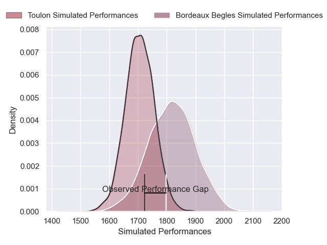
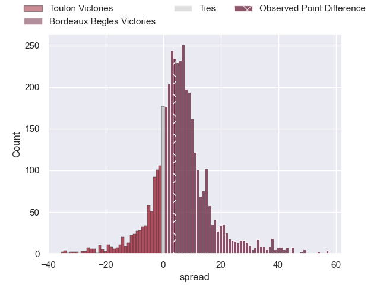
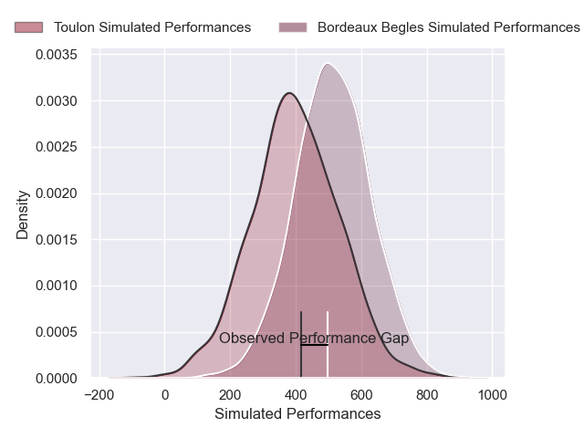
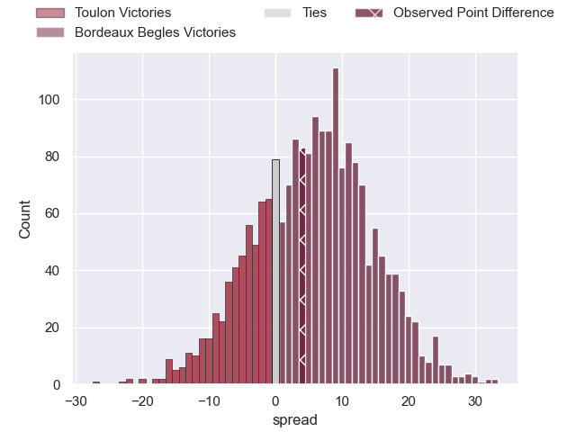

---  
layout: page  
title: Toulon at Bordeaux Begles; 17-21  
date: 2024-12-28 18:00:00 -0500  
categories: "Top 14 Orange 2024" match review  
---
# Toulon at Bordeaux Begles; 17-21

# Club Level Predictions

The first set of predictions treats a club as the smallest object, as the club develops its members, organizes a gameplan, and deploys its players as needed for each match. This club model has a prediction of 0.655, which translates to predicting Bordeaux Begles to win by 5.6.

Our Over/Under is 33.5 - and combined with the spread above, we have a predicted scoreline of 14 to 20

Each club has a rating and a rating deviation (similar to a Glicko rating), and expected performances can be generated. This allows for simulated matches and spreads like the ones below.
## Projected Performances - Club Model

## Projected Spreads - Club Model

## Projected Results - Club Model

# Player Level Predictions

Treating teams instead as an entity made up of the currently active players, I have ratings for each player in an altogether different system. These can be combined to form team ratings once teamsheets are announced, weighting starters a bit higher than the reserves. After the match is played, players can be weighted by their minutes on the field, allowing for an accurate measure of the team's composition. With these compiled team ratings, we can make predictions, measure inaccuracy, and update the individual player ratings.
## Prediction without Player Minutes: Bordeaux Begles by 12.5

Bordeaux Begles by 0.5 on a neutral pitch

## Projected Performances - Player Model

## Projected Spreads - Player Model

## Projected Results - Player Model

|   Away Minutes | Away Player            |   Away Percentile |   Number |   Home Percentile | Home Player          |   Home Minutes |
|---------------:|:-----------------------|------------------:|---------:|------------------:|:---------------------|---------------:|
|             80 | Daniel Brennan         |             55.63 |        1 |             85.74 | Ugo Boniface         |             32 |
|             80 | Gianmarco Lucchesi     |             76.9  |        2 |             62.5  | Maxime Lamothe       |             80 |
|             64 | Beka Gigashvili        |             72.15 |        3 |             75.95 | Carlu Sadie          |             64 |
|             80 | Matthias Halagahu      |             71.86 |        4 |             93.9  | Guido Petti          |             80 |
|             64 | Brian Alainu'uese      |             81.97 |        5 |             97.56 | Adam Coleman         |             16 |
|             56 | Jules Coulon           |             78.82 |        6 |             81.47 | Mahamadou Diaby      |             80 |
|             80 | Charles Ollivon        |             99.32 |        7 |              9.48 | Temo Matiu           |             32 |
|             16 | Facundo Isa            |             65.44 |        8 |             65.3  | Tevita Tatafu        |             80 |
|             80 | Jules Danglot          |             81.48 |        9 |             99.52 | Maxime Lucu          |             24 |
|             32 | Enzo Herve             |             90.38 |       10 |             78.56 | Joey Carbery         |             77 |
|             32 | Gabin Villiere         |             85.24 |       11 |             94.64 | Arthur Retiere       |              3 |
|             48 | Antoine Frisch         |             98.12 |       12 |             92.97 | Yoram Moefana        |             80 |
|             80 | Leicester Fainga'anuku |             90.59 |       13 |             91.39 | Nicolas Depoortere   |             64 |
|             64 | Gael Drean             |             63.79 |       14 |             93.78 | Damian Penaud        |             24 |
|             80 | Seta Tuicuvu           |             79.92 |       15 |             61.17 | Louis Bielle-Biarrey |             48 |
|             80 | Dany Priso             |             89.34 |       16 |             86.34 | Marko Gazzotti       |             80 |
|             10 | Teddy Baubigny         |             93.2  |       17 |             66.62 | Jefferson Poirot     |             80 |
|             10 | Emerick Setiano        |             89.87 |       18 |             88.74 | Ben Tameifuna        |             24 |
|             66 | Matteo Le Corvec       |             85.48 |       19 |             89.81 | Cyril Cazeaux        |             80 |
|             64 | Joe Quere Karaba       |             82.49 |       20 |             14.77 | Lachlan Swinton      |             51 |
|             24 | Paolo Garbisi          |             80.56 |       21 |             81.44 | Mateo Garcia         |             48 |
|             80 | Oliver Cowie           |            nan    |       22 |            nan    | nan                  |            nan |

