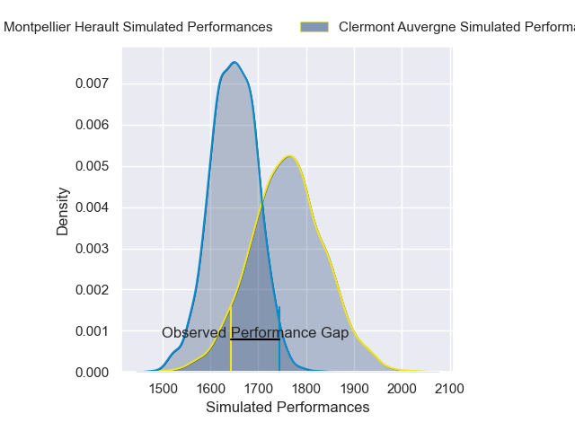
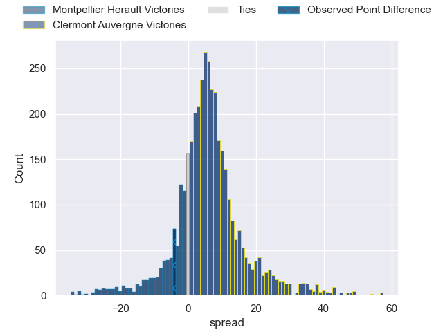
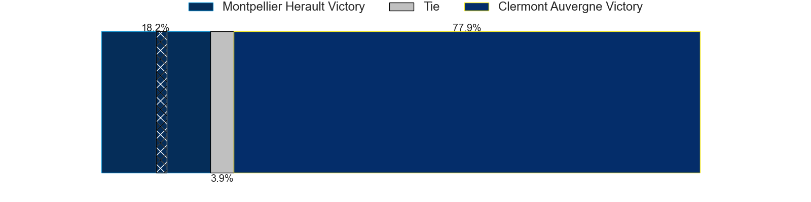
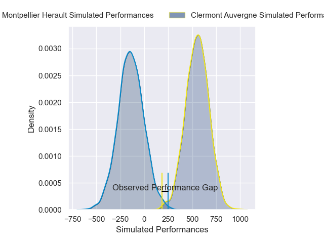
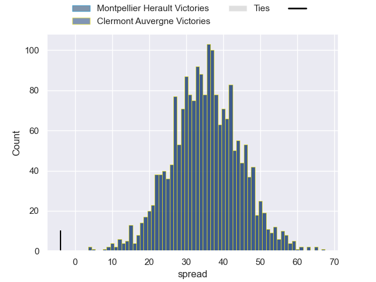

---  
layout: page  
title: Montpellier Herault at Clermont Auvergne; 22-18  
date: 2024-12-28 18:00:00 -0500  
categories: "Top 14 Orange 2024" match review  
---
# Montpellier Herault at Clermont Auvergne; 22-18

# Club Level Predictions

The first set of predictions treats a club as the smallest object, as the club develops its members, organizes a gameplan, and deploys its players as needed for each match. This club model has a prediction of 0.654, which translates to predicting Clermont Auvergne to win by 5.6.

Our Over/Under is 48.5 - and combined with the spread above, we have a predicted scoreline of 21 to 27

Each club has a rating and a rating deviation (similar to a Glicko rating), and expected performances can be generated. This allows for simulated matches and spreads like the ones below.
## Projected Performances - Club Model

## Projected Spreads - Club Model

## Projected Results - Club Model

# Player Level Predictions

Treating teams instead as an entity made up of the currently active players, I have ratings for each player in an altogether different system. These can be combined to form team ratings once teamsheets are announced, weighting starters a bit higher than the reserves. After the match is played, players can be weighted by their minutes on the field, allowing for an accurate measure of the team's composition. With these compiled team ratings, we can make predictions, measure inaccuracy, and update the individual player ratings.
## Prediction without Player Minutes: Clermont Auvergne by 20.2

Clermont Auvergne by 7.1 on a neutral pitch

## Projected Performances - Player Model

## Projected Spreads - Player Model

## Projected Results - Player Model

|   Away Minutes | Away Player         |   Away Percentile |   Number |   Home Percentile | Home Player          |   Home Minutes |
|---------------:|:--------------------|------------------:|---------:|------------------:|:---------------------|---------------:|
|             13 | Enzo Forletta       |             84.41 |        1 |             16.92 | Sacha Lotrian        |             80 |
|             80 | Jordan Uelese       |             57.12 |        2 |             56.65 | Etienne Fourcade     |             55 |
|             57 | Luka Japaridze      |             88.41 |        3 |             18.59 | Cristian Ojovan      |             80 |
|             64 | Florian Verhaeghe   |             76.31 |        4 |             85.71 | Rob Simmons          |             60 |
|              9 | Bastien Chalureau   |             80.14 |        5 |             54.62 | Thomas Ceyte         |             28 |
|             80 | Lenni Nouchi        |             96.93 |        6 |             80.79 | Alexandre Fischer    |             80 |
|             13 | Alexandre Becognee  |             70.54 |        7 |             92.14 | Marcos Kremer        |             23 |
|             18 | Billy Vunipola      |             71.77 |        8 |             64.64 | Fritz Lee            |             80 |
|             21 | Cobus Reinach       |             95.81 |        9 |             67.15 | Sebastien Bezy       |             80 |
|             28 | Stuart Hogg         |             95.99 |       10 |             62.53 | Benjamin Urdapilleta |             80 |
|             32 | George Bridge       |             98.14 |       11 |              9.79 | Alivereti Raka       |             62 |
|             57 | George Bridge       |             98.14 |       11 |              9.79 | Alivereti Raka       |             62 |
|             80 | George Bridge       |             98.14 |       11 |              9.79 | Alivereti Raka       |             62 |
|             18 | Arthur Vincent      |             39.41 |       12 |             23.86 | Irae Simone          |             23 |
|              6 | Thomas Darmon       |             44.75 |       13 |             21.49 | Mathys Belaubre      |             80 |
|             18 | Gabriel Ngandebe    |             13.52 |       14 |             89.59 | Bautista Delguy      |             24 |
|             18 | Joshua Moorby       |             82.01 |       15 |             64.96 | Alex Newsome         |             24 |
|             80 | Tyler Duguid        |             81.53 |       16 |             84.74 | Etienne Falgoux      |             56 |
|             80 | Sam Simmonds        |             16.23 |       17 |            nan    | Théo Giral           |             20 |
|             80 | Wilfrid Hounkpatin  |             63.42 |       18 |             89.37 | Peceli Yato Senibitu |             80 |
|             52 | Christopher Tolofua |             88.77 |       19 |             76.95 | Regis Montagne       |             48 |
|             69 | Yacouba Camara      |             91.2  |       20 |             85.31 | Killian Tixeront     |             52 |
|             80 | Luca Tabarot        |             33.51 |       21 |             85.8  | Thibaud Lanen        |             80 |
|             52 | Leo Coly            |             31.24 |       22 |             81    | Baptiste Jauneau     |             74 |
|             62 | Auguste Cadot       |             39.7  |       23 |            nan    | nan                  |            nan |

